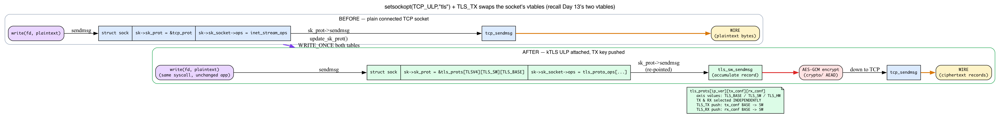
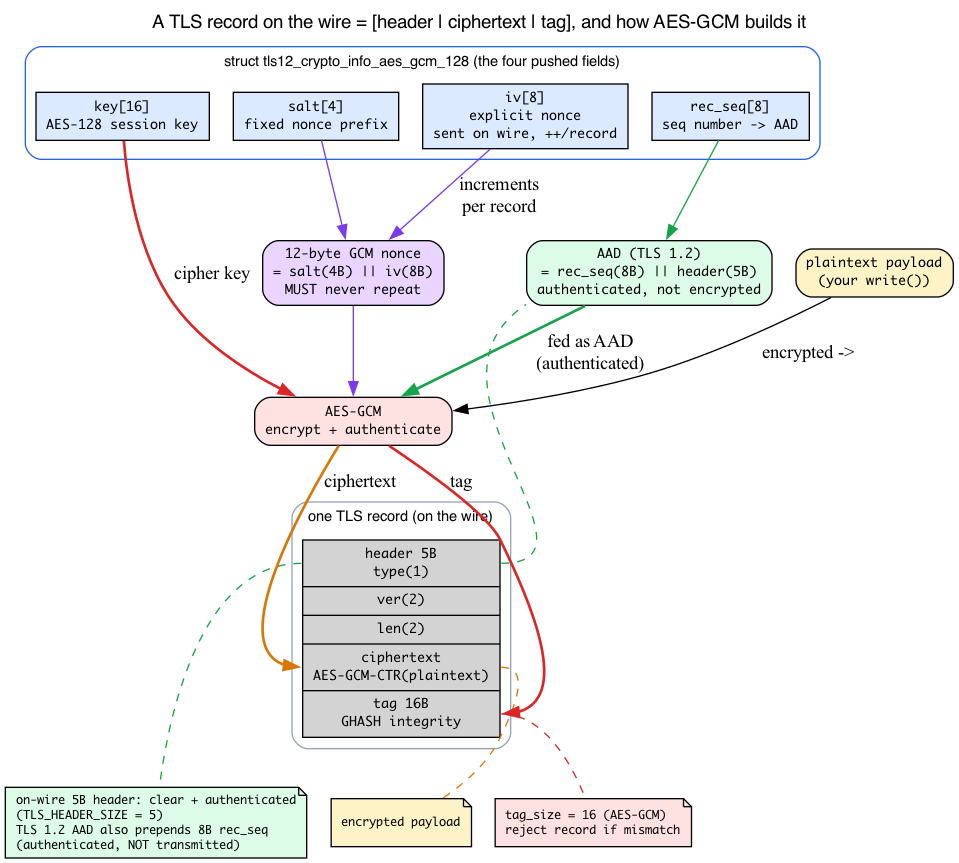
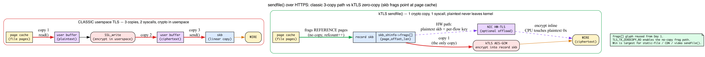
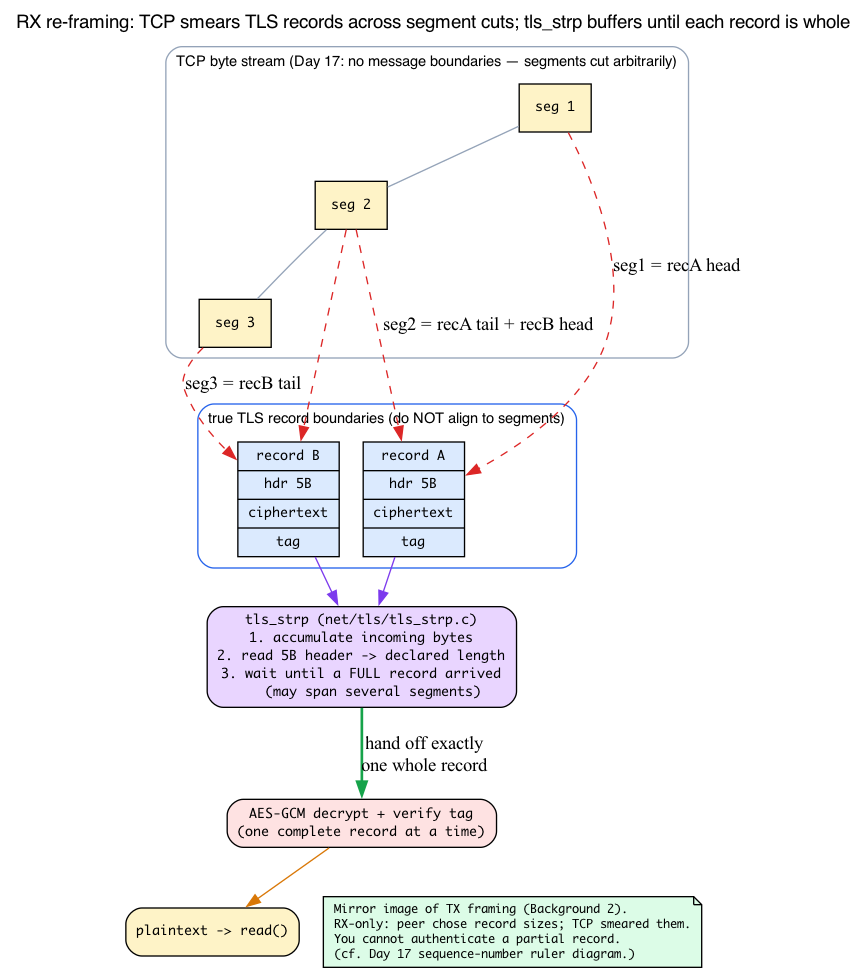

# Day 25 — kTLS: in-kernel transport encryption

> **Today's mission:** see how Linux puts AES-GCM into the kernel data path, why this matters for `sendfile()` over HTTPS, and how hardware-offloaded TLS extends the same model — and learn the four pieces of machinery it all rests on (the TCP ULP framework, AEAD/AES-GCM and the TLS record format, `sendfile`/`splice` zero-copy, and RX record re-framing) so nothing in the setup dance is a black box. Total time: ~110 minutes.

## What kTLS does

Kernel TLS (kTLS) lets the kernel handle TLS *record encryption and decryption* — but not the handshake. The pattern:

1. **Userspace performs the TLS handshake** — using OpenSSL, BoringSSL, GnuTLS, or any handshake library. The handshake produces a session key (and IV, salt, sequence number).
2. **Userspace hands the key to the kernel** via `setsockopt(SOL_TLS, TLS_TX, ...)` and `TLS_RX`.
3. **Subsequent socket I/O is automatically encrypted/decrypted by the kernel.** `write()` plaintext → kernel encrypts → ciphertext on wire. Wire ciphertext → kernel decrypts → `read()` plaintext.


The split is deliberate. The handshake involves certificate validation, X.509 parsing, complex protocol state machines, and a constantly-evolving TLS protocol. None of that belongs in the kernel — it would balloon the attack surface, demand kernel updates with every TLS protocol change, and fight kernel-OpenSSL feature parity. **The kernel only does the bulk symmetric encryption — the steady state, where every record is `AES-GCM(plaintext + AAD)` and nothing else.**

That sentence already leans on three things we haven't taught yet: *how* a connected TCP socket suddenly starts encrypting your `write()`s without changing a line of application code, *what* `AES-GCM(plaintext + AAD)` actually computes (and what AAD even is), and *why* the whole exercise is worth it (the `sendfile()` zero-copy win). And on the receive side there's a fourth: TLS records don't line up with TCP segments, so the kernel has to re-frame the byte stream before it can decrypt. We'll teach each one as a proper background section — intuition first, then the concrete v7.1 struct/function — and only then walk the setup dance, with every step resting on something you already understand.

---

## Background 1: the TCP ULP framework — hot-swapping a socket's protocol vtable

Step 2 of the setup dance is `setsockopt(fd, SOL_TCP, TCP_ULP, "tls", 4)`, and the chapter used to wave at it with "TCP_ULP = Upper Layer Protocol." But that single call is the load-bearing trick behind the entire "transparent encryption" claim — so let's make it real.

### The intuition: a pluggable shim on top of TCP

A **ULP (Upper Layer Protocol)** is a shim that sits *on top of* an established TCP socket and intercepts its send/receive path. Think of it as a hook the kernel offers: "if you name a registered ULP, I'll splice its code between your syscalls and TCP." kTLS is one such ULP; MPTCP (`.name = "mptcp"`) and IPsec-in-TCP (`espintcp`) use the same mechanism. (Don't confuse this with SMC — that's a separate `AF_SMC` protocol family, not a TCP ULP; it explicitly refuses `TCP_ULP` with `-EOPNOTSUPP`.)

The kernel keeps a small **registry of ULPs**. Each one is a `struct tcp_ulp_ops` carrying a name string and a handful of callbacks (`include/net/tcp.h:2819`):

```c
struct tcp_ulp_ops {
    struct list_head    list;
    int  (*init)(struct sock *sk);     /* called when the ULP is attached */
    void (*update)(struct sock *sk, struct proto *p, ...);
    void (*release)(struct sock *sk);
    int  (*get_info)(struct sock *sk, struct sk_buff *skb, bool net_admin);
    size_t (*get_info_size)(const struct sock *sk, bool net_admin);
    void (*clone)(const struct request_sock *req, struct sock *newsk, ...);
    char name[TCP_ULP_NAME_MAX];       /* the string userspace passes */
    struct module *owner;
};
```

A module calls `tcp_register_ulp()` to add itself to the registry. kTLS registers `tcp_tls_ulp_ops` (`net/tls/tls_main.c:1230`) with `.name = "tls"` (`:1231`) and `.init = tls_init` (`:1233`):

```c
static struct tcp_ulp_ops tcp_tls_ulp_ops __read_mostly = {
    .name = "tls",
    .init = tls_init,
    /* ... */
};
```

### What `setsockopt(TCP_ULP, "tls")` actually does

When userspace makes that call, the kernel runs `tcp_set_ulp` (`net/ipv4/tcp_ulp.c:157`):

1. `__tcp_ulp_find_autoload("tls")` (`:163`) searches the registry by name and, if the `tls` module isn't loaded yet, **auto-loads it** (that's why you don't have to `modprobe tls` by hand).
2. `__tcp_set_ulp` (`:130`) does the attach. It refuses if a ULP is already set (`-EEXIST`), and crucially it requires the socket to **already be connected**: a `TCP_LISTEN` socket gets `-ENOTCONN` unless the ULP supplies a `.clone` callback (`:142`). That's why the handshake must complete first — you attach kTLS to an *established* connection.
3. If the checks pass, it calls `ulp_ops->init(sk)` (`:146`) — for kTLS, `tls_init`.

`tls_init` (`net/tls/tls_main.c:1047`) double-checks the state (`sk->sk_state != TCP_ESTABLISHED` → `-ENOTCONN`), allocates a `tls_context` via `tls_ctx_create` (`:1070`), sets both directions to the base state (`ctx->tx_conf = TLS_BASE; ctx->rx_conf = TLS_BASE`), and calls `update_sk_prot` (`:1079`).

### The transparency trick: replacing the socket's vtables

Here's the actual magic. Recall the **two dispatch tables** from Day 13 (Background 3): every socket has `sk->sk_socket->ops` (a `proto_ops`, the BSD-API vtable facing userspace) and `sk->sk_prot` (a `proto`, the protocol vtable facing the wire). A `write()` descends `socket->ops->sendmsg` → `sk->sk_prot->sendmsg`, which for plain TCP is `tcp_sendmsg`.

kTLS simply **points those two tables at TLS-aware versions.** `update_sk_prot` (`net/tls/tls_main.c:131`) does exactly that:

```c
void update_sk_prot(struct sock *sk, struct tls_context *ctx)
{
    int ip_ver = sk->sk_family == AF_INET6 ? TLSV6 : TLSV4;

    WRITE_ONCE(sk->sk_prot,
               &tls_prots[ip_ver][ctx->tx_conf][ctx->rx_conf]);
    WRITE_ONCE(sk->sk_socket->ops,
               &tls_proto_ops[ip_ver][ctx->tx_conf][ctx->rx_conf]);
}
```

After this, the *same* `write()`/`sendmsg()` syscall lands in a TLS sendmsg (which encrypts, then calls down to `tcp_sendmsg` for the wire) instead of going straight to `tcp_sendmsg`. The application never changed; the vtable underneath it did. That is the whole meaning of "transparent."



### The `[tx_conf][rx_conf]` state matrix

Notice the index: `tls_prots[ip_ver][ctx->tx_conf][ctx->rx_conf]`. The installed vtable depends on a **2-D state**, one axis per direction. Each axis is one of `TLS_BASE`, `TLS_SW`, or `TLS_HW` (`include/net/tls.h:85`):

- `TLS_BASE` — kTLS attached but this direction does nothing to traffic yet.
- `TLS_SW`  — software encryption/decryption (the kernel's `crypto/` framework).
- `TLS_HW`  — hardware offload (the NIC does AES-GCM).

So **TX and RX are routed independently**: you can run hardware-offloaded TX while RX stays in software, each direction selecting its own row/column of the table. This is *why* pushing the TX key and the RX key are two separate `setsockopt`s (steps 3 and 4 below): each one upgrades one axis (e.g. `TLS_BASE → TLS_SW`) and re-runs `update_sk_prot` to re-point the vtables.

And one subtle but important consequence: **`setsockopt(TCP_ULP, "tls")` alone does nothing to your traffic yet.** It installs `tls_prots[*][TLS_BASE][TLS_BASE]`, whose only real job is a `setsockopt` handler that now accepts `SOL_TLS` (`build_protos` sets `prot[TLS_BASE][TLS_BASE].setsockopt = tls_setsockopt`, `net/tls/tls_main.c:1006`). Encryption begins only once you push a key (TLS_TX/TLS_RX), which flips that axis to `TLS_SW` (or `TLS_HW`).

> ### There are no Dumb Questions
>
> **Q: If `TCP_ULP "tls"` encrypts nothing until a key is pushed, why is it a separate step at all? Why not push the key in one call?**
>
> A: Because the two steps do genuinely different things, and separating them keeps each one simple. `TCP_ULP "tls"` is the *structural* change — it attaches the ULP and swaps the socket's vtables to the `[TLS_BASE][TLS_BASE]` versions, whose only new ability is to *accept* `SOL_TLS` options. Until that swap happens, the socket's `setsockopt` doesn't even understand `TLS_TX`/`TLS_RX`. So the ULP attach is what *unlocks* the key-push call. Splitting them also mirrors the protocol reality: you attach to an already-connected socket (the ULP refuses a non-established socket), then feed in keys that the handshake produced moments earlier — and you can upgrade TX and RX independently afterward.

---

## Background 2: AEAD, AES-GCM, and the TLS record on the wire

Step 3 memcpy's four separate fields — `key`, `iv`, `salt`, `rec_seq` — into a crypto struct, and the chapter's "every record is `AES-GCM(plaintext + AAD)`" rests on you knowing what each of those is. No earlier day taught any cryptography, so here's the minimum to read the setup honestly.

### AEAD: one primitive, two jobs

**AEAD = Authenticated Encryption with Associated Data.** A single primitive does two things at once:

1. **Encrypts** the plaintext into ciphertext (confidentiality).
2. Computes an **authentication tag** — a short fingerprint that proves the ciphertext (and some header data) wasn't tampered with (integrity).

**AES-GCM** is the dominant AEAD: AES in *counter mode* provides the encryption, and *GHASH* computes the tag. The killer property: on decrypt, the receiver **recomputes the tag and rejects the whole record if it doesn't match.** There is no separate "decrypt, then verify" step you might forget — authentication is welded into the same operation.

### AAD: authenticated but not encrypted

**AAD (Additional Authenticated Data)** is data that is *authenticated but not encrypted* — it travels in the clear, yet it's folded into the tag computation so an attacker can't alter it without breaking the tag. For TLS, the AAD is the record's framing: the content type, version, and length, plus the record sequence number. That's the `+ AAD` in "`AES-GCM(plaintext + AAD)`": the 5-byte TLS record header (`TLS_HEADER_SIZE`, `include/net/tls.h:59`) is authenticated framing and visible on the wire, while only the payload is encrypted. One caveat for the TLS 1.2 struct we're explaining here: `tls_make_aad` (`net/tls/tls.h:366`) builds a **13-byte** AAD — an 8-byte record sequence number *prepended* to the 5-byte type/version/length header. That sequence number is authenticated but is **not** transmitted (it's implicit, reconstructed by both ends). So in TLS 1.2 the on-wire 5-byte header is a *subset* of the AAD, not the whole AAD. (In TLS 1.3 the AAD is exactly the 5-byte record header.)

### What a TLS record looks like on the wire

Putting it together, one TLS record is:

```
[ 5-byte header: content_type(1) | version(2) | length(2) ]  ← clear, authenticated framing*
[ ciphertext = AES-GCM-encrypt(plaintext) ]                  ← encrypted
[ 16-byte authentication tag ]                               ← integrity check
```

\* In TLS 1.2 the full AEAD AAD is larger than this on-wire header: it is the 8-byte implicit record sequence number followed by these 5 bytes (13 bytes total). Only the 5-byte header is actually transmitted.

So kTLS turns one plaintext `write()` into a record with fixed framing overhead: a header in front and a tag behind the payload. The kernel reserves exactly that space around each record's payload — `prepend_size` for the header and `tag_size` for the tag (`struct tls_prot_info`, `include/net/tls.h:213-214`); for AES-GCM the tag is 16 bytes.

### The four fields, and why you need all four

Now the `memcpy`s in step 3 read like a sentence. The struct is `tls12_crypto_info_aes_gcm_128` (`include/uapi/linux/tls.h:126`):

```c
struct tls12_crypto_info_aes_gcm_128 {
    struct tls_crypto_info info;
    unsigned char iv[8];        /* TLS_CIPHER_AES_GCM_128_IV_SIZE      */
    unsigned char key[16];      /* TLS_CIPHER_AES_GCM_128_KEY_SIZE     */
    unsigned char salt[4];      /* TLS_CIPHER_AES_GCM_128_SALT_SIZE    */
    unsigned char rec_seq[8];   /* TLS_CIPHER_AES_GCM_128_REC_SEQ_SIZE */
};
```

- **`key` (16 bytes)** — the AES-128 session key produced by the handshake. This is what actually encrypts.
- **The GCM nonce (12 bytes)** is *not* a single field — for this TLS 1.2 AES-GCM-128 case the kernel builds it as **`salt` (4 bytes)** `||` **`iv` (8 bytes)**: `memcpy(cctx->iv, salt, 4); memcpy(cctx->iv + 4, iv, 8)` (`net/tls/tls_sw.c:2911`). The `salt` is a fixed implicit prefix for the whole session; the `iv` is the **8-byte explicit nonce** — the per-record changing part. It is sent in the clear at the front of each record (`tls_fill_prepend` copies `ctx->tx.iv + salt_size`, `net/tls/tls.h:347`) and incremented every record (`tls_advance_record_sn` bumps `ctx->iv + salt_size` for the non-1.3/non-ChaCha case, `net/tls/tls.h:317`). GCM's security depends on the nonce **never repeating** under the same key — nonce reuse breaks AES-GCM catastrophically.
- **`rec_seq` (8 bytes)** is a *separate* counter: the record sequence number. In TLS 1.2 it feeds the **AAD**, not the nonce — `tls_make_aad` copies `record_sequence` into the AAD's first 8 bytes (`net/tls/tls.h:368`), where it is authenticated but never transmitted. That is the real reason the struct carries four distinct fields: `key`, the fixed `salt`, the per-record explicit `iv` (nonce), and the authenticated `rec_seq`.

(In TLS 1.3 / ChaCha20-Poly1305 the construction differs: the nonce's low 8 bytes are `iv XOR rec_seq` (`tls_xor_iv_with_seq`, `net/tls/tls.h:328`) and no explicit `iv` is sent on the wire.)

The handshake library computed all four during the TLS key exchange; `setsockopt` just *transfers that state* so the kernel can continue the record sequence from precisely where userspace left off. kTLS doesn't hand-roll AES — it calls the kernel's `crypto/` AEAD framework, the **same code IPsec uses**. Before accepting the key, the kernel validates the struct: `get_cipher_desc(crypto_info->cipher_type)` then `if (optlen != cipher_desc->crypto_info) return -EINVAL` (`net/tls/tls_main.c:692-702`), so a wrong-sized struct for the named cipher is rejected.



> ### There are no Dumb Questions
>
> **Q: Why is the nonce split into `salt` + `iv` instead of just one 12-byte field?**
>
> A: Because the two halves have different lifetimes and different jobs. The `salt` (4 bytes) is fixed for the whole session — it never changes, so there's no reason to re-send or re-store it per record. The `iv` (8 bytes) is the part that *must* change every record, since GCM's security collapses if a nonce ever repeats under the same key. Keeping them separate lets the kernel store the constant once and only increment the 8-byte counter — and it matches the wire format, where just the 8-byte explicit `iv` rides in front of each record while the salt stays implicit. (Don't confuse `iv` with `rec_seq`: in TLS 1.2 the `iv` is the nonce's changing part, while the separate `rec_seq` is the sequence number folded into the authenticated AAD.)

---

## Background 3: `sendfile()`, `splice`, and the page cache — what the "one copy" win is

The whole "Why it matters" section below rests on three ideas no earlier day taught as such: the page cache, `sendfile`/`splice`, and *why* an skb can reference file pages without copying them. (Day 1 taught skb page fragments; here we connect them to the file→socket path.)

### The page cache

The **page cache** is the kernel's in-RAM cache of file contents. When a file is read, its bytes live in `struct page`s indexed by that file. A static-file server's hot files are already resident there, so "reading" them is just locating those pages — no disk I/O, no copy.

### `sendfile()` / `splice`: skip the userspace round-trip

`sendfile(out_socket, in_file, ...)` (and the more general `splice`) tells the kernel to move bytes from a file straight to a socket **without** routing them through a userspace buffer. Contrast the classic HTTPS send path:

1. `read(file)` copies page-cache → user buffer.
2. `SSL_write(buffer)` encrypts in the user buffer.
3. `send(socket)` copies user buffer → skb.

That's **three copies plus a userspace crypto pass**, with context switches between `read` and `send`.

### Why no copy is needed: skb frags point at file pages

The zero-copy mechanism reuses the skb page-fragment design from Day 1. Recall that an skb's payload can live in `skb_shinfo(skb)->frags[]` — `(page, offset, len)` references to arbitrary pages, not necessarily contiguous. Instead of `memcpy`-ing file bytes into the skb's linear area, `splice` points the skb's frag array **directly at the page-cache pages** (bumping their refcount, sharing them). The bytes never move.

With kTLS, the only remaining copy is the encryption itself: the kernel reads the plaintext file pages and writes ciphertext into the record skb. Crucially the **plaintext never crosses the user/kernel boundary**, and there's no context switch between "read" and "send" — one syscall runs the whole file → encrypt → wire pipeline. With NIC hardware offload (below), even that encryption copy moves to the NIC, so after the initial page-cache fill the CPU touches plaintext *zero* times.

This is why kTLS matters most for static-file / CDN / video workloads: they `sendfile()` large, already-cached files over TLS. Dynamic content that must be generated in userspace can't use the zero-copy path and benefits far less. (The kernel-side knob for this TX zero-copy path is `TLS_TX_ZEROCOPY_RO`, `include/uapi/linux/tls.h:42` — "TX zerocopy (only sendfile now)" — handled by `do_tls_setsockopt_tx_zc`, `net/tls/tls_main.c:785`.)



## Why it matters

### `sendfile()` over HTTPS

Recall the 3-copy classic path vs the 1-copy kTLS `sendfile` path from Background 3. The payoff is the same comparison applied at scale: for static-file servers (CDN, image servers, video streaming) that `sendfile()` large, already-cached files over TLS, dropping from three copies plus a userspace crypto pass to a single encryption copy with zero read/send context switches is a massive throughput win. Netflix's BSD-based servers (and various Linux derivatives) ship hundreds of Gbps from a single box using exactly this pattern.

### Hardware offload

NICs that support TLS offload (Mellanox ConnectX-6+, Chelsio T6, recent Intel) can do AES-GCM at the NIC. With kTLS:

1. Application writes plaintext via `sendfile()`.
2. Kernel hands plaintext skb to the driver with a per-flow key.
3. NIC encrypts inline at the DMA boundary; ciphertext goes out the wire.
4. The CPU never touches plaintext for encryption — with `sendfile` from the page cache it touches plaintext zero times (matching the zero-copy claim in Background 3).

Detected via NIC features `NETIF_F_HW_TLS_TX` / `NETIF_F_HW_TLS_RX` (`include/linux/netdev_features.h:158-159`). Configured via the same kTLS sockopt path; the kernel decides software vs hardware by flipping that direction's axis to `TLS_HW` (Background 1) based on the NIC's capability.

## Background 4: why RX must re-frame the byte stream

On the receive side there's one more prerequisite — and it's why step 4 of the setup dance (push RX key → `read()` decrypts) needs more machinery than the TX side. The "What to read" list points at `net/tls/tls_strp.c` — "the stream parser that re-frames TCP byte stream into TLS records … because TLS records aren't aligned to TCP segment boundaries." That's a fact about TCP you met on Day 17.

**One-line refresher (Day 17 Background 1):** TCP is a pure *byte stream* — it numbers every byte and guarantees order, but imposes **no message boundaries**; an ACK just says "next byte expected." (See day17 for sequence numbers, `snd_una`/`snd_nxt`.) A single `read()` may hand you half a TLS record or three records glued together.

Because of that, the RX side **cannot assume one recv = one record.** `tls_strp` (the kernel's strparser) accumulates incoming bytes, reads each record's 5-byte header (`TLS_HEADER_SIZE`) to learn its declared length, waits until a *full* record has arrived — possibly spanning several TCP segments — and only then hands exactly one complete record to the AES-GCM decrypt step. This is the mirror image of TX framing from Background 2.

It's purely an RX concern. On **TX** the kernel chooses record sizes, so it controls framing. On **RX** the peer chose them and TCP smeared them across segment boundaries, so reassembly is mandatory *before* the tag can be verified — you can't authenticate a partial record.



## The setup dance

```c
/* 1. Application opens TCP, performs TLS handshake (OpenSSL or similar).
 *    After handshake, has access to: session key, IV, salt, current rec_seq. */

/* 2. Activate kTLS on the socket */
setsockopt(fd, SOL_TCP, TCP_ULP, "tls", 4);
/* TCP_ULP = "Upper Layer Protocol"; kTLS is registered as a ULP (Background 1).
 * This only attaches the ULP and installs tls_prot[TLS_BASE][TLS_BASE] —
 * no traffic is encrypted yet. */

/* 3. Push TX key */
struct tls12_crypto_info_aes_gcm_128 tx = {
    .info.version = TLS_1_2_VERSION,
    .info.cipher_type = TLS_CIPHER_AES_GCM_128,
};
memcpy(tx.key, session_tx_key, 16);     /* AES-128 session key   (Background 2) */
memcpy(tx.iv, session_tx_iv, 8);        /* explicit nonce, sent on wire, ++/record */
memcpy(tx.salt, session_tx_salt, 4);    /* fixed implicit nonce prefix          */
memcpy(tx.rec_seq, session_tx_rec_seq, 8); /* seq number → AAD (TLS 1.2)         */
setsockopt(fd, SOL_TLS, TLS_TX, &tx, sizeof(tx));
/* This flips tx_conf BASE→SW and re-runs update_sk_prot: write() now encrypts. */

/* 4. Push RX key (mirror struct, RX side) */
setsockopt(fd, SOL_TLS, TLS_RX, &rx, sizeof(rx));
/* Flips rx_conf BASE→SW independently: read() now decrypts. */

/* 5. From now on, write/read produce/consume plaintext.
 *    The kernel encrypts/decrypts records transparently. */
```

`do_tls_setsockopt` in `net/tls/tls_main.c:863` is the dispatcher. The TX/RX key pushes go through `do_tls_setsockopt_conf` (line 635) which calls `tls_set_sw_offload` (software path) or `tls_set_device_offload` (hardware path, line 1062 in `tls_device.c`). Each successful key push ends in `update_sk_prot` (Background 1), re-pointing the vtables to the new `[tx_conf][rx_conf]` state.

## Cipher support

```
TLS_CIPHER_AES_GCM_128       (TLSv1.2 + TLSv1.3)
TLS_CIPHER_AES_GCM_256
TLS_CIPHER_AES_CCM_128
TLS_CIPHER_CHACHA20_POLY1305 (TLSv1.2 + TLSv1.3)
TLS_CIPHER_SM4_GCM           (chinese national algorithm)
TLS_CIPHER_ARIA_GCM          (some kernels)
```

The cipher type is in `crypto_info.cipher_type`. Each cipher has its own struct (different IV/salt/key sizes) — which is why the kernel validates `optlen` against the named cipher's expected size before accepting the key (Background 2). The kernel uses its `crypto/` framework to do the actual AES — same underlying routines as IPsec.

## What's NOT in kTLS

- **Handshake** (still userspace).
- **Renegotiation / rekey** (kernel doesn't track session state beyond the current key; key rotation requires application coordination — though TLS 1.3 key updates are accepted, see the rekey check in `do_tls_setsockopt_conf`).
- **TLS extensions** (the kernel handles records, not the higher-level extensions like ALPN).
- **TLS 1.0/1.1** (only 1.2 and 1.3 supported).

## Today's experiment

Most modern Linux distros have kTLS support compiled in. Verify:

```bash
ls /sys/module/tls
modinfo tls
```

To use it, an application must explicitly call the setsockopt sequence. Modern OpenSSL (1.1.1+) supports it via `SSL_OP_ENABLE_KTLS` — pass it to `SSL_CTX_set_options` and OpenSSL handshakes normally then offloads encryption.

The key push fires the instant the handshake completes, so the tracer must already be running before the client connects. First generate a cert and start the server (pass `-ktls` so the server offloads too):

```bash
# Test with openssl s_server (since OpenSSL 3.0)
openssl genrsa -out /tmp/k.pem 2048
openssl req -new -x509 -key /tmp/k.pem -out /tmp/c.pem -days 1 -subj /CN=test
sudo openssl s_server -accept 4443 -cert /tmp/c.pem -key /tmp/k.pem -ktls &
```

Now start the bpftrace one-liner and **leave it running** in this terminal. It prints the key push symbolically — `optname` 1 and 2 are `TLS_TX` and `TLS_RX` from `include/uapi/linux/tls.h`:

```bash
sudo bpftrace -e '
fentry:tls_setsockopt {
  printf("%s push on sk=%p\n", args->optname==1?"TLS_TX":"TLS_RX", args->sk);
}'
```

Then, in another terminal, connect the client. `s_client` is interactive and blocks on stdin — type `Q` then Enter (or Ctrl-D) to close it, or drive it non-interactively with `echo Q`:

```bash
echo Q | openssl s_client -connect 127.0.0.1:4443 -ktls
```

When the offload engages you'll see the SOL_TLS key pushes, one per direction (the `sk` value is an opaque kernel pointer that differs every run):

```
TLS_TX push on sk=0xffff...
TLS_RX push on sk=0xffff...
```

Two caveats worth knowing, because kTLS offload is genuinely finicky:

- **The push only happens if kTLS actually activates**, which needs the handshake to negotiate a cipher the kernel can offload (an AES-GCM suite). Default TLS 1.3 on some builds negotiates a suite the kernel declines, so no key is pushed and the tracer stays silent. Pin a known-good suite to force it: add `-tls1_2 -cipher ECDHE-RSA-AES128-GCM-SHA256` to `s_server` and `-tls1_2` to `s_client`.
- **The probe target varies by kernel.** The inner `do_tls_setsockopt` is `static`, so on many builds it's inlined and has no `fentry` target at all (hence the probe above hooks the exported `tls_setsockopt` wrapper instead); on others the wrapper attaches but the key push doesn't traverse it. The reliable, probe-independent confirmation that kTLS engaged is the SNMP counters — `TlsTxSw`/`TlsRxSw` (software offload) increment per offloaded session:

```bash
grep -E 'TlsTxSw|TlsRxSw' /proc/net/tls_stat   # before and after; the count rises when kTLS engages
```

When done, stop the server and clean up: `sudo pkill -f 's_server -accept 4443'; rm -f /tmp/k.pem /tmp/c.pem`.

### Watch hardware-offload status

```bash
ethtool -k eth0 | grep -i tls
# tls-hw-tx-offload: on/off
# tls-hw-rx-offload: on/off
# tls-hw-record: on/off
```

If on, your NIC has TLS offload available; kTLS will use it transparently when the cipher is supported. These three map to the verified `NETIF_F_HW_TLS_TX` / `NETIF_F_HW_TLS_RX` / `NETIF_F_HW_TLS_RECORD` feature flags (`include/linux/netdev_features.h:156-159`).

## What to read in the kernel

- **`include/net/tcp.h:2819`** — `struct tcp_ulp_ops`. The ULP registration record (name + `init`/`update`/`release`/`clone` callbacks). The whole "TCP_ULP" mechanism (Background 1) lives around here.

- **`net/ipv4/tcp_ulp.c:157`** — `tcp_set_ulp` → `__tcp_ulp_find_autoload` (line 163, auto-loads the module) → `__tcp_set_ulp` (line 130). Note the `-EEXIST`/`-ENOTCONN` checks and the `ulp_ops->init(sk)` call at line 146 — this is the path `setsockopt(TCP_ULP,"tls")` takes.

- **`net/tls/tls_main.c:1230`** — `tcp_tls_ulp_ops` (`.name = "tls"`, `.init = tls_init`). Follow `tls_init` (line 1047) → `tls_ctx_create` (line 1070) → `update_sk_prot` (line 131), the vtable-swap that makes encryption transparent.

- **`net/tls/tls_main.c:863`** — `do_tls_setsockopt`. The dispatcher (~32 lines, ending at line 894) for TLS_TX, TLS_RX, TLS_TX_ZEROCOPY_RO, etc. To follow the full setsockopt flow including the per-option handlers, read from `do_tls_setsockopt_conf` (line 635) through line 906 — ~272 lines.

- **`net/tls/tls_main.c:635`** — `do_tls_setsockopt_conf`. The TX/RX key configuration. This is where the kernel validates the crypto_info struct (`optlen` vs the cipher's expected size, ~line 692) and decides software (`tls_set_sw_offload`) vs hardware (`tls_set_device_offload`).

- **`net/tls/tls_sw.c`** — software encryption path. Read `tls_sw_sendmsg` (line 1288) and `tls_sw_recvmsg` (line 2060). The flow: receive plaintext from user via `tcp_sendmsg` interception, accumulate into a record, AES-GCM encrypt with the kernel's crypto API, send the ciphertext via `tcp_sendmsg`.

- **`net/tls/tls_device.c:1062`** — `tls_set_device_offload`. The hardware path. Tells the NIC about the per-flow key. The driver implements `tls_dev_add` (a member of `struct tlsdev_ops`) to register the flow with the hardware. Read this if you want to understand how kernel ↔ NIC TLS coordination works.

- **`net/tls/tls_device_fallback.c`** — what happens when hardware offload is partially failing (e.g., a packet has to be retransmitted but the NIC's key state has advanced). The kernel handles those records in software.

- **`net/tls/tls_strp.c`** — the stream parser that re-frames TCP byte stream into TLS records on the receive side (Background 4). Necessary because TLS records aren't aligned to TCP segment boundaries.

- **`include/uapi/linux/tls.h`** — the userspace ABI: `TLS_TX`/`TLS_RX`/`TLS_TX_ZEROCOPY_RO` (lines 40–42), `struct tls12_crypto_info_aes_gcm_128` (line 126) and the per-cipher size macros.

- **`Documentation/networking/tls.rst`** — official doc. Practical examples of setup.

## Bullet Points

- **kTLS** = TLS records produced/consumed by the kernel after handshake done in userspace.
- **The ULP framework** is the enabling trick: `setsockopt(TCP_ULP,"tls")` attaches kTLS to a *connected* socket and `update_sk_prot` swaps the socket's two vtables (`sk->sk_prot` + `socket->ops`, recall Day 13) for TLS-aware ones — so the same `write()`/`read()` now encrypt/decrypt.
- The installed vtable is `tls_prots[ip_ver][tx_conf][rx_conf]`; each direction is `TLS_BASE`/`TLS_SW`/`TLS_HW` **independently**, which is why TX and RX keys are separate setsockopts. `TCP_ULP` alone (BASE/BASE) encrypts nothing until a key is pushed.
- **AEAD / AES-GCM** does encryption *and* an authentication tag in one step. **AAD** = the record framing, authenticated but sent in clear: the on-wire 5-byte record header, plus (in TLS 1.2) an 8-byte implicit sequence number that is authenticated but not transmitted. A record on the wire = `[5B header][ciphertext][16B tag]`.
- The crypto struct carries four fields: **key** (AES-128), the fixed **salt** (implicit nonce prefix), the **iv** (8-byte explicit nonce — the per-record changing part, sent on the wire and incremented each record; nonce reuse breaks GCM), and **rec_seq** (the record sequence number, folded into the authenticated AAD in TLS 1.2). setsockopt transfers the handshake's crypto state into the kernel.
- Activated via `TCP_ULP=tls` + `TLS_TX` + `TLS_RX` sockopts; kTLS reuses the kernel's `crypto/` framework (shared with IPsec).
- Enables zero-copy **`sendfile()`** for HTTPS: page-cache pages become skb frags (recall Day 1) — no userspace copy, no `read`/`send` context switch; with HW offload the CPU touches plaintext 0 times. Huge win for static-file CDNs.
- **RX re-framing:** TCP is a byte stream with no message boundaries (Day 17), so `tls_strp` reassembles full records across TCP segments before decrypt — you can't authenticate a partial record.
- **Hardware offload** via `NETIF_F_HW_TLS_TX/RX` — NIC encrypts inline.
- Supported ciphers: AES-GCM-128/256, AES-CCM-128, ChaCha20-Poly1305, SM4-GCM.
- Only TLSv1.2 and TLSv1.3 (not 1.0/1.1).
- Used by **nginx**, **Netflix's stream servers**, **HAProxy** in some modes.
- Inspect: `modinfo tls`, `ethtool -k <dev> | grep tls`, `/proc/net/tls_stat`.

## Check question

Why doesn't Linux just do the TLS handshake in the kernel too? Wouldn't that simplify the API?

<details>
<summary>Click to reveal answer</summary>

**Answer:** Three reasons.

**(1) Attack surface.** TLS handshake involves certificate validation, X.509 parsing (a notoriously bug-prone format), complex state machines, and the negotiation logic for ciphers, extensions, and protocol versions. Every CVE in OpenSSL is one your attackers would now see in the kernel. The kernel community is unwilling to take that maintenance burden.

**(2) Velocity.** TLS evolves: new ciphers (every few years), protocol revisions (TLS 1.3 changed the handshake fundamentally), extensions (PSK, 0-RTT, ECH, DC). Userspace libraries iterate on these; kernel kernel-versions iterate every 2–3 months but you can't roll out kernel updates as quickly as you can update OpenSSL.

**(3) The win is in the data path, not the handshake.** A handshake is ~milliseconds, once per connection. Bulk encryption is microseconds, *millions* of times per connection. kTLS targets the bulk: AES-GCM streaming. The handshake stays in userspace where it's well-tested and easy to update.

The split is the right engineering tradeoff: userspace handles the rare-but-complex; kernel handles the common-and-simple.

</details>

---

## Tomorrow

Day 26: MPTCP — multipath TCP, the spec for "one connection over many paths."
