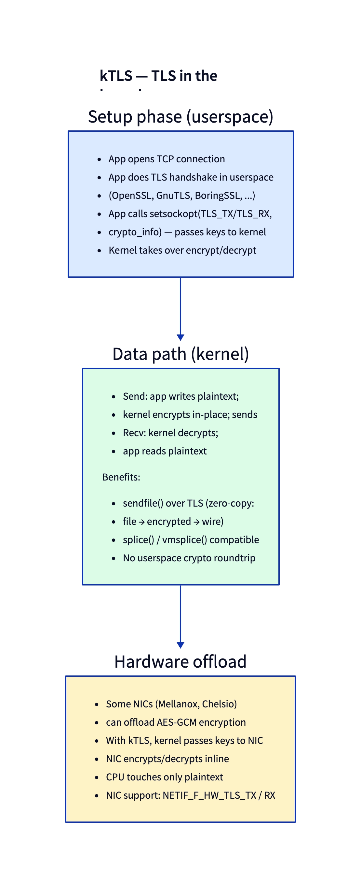

# Day 25 — kTLS: in-kernel transport encryption

> **Today's mission:** see how Linux puts AES-GCM into the kernel data path, why this matters for `sendfile()` over HTTPS, and how hardware-offloaded TLS extends the same model. Total time: ~75 minutes.

## What kTLS does

Kernel TLS (kTLS) lets the kernel handle TLS *record encryption and decryption* — but not the handshake. The pattern:

1. **Userspace performs the TLS handshake** — using OpenSSL, BoringSSL, GnuTLS, or any handshake library. The handshake produces a session key (and IV, salt, sequence number).
2. **Userspace hands the key to the kernel** via `setsockopt(SOL_TLS, TLS_TX, ...)` and `TLS_RX`.
3. **Subsequent socket I/O is automatically encrypted/decrypted by the kernel.** `write()` plaintext → kernel encrypts → ciphertext on wire. Wire ciphertext → kernel decrypts → `read()` plaintext.



The split is deliberate. The handshake involves certificate validation, X.509 parsing, complex protocol state machines, and a constantly-evolving TLS protocol. None of that belongs in the kernel — it would balloon the attack surface, demand kernel updates with every TLS protocol change, and fight kernel-OpenSSL feature parity. **The kernel only does the bulk symmetric encryption — the steady state, where every record is `AES-GCM(plaintext + AAD)` and nothing else.**

## Why it matters

### `sendfile()` over HTTPS

Without kTLS:

1. `read(file)` → kernel page cache → user buffer.
2. `SSL_write(buffer)` → OpenSSL encrypts in user buffer.
3. `send(socket)` → kernel copies to skb, sends.

Three copies, plus crypto in userspace.

With kTLS:

1. `sendfile(socket, file)` → kernel page cache → splice into skb (no userspace copy) → kernel encrypts → wire.

One copy (the encryption itself), zero context switches between read and send.

For static-file servers (CDN, image servers, video streaming) this is a massive win. Netflix's BSD-based servers (and various Linux derivatives) ship hundreds of Gbps from a single box using exactly this pattern.

### Hardware offload

NICs that support TLS offload (Mellanox ConnectX-6+, Chelsio T6, recent Intel) can do AES-GCM at the NIC. With kTLS:

1. Application writes plaintext via `sendfile()`.
2. Kernel hands plaintext skb to the driver with a per-flow key.
3. NIC encrypts inline at the DMA boundary; ciphertext goes out the wire.
4. CPU touches plaintext only.

Detected via NIC features `NETIF_F_HW_TLS_TX` / `NETIF_F_HW_TLS_RX`. Configured via the same kTLS sockopt path; kernel decides software vs hardware path based on the NIC's capability.

## The setup dance

```c
/* 1. Application opens TCP, performs TLS handshake (OpenSSL or similar).
 *    After handshake, has access to: session key, IV, salt, current rec_seq. */

/* 2. Activate kTLS on the socket */
setsockopt(fd, SOL_TCP, TCP_ULP, "tls", 4);
/* TCP_ULP = "Upper Layer Protocol"; kTLS is registered as a ULP. */

/* 3. Push TX key */
struct tls12_crypto_info_aes_gcm_128 tx = {
    .info.version = TLS_1_2_VERSION,
    .info.cipher_type = TLS_CIPHER_AES_GCM_128,
};
memcpy(tx.key, session_tx_key, 16);
memcpy(tx.iv, session_tx_iv, 8);
memcpy(tx.salt, session_tx_salt, 4);
memcpy(tx.rec_seq, session_tx_rec_seq, 8);
setsockopt(fd, SOL_TLS, TLS_TX, &tx, sizeof(tx));

/* 4. Push RX key (mirror struct, RX side) */
setsockopt(fd, SOL_TLS, TLS_RX, &rx, sizeof(rx));

/* 5. From now on, write/read produce/consume plaintext.
 *    The kernel encrypts/decrypts records transparently. */
```

`do_tls_setsockopt` in `net/tls/tls_main.c:863` is the dispatcher. The TX/RX key pushes go through `do_tls_setsockopt_conf` (line 635) which calls `tls_set_sw_offload` (software path) or `tls_set_device_offload` (hardware path, line 1062 in `tls_device.c`).

## Cipher support

```
TLS_CIPHER_AES_GCM_128       (TLSv1.2 + TLSv1.3)
TLS_CIPHER_AES_GCM_256
TLS_CIPHER_AES_CCM_128
TLS_CIPHER_CHACHA20_POLY1305 (TLSv1.2 + TLSv1.3)
TLS_CIPHER_SM4_GCM           (chinese national algorithm)
TLS_CIPHER_ARIA_GCM          (some kernels)
```

The cipher type is in `crypto_info.cipher_type`. Each cipher has its own struct (different IV/salt/key sizes). The kernel uses its `crypto/` framework to do the actual AES — same underlying routines as IPsec.

## What's NOT in kTLS

- **Handshake** (still userspace).
- **Renegotiation / rekey** (kernel doesn't track session state beyond the current key; key rotation requires application coordination).
- **TLS extensions** (the kernel handles records, not the higher-level extensions like ALPN).
- **TLS 1.0/1.1** (only 1.2 and 1.3 supported).

## Today's experiment

Most modern Linux distros have kTLS support compiled in. Verify:

```bash
ls /sys/module/tls
modinfo tls
```

To use it, an application must explicitly call the setsockopt sequence. Modern OpenSSL (1.1.1+) supports it via `SSL_OP_ENABLE_KTLS` — pass it to `SSL_CTX_set_options` and OpenSSL handshakes normally then offloads encryption.

```bash
# Test with openssl s_server (since OpenSSL 3.0)
openssl genrsa -out /tmp/k.pem 2048
openssl req -new -x509 -key /tmp/k.pem -out /tmp/c.pem -days 1 -subj /CN=test
sudo openssl s_server -accept 4443 -cert /tmp/c.pem -key /tmp/k.pem &

openssl s_client -connect 127.0.0.1:4443 -ktls
# Inside the client, type some text; verify the connection works
```

Watch with bpftrace:

```bash
sudo bpftrace -e '
fentry:do_tls_setsockopt {
  printf("setsockopt optname=%d on sk=%p\n", args->optname, args->sk);
}'
```

Run the openssl client; you'll see TX_KEY and RX_KEY pushes. (`do_tls_setsockopt` is `static`, so on some builds it may be inlined and the `fentry` probe won't attach — if so, trace the exported `tls_setsockopt` instead.)

### Watch hardware-offload status

```bash
ethtool -k eth0 | grep -i tls
# tls-hw-tx-offload: on/off
# tls-hw-rx-offload: on/off
# tls-hw-record: on/off
```

If on, your NIC has TLS offload available; kTLS will use it transparently when the cipher is supported.

## What to read in the kernel

- **`net/tls/tls_main.c:863`** — `do_tls_setsockopt`. The dispatcher (~44 lines, ending at line 906) for TLS_TX, TLS_RX, TLS_TX_ZEROCOPY_RO, etc. To follow the full setsockopt flow including the per-option handlers, read from `do_tls_setsockopt_conf` (line 635) through line 906 — ~272 lines.

- **`net/tls/tls_main.c:635`** — `do_tls_setsockopt_conf`. The TX/RX key configuration. This is where the kernel decides software (`tls_set_sw_offload`) vs hardware (`tls_set_device_offload`) and validates the crypto_info struct.

- **`net/tls/tls_sw.c`** — software encryption path. Read `tls_sw_sendmsg` (line 1288) and `tls_sw_recvmsg` (line 2060). The flow: receive plaintext from user via `tcp_sendmsg` interception, accumulate into a record, AES-GCM encrypt with the kernel's crypto API, send the ciphertext via `tcp_sendmsg`.

- **`net/tls/tls_device.c:1062`** — `tls_set_device_offload`. The hardware path. Tells the NIC about the per-flow key. The driver implements `tls_dev_add` (a member of `struct tlsdev_ops`) to register the flow with the hardware. Read this if you want to understand how kernel ↔ NIC TLS coordination works.

- **`net/tls/tls_device_fallback.c`** — what happens when hardware offload is partially failing (e.g., a packet has to be retransmitted but the NIC's key state has advanced). The kernel handles those records in software.

- **`net/tls/tls_strp.c`** — the stream parser that re-frames TCP byte stream into TLS records on the receive side. Necessary because TLS records aren't aligned to TCP segment boundaries.

- **`Documentation/networking/tls.rst`** — official doc. Practical examples of setup.

## Bullet Points

- **kTLS** = TLS records produced/consumed by the kernel after handshake done in userspace.
- Activated via `TCP_ULP=tls` + `TLS_TX` + `TLS_RX` sockopts.
- Enables zero-copy `sendfile()` for HTTPS (huge win for static-file CDNs).
- **Hardware offload** via `NETIF_F_HW_TLS_TX/RX` — NIC encrypts inline.
- Supported ciphers: AES-GCM-128/256, AES-CCM-128, ChaCha20-Poly1305, SM4-GCM.
- Only TLSv1.2 and TLSv1.3 (not 1.0/1.1).
- Used by **nginx**, **Netflix's stream servers**, **HAProxy** in some modes.
- Inspect: `modinfo tls`, `ethtool -k <dev> | grep tls`.

## Check question

Why doesn't Linux just do the TLS handshake in the kernel too? Wouldn't that simplify the API?

<details>
<summary>Click to reveal answer</summary>

**Answer:** Three reasons.

**(1) Attack surface.** TLS handshake involves certificate validation, X.509 parsing (a notoriously bug-prone format), complex state machines, and the negotiation logic for ciphers, extensions, and protocol versions. Every CVE in OpenSSL is one your attackers would now see in the kernel. The kernel community is unwilling to take that maintenance burden.

**(2) Velocity.** TLS evolves: new ciphers (every few years), protocol revisions (TLS 1.3 changed the handshake fundamentally), extensions (PSK, 0-RTT, ECH, DC). Userspace libraries iterate on these; kernel kernel-versions iterate every 2–3 months but you can't roll out kernel updates as quickly as you can update OpenSSL.

**(3) The win is in the data path, not the handshake.** A handshake is ~milliseconds, once per connection. Bulk encryption is microseconds, *millions* of times per connection. kTLS targets the bulk: AES-GCM streaming. The handshake stays in userspace where it's well-tested and easy to update.

The split is the right engineering tradeoff: userspace handles the rare-but-complex; kernel handles the common-and-simple.

</details>

---

## Tomorrow

Day 26: MPTCP — multipath TCP, the spec for "one connection over many paths."
