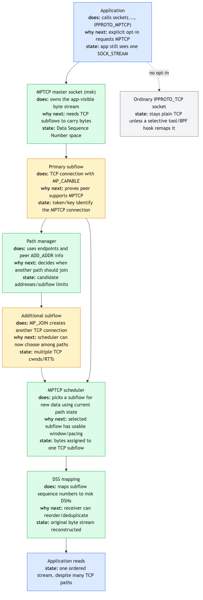

# Day 26 — MPTCP: multipath TCP

> **Today's mission:** understand how a single TCP connection can use multiple paths simultaneously, and how Linux implements MPTCP via the "msk" socket holding multiple subflows. Total time: ~75 minutes. End of Phase 4.

## What MPTCP is

A TCP connection is normally one socket pair: one client IP, one server IP, one TCP stream. **MPTCP (RFC 8684)** lets one logical connection carry data over multiple TCP "subflows" simultaneously.

The motivation: mobile devices have both WiFi and cellular. Bulk-transfer hosts have multiple NICs. Today, switching networks requires a new TCP connection — losing in-flight data and sometimes upper-layer state. MPTCP lets the connection survive a network change *and* use multiple paths concurrently for higher throughput.



## The protocol model

An MPTCP connection has:

- **One "msk" (master socket)** — what the application sees. From the application's perspective, it's a regular `SOCK_STREAM` socket.
- **One or more subflows** — each is an actual TCP connection over one path. The first subflow is the "primary"; additional subflows (`MP_JOIN`) are added later.

Each subflow is bidirectional. The MPTCP scheduler decides which subflow gets each segment (or, for redundancy, sends to both). Sequence numbers come in two layers: per-subflow (regular TCP), and per-msk (MPTCP-level), so the receiver can reconstruct the original byte stream regardless of which subflow each chunk came from.

## On-wire signaling

MPTCP uses **TCP options** (the variable-length header field) to carry its protocol:

- **MP_CAPABLE** in the SYN of the primary subflow: "I support MPTCP; do you?"
- **MP_JOIN** in the SYN of an additional subflow: "I want to join the MPTCP connection identified by token X."
- **DSS (Data Sequence Signal)**: per-segment metadata mapping the subflow's local sequence number to the msk-level sequence number.
- **ADD_ADDR / REMOVE_ADDR**: announce additional endpoints peer can use to join via MP_JOIN.

If a middlebox strips MP_* options (some old NATs do), MPTCP gracefully falls back to plain TCP.

## API

```c
int sk = socket(AF_INET, SOCK_STREAM, IPPROTO_MPTCP);
```

That's it. The application sees a regular socket. The kernel handles all subflow management. (`IPPROTO_MPTCP = 262`.)

`net.mptcp.enabled=1` controls whether MPTCP sockets can be created; it does **not** remap ordinary `IPPROTO_TCP` sockets to MPTCP. Applications opt in with `IPPROTO_MPTCP`, or an operator can use a selective mechanism such as `mptcpize`/LD_PRELOAD or a BPF socket-create hook to change specific sockets before creation.

## Endpoint configuration

Subflows aren't created automatically — you tell MPTCP which addresses can be used.

```bash
# Mark an address as an MPTCP endpoint
sudo ip mptcp endpoint add 192.168.2.10 dev eth1 signal
# 'signal' = announce this address to peers via ADD_ADDR

# Or 'subflow' = automatically initiate a subflow from this address
sudo ip mptcp endpoint add 192.168.99.5 dev eth0 subflow

# Inspect
sudo ip mptcp endpoint show
sudo ip mptcp limits show     # how many subflows max
```

Endpoint flags:
- **`signal`**: announce to peer (peer can join from this address).
- **`subflow`**: initiate a subflow from this address.
- **`backup`**: low-priority subflow (used only when others are unavailable).
- **`fullmesh`**: create subflows from this address to every peer endpoint.

## Schedulers

`net/mptcp/sched.c`. The scheduler decides which subflow gets the next segment:

- **default** (`mptcp_sched_default`): choose an available subflow using the in-kernel send-time estimate, queued data, pacing rate, window space, and backup status.

The scheduler framework is pluggable (`struct mptcp_sched_ops`), but the set available on your system is exactly what the kernel has registered. Check before configuring:

```bash
cat /proc/sys/net/mptcp/available_schedulers
cat /proc/sys/net/mptcp/scheduler
sudo sysctl -w net.mptcp.scheduler=default
```

Do not assume `redundant`, `round-robin`, or `bpf` exists unless it appears in `available_schedulers` for the kernel you are running.

## Path manager

`net/mptcp/pm_*.c` — decides *when* to add/remove subflows. Two flavors:

- **In-kernel**: the kernel's path manager uses the configured endpoints to add subflows on its own.
- **Userspace**: an application drives subflow lifecycle via the Netlink API (netlink sockets). Used by tools like `mptcpd`.

## Reliability and recovery

Each subflow is a real TCP connection — it has its own RTT, cwnd, retransmit logic. The msk-level adds:

- **Reinjection on failure**: if a subflow's RTO fires and it can't deliver, the msk reinjects the data on another subflow (so peer receives it via a different path).
- **DSN-based deduplication**: receiver sees msk-level sequence numbers; even if data arrives twice (once on each subflow), the receiver delivers it to the application only once.
- **Connection migration**: if all current subflows fail (e.g., WiFi + cellular both lose coverage briefly), the msk waits; new subflows can join when connectivity returns. The application's connection is preserved.

## Performance characteristics

MPTCP is at its best when:
- **Multiple paths exist** with similar RTTs and bandwidths.
- **Single-path failure rate is non-trivial** (mobile, lossy paths).
- **The bulk transfer is large enough** that the per-subflow setup cost is amortized.

It's worse than plain TCP when:
- Only one path is available (overhead of MPTCP options, slower handshake).
- Paths have very asymmetric RTTs (head-of-line blocking on the slow path).
- Buffer is too small to coordinate (msk-level reordering needs receive buffer ≥ BDP × N).

## Today's experiment

```bash
# Verify MPTCP support; save the current value if you change it.
old_mptcp_enabled=$(cat /proc/sys/net/mptcp/enabled)
sudo sysctl net.mptcp.enabled
sudo sysctl -w net.mptcp.enabled=1
trap 'sudo sysctl -w net.mptcp.enabled=$old_mptcp_enabled; pkill -f /tmp/mptcp_demo 2>/dev/null; rm -f /tmp/mptcp_demo /tmp/mptcp_demo.c' EXIT

# Use ip mptcp tooling
sudo ip mptcp endpoint show
cat /proc/sys/net/mptcp/available_schedulers
# 'endpoint show' is normally empty on a single-host test until you add
# endpoints — that's expected, not a failure. 'available_schedulers' prints
# at least 'default'.

# Quick test over loopback. Stock `nc` has no `--mptcp` flag and the `mptcpize`
# LD_PRELOAD wrapper needs the mptcpd package — neither is guaranteed present —
# so we use ONE self-contained binary that is both the MPTCP server and client.
# It holds the connection open for a few seconds so `ss -M` and tcpdump can
# observe the live msk and its subflow instead of catching nothing after exit.
cat << 'EOF' > /tmp/mptcp_demo.c
#include <stdio.h>
#include <stdlib.h>
#include <string.h>
#include <unistd.h>
#include <sys/socket.h>
#include <sys/wait.h>
#include <netinet/in.h>
#include <arpa/inet.h>
#ifndef IPPROTO_MPTCP
#define IPPROTO_MPTCP 262
#endif
int main(void) {
    struct sockaddr_in a = { .sin_family = AF_INET, .sin_port = htons(9999) };
    inet_aton("127.0.0.1", &a.sin_addr);

    int srv = socket(AF_INET, SOCK_STREAM, IPPROTO_MPTCP);
    if (srv < 0) { perror("socket(server)"); return 1; }
    int one = 1; setsockopt(srv, SOL_SOCKET, SO_REUSEADDR, &one, sizeof one);
    if (bind(srv, (struct sockaddr*)&a, sizeof a) < 0) { perror("bind"); return 1; }
    if (listen(srv, 1) < 0) { perror("listen"); return 1; }

    if (fork() == 0) {                      // child = client
        int c = socket(AF_INET, SOCK_STREAM, IPPROTO_MPTCP);
        if (c < 0) { perror("socket(client)"); _exit(1); }
        if (connect(c, (struct sockaddr*)&a, sizeof a) < 0) { perror("connect"); _exit(1); }
        write(c, "hello\n", 6);
        sleep(6);                           // hold the connection open to observe
        close(c); _exit(0);
    }

    int cs = accept(srv, NULL, NULL);       // parent = server
    if (cs < 0) { perror("accept"); return 1; }
    char buf[64]; int n = read(cs, buf, sizeof buf);
    if (n > 0) write(1, buf, n);            // prints "hello"
    sleep(6);
    close(cs); close(srv);
    wait(NULL);
    return 0;
}
EOF
cc /tmp/mptcp_demo.c -o /tmp/mptcp_demo

# Run it in the background so we can watch the connection while it is still up.
/tmp/mptcp_demo &
sleep 1

# 'M' = MPTCP. Shows the msk and its subflow while the connection is live.
ss -M | head
```

On loopback you see the single subflow as a pair of `ESTAB` rows (the client end
and the server end of the one path; your ephemeral port will differ):

```
State Recv-Q Send-Q Local Address:Port  Peer Address:Port
ESTAB 0      0          127.0.0.1:48902    127.0.0.1:9999
ESTAB 0      0          127.0.0.1:9999     127.0.0.1:48902
```

If `ss -M` prints only the header, the connection already closed before you
looked — the `sleep(6)` in both ends is what keeps it alive long enough to
observe, so re-run `ss -M` while `/tmp/mptcp_demo` is still in the background.

Verify via tcpdump. Start the capture **first** (line-buffered with `-l`,
self-terminating with `timeout`), then drive traffic into it. tcpdump decodes
MPTCP TCP options in **lowercase** (`mptcp ... capable`, `mptcp ... dss`), so
match those — the uppercase `MP_CAPABLE`/`DSS` tokens never appear in its output,
and `-X` only dumps payload bytes where the binary option fields are not literal
strings.

```bash
sudo timeout 8 tcpdump -l -i lo -nn 'tcp port 9999' 2>/dev/null | grep -i mptcp &
sleep 1
/tmp/mptcp_demo
```

You should see `mptcp ... capable` on the SYN/SYN-ACK (the MP_CAPABLE handshake)
and `mptcp ... dss` on the data and ACK segments:

```
IP 127.0.0.1.9999 > 127.0.0.1.48902: Flags [.], ..., options [...,mptcp 26 dss fin ack ... seq ... subseq 0 len 1,...], length 0
IP 127.0.0.1.48902 > 127.0.0.1.9999: Flags [F.], ..., options [...,mptcp 8 dss ack ...], length 0
```

### Seeing real multipath (optional)

The loopback test above only ever has **one** path — a single address pair — so
the connection completes the MP_CAPABLE handshake plus DSS on exactly **one**
subflow. `ss -M` lists that single subflow and **`MP_JOIN` never appears**:
there is no second path to join. To observe genuine multipath on a single host,
give the kernel a second address it can open an additional subflow from. This
**changes persistent kernel MPTCP state**, so undo it afterward (verify the exact
`ip mptcp` syntax on your kernel — it has shifted across releases):

```bash
# Announce a second loopback address and allow one extra subflow.
sudo ip addr add 127.0.0.2/8 dev lo
sudo ip mptcp limits set subflow 2 add_addr_accepted 2
sudo ip mptcp endpoint add 127.0.0.2 dev lo signal    # ADD_ADDR so the peer can join
sudo ip mptcp endpoint add 127.0.0.2 dev lo subflow   # initiate a subflow from it

# Re-run the transfer, then look for the second subflow and the MP_JOIN exchange:
/tmp/mptcp_demo & sleep 1; ss -M | head
sudo timeout 8 tcpdump -l -i lo -nn 'tcp port 9999' 2>/dev/null | grep -iE 'join|add'

# Cleanup
sudo ip mptcp endpoint flush
sudo ip mptcp limits set subflow 2 add_addr_accepted 0
sudo ip addr del 127.0.0.2/8 dev lo
```

With the second endpoint configured you should see `mptcp ... join` in the
capture and an extra subflow in `ss -M` — the multipath behavior that is the
whole point of MPTCP.

## What to read in the kernel

- **`net/mptcp/protocol.c`** — main file. Read `__mptcp_socket_create` to see how an msk is built. The msk owns a list of subflows.

- **`net/mptcp/subflow.c`** — subflow lifecycle. `subflow_finish_connect`, `mptcp_subflow_create_socket`. How a TCP subflow becomes part of an MPTCP connection.

- **`net/mptcp/sched.c:130`** — `mptcp_init_sched`. The scheduler entry. Read the default scheduler path to see how the kernel picks "best" subflow per send.

- **`net/mptcp/pm_kernel.c`** — in-kernel path manager. Reads MPTCP endpoint config, opens new subflows when announced.

- **`net/mptcp/pm_userspace.c`** — userspace path-manager hooks via netlink.

- **`net/mptcp/options.c`** — TCP-option encoding/decoding for MPTCP. Read `mptcp_write_options` to see how MP_CAPABLE, MP_JOIN, DSS are emitted.

- **`Documentation/networking/mptcp.rst`** — official guide. Has examples and a compatibility matrix.

- **`mptcpd`** (userspace daemon) — a reference path-manager implementation; useful to study real-world configuration patterns.

## Bullet Points

- **MPTCP** = one TCP connection, multiple TCP subflows on different paths.
- API: `socket(AF_INET, SOCK_STREAM, IPPROTO_MPTCP)`. Application code rarely needs to change.
- **Subflows** are real TCP connections; the **msk** (master) coordinates them.
- Key TCP options: **MP_CAPABLE** (handshake), **MP_JOIN** (add subflow), **DSS** (msk-level seq), **ADD_ADDR** (announce endpoints).
- **Endpoints** configured via `ip mptcp endpoint`. Flags: `signal`, `subflow`, `backup`, `fullmesh`.
- **Schedulers** are pluggable, but current choices are whatever appears in `net.mptcp.available_schedulers`; the in-tree default is `default`.
- **Mobile / multi-NIC** workloads benefit; single-path low-latency workloads see MPTCP overhead.
- In-tree since 5.6 (2020); substantial improvements every release through 7.x.

## Check question

If one subflow's RTT spikes severely (e.g., cellular degrades during a transfer), what does MPTCP do, and what's the limit of how gracefully it recovers?

<details>
<summary>Click to reveal answer</summary>

**Answer:** The default scheduler steers new segments to a better available subflow using its send-time estimate, queued data, pacing rate, window space, and backup status. A path with a much worse RTT or no usable window naturally gets less traffic. Already-in-flight segments on the slow subflow stay there until ACKed or retransmitted; MPTCP-level retransmit can also reinject them on the better subflow if the slow one's RTO fires.

**The limit is buffering.** The msk reassembles data in order at the receiver. If subflow A is fast (low RTT, current data) and subflow B is slow (high RTT, older data), the receiver has to buffer A's data while waiting for B's older data to arrive. If the receive buffer is too small (`tcp_rmem`), MPTCP can't take advantage of the path diversity — head-of-line blocking on the slow path stalls the application. Tuning: bump `tcp_rmem` to at least the sum of the BDPs across subflows.

**For sudden complete failure** (a subflow's RTO breaks): MPTCP can mark it `backup` and reinject; the application sees a brief stall but no error.

</details>

---

## End of Phase 4

You've covered the kernel's network subsystems: netfilter for packet filtering, nftables for the modern filter API, conntrack for state tracking, traffic control for queueing, SO_REUSEPORT for socket scaling, kTLS for transport crypto, MPTCP for multipath. That's the bulk of "kernel networking infrastructure beyond the basic stack."

Phase 5 (Days 27–30) covers modern features and the capstone.
