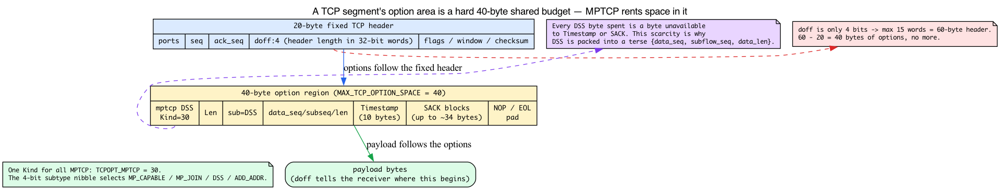
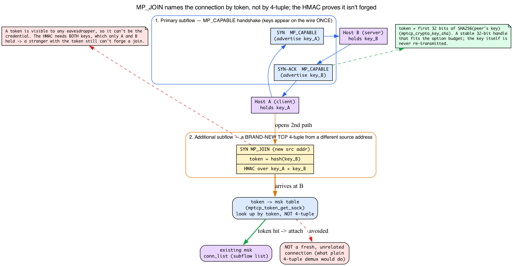
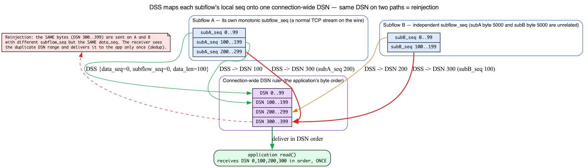
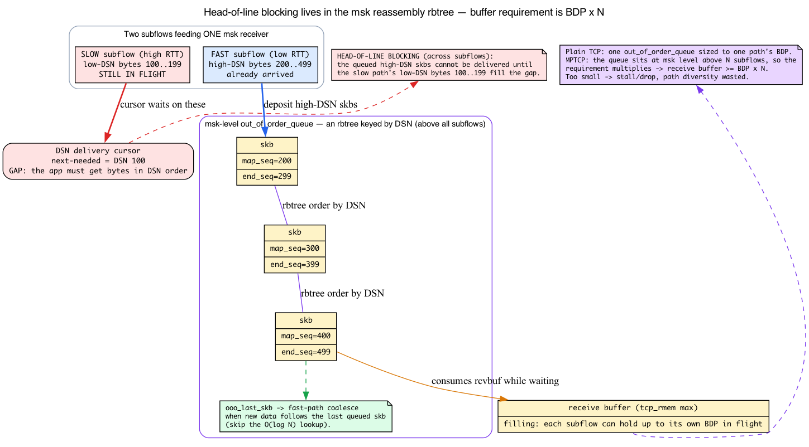

# Day 26 — MPTCP: multipath TCP

> **Today's mission:** understand how a single TCP connection can use multiple paths simultaneously, and how Linux implements MPTCP via the "msk" socket holding multiple subflows. Along the way we'll teach the four mechanisms MPTCP leans on but that no earlier chapter covered — how TCP options carry the protocol in a scarce 40-byte budget, how a token plus an HMAC binds a new subflow to the right connection, the two-layer sequence-number scheme that lets the receiver re-splice the stream, and the msk-level reassembly queue where head-of-line blocking lives — so nothing in the experiment is a black box. Total time: ~120 minutes. End of Phase 4.

## What MPTCP is

A TCP connection is normally one socket pair: one client IP, one server IP, one TCP stream. **MPTCP (RFC 8684)** lets one logical connection carry data over multiple TCP "subflows" simultaneously.

The motivation: mobile devices have both WiFi and cellular. Bulk-transfer hosts have multiple NICs. Today, switching networks requires a new TCP connection — losing in-flight data and sometimes upper-layer state. MPTCP lets the connection survive a network change *and* use multiple paths concurrently for higher throughput.


## The protocol model

An MPTCP connection has:

- **One "msk" (master socket)** — what the application sees. From the application's perspective, it's a regular `SOCK_STREAM` socket.
- **One or more subflows** — each is an actual TCP connection over one path. The first subflow is the "primary"; additional subflows (`MP_JOIN`) are added later.

Each subflow is bidirectional. The MPTCP scheduler decides which subflow gets each segment (or, for redundancy, sends to both). Sequence numbers come in two layers: per-subflow (regular TCP), and per-msk (MPTCP-level), so the receiver can reconstruct the original byte stream regardless of which subflow each chunk came from.

Three of those one-line claims — "MPTCP rides in TCP options," "the join names a connection by token," and "sequence numbers come in two layers" — are doing a lot of silent work, and the next four Backgrounds make each concrete before we touch the kernel.

## Background 1: TCP options are a scarce TLV budget — and MPTCP lives inside it

Every MP_CAPABLE, MP_JOIN, and DSS you will see today is a **TCP option**. So before "On-wire signaling" can mean anything, you need to know exactly what a TCP option is and why there is so little room for one.

**Refresher (Day 15), not re-taught:** a TCP segment is a fixed **20-byte header** followed by optional *options* and then payload. A 4-bit field called **`doff` (data offset)** in the header counts the header length in 32-bit words, so it tells the receiver where the options end and the payload begins (`day15.md:52`, `day15.md:23`). That is the entire base we build on — we will not re-derive the header.

**New — every option is a TLV.** The options area is not free-form. It is a sequence of **TLV** records: a 1-byte **Kind**, a 1-byte **Length** (covering Kind + Length + Value), then the **Value** bytes. The receiver walks them by reading Kind, then Length, then skipping Length bytes to the next option. (A couple of one-byte options — End-of-options and No-op padding — are the exception, but every option that carries data is a full Kind/Length/Value triple.)

**New — MPTCP is a single Kind, with a subtype nibble inside.** MPTCP does **not** get one option Kind per message type. It gets exactly one:

```c
/* include/net/tcp.h:216 */
#define TCPOPT_MPTCP    30   /* Multipath TCP (RFC6824) */
```

Which *kind of* MPTCP message it is — MP_CAPABLE, MP_JOIN, DSS, ADD_ADDR — is encoded as a 4-bit **subtype** nibble in the first byte of the option's Value:

```c
/* net/mptcp/protocol.h:42-45 — the subtype nibbles */
#define MPTCPOPT_MP_CAPABLE  0
#define MPTCPOPT_MP_JOIN     1
#define MPTCPOPT_DSS         2
#define MPTCPOPT_ADD_ADDR    3
```

This is exactly why tcpdump prints lines like `mptcp 26 dss`: the `30` Kind is decoded to the word `mptcp`, the `26` is the option **Length in bytes**, and `dss` is the decoded subtype nibble. When you read `mptcp 8 dss ack`, you are reading "an 8-byte option of Kind 30, subtype DSS, carrying only a Data-ACK." `mptcp_write_options()` (`net/mptcp/options.c:1403`) is the function that emits these subtypes into the option area on the send side.

**New — the 40-byte ceiling, and why it makes DSS so terse.** Because `doff` is only 4 bits, it can count at most 15 words = a 60-byte header. Subtract the fixed 20 bytes and the entire options region can be at most **40 bytes**:

```c
/* include/net/tcp.h:71 */
#define MAX_TCP_OPTION_SPACE 40
```

That 40 bytes is a hard, shared budget. MPTCP options must fit alongside everything else TCP already wants to put there — the timestamp option (10 bytes), SACK blocks (up to ~34 bytes), window scale, MSS on the SYN. There is no room for a verbose encoding. This scarcity is the entire reason DSS is packed into a tight `{data_seq, subflow_seq, data_len}` triple (Background 3) and the reason the "Performance characteristics" section warns about MPTCP's per-segment overhead: every DSS byte spent is a byte unavailable to timestamps or SACK.



**New — why a middlebox can silently strip it.** A TCP option is *optional, and some middleboxes strip ones they do not recognize*: a spec-compliant router forwards Kind 30 unchanged, but a non-compliant NAT that does not understand it may drop it while forwarding the rest of the segment. The peer's TCP still sees a valid stream — just without the MP_CAPABLE handshake. This is the mechanism behind "graceful fallback": because the MPTCP signaling lives entirely in a strippable, optional header field, a path that mangles it causes the connection to **degrade to ordinary single-path TCP** rather than break. You cannot understand the fallback paragraph below without first seeing that the protocol's whole presence on the wire is optional.

## On-wire signaling

MPTCP uses **TCP options** (the variable-length header field from Background 1) to carry its protocol — all under the single Kind 30, distinguished by subtype:

- **MP_CAPABLE** in the SYN of the primary subflow: "I support MPTCP; do you?"
- **MP_JOIN** in the SYN of an additional subflow: "I want to join the MPTCP connection identified by token X." (What that token *is* and how it routes to the right connection is Background 2.)
- **DSS (Data Sequence Signal)**: per-segment metadata mapping the subflow's local sequence number to the msk-level sequence number (Background 3).
- **ADD_ADDR / REMOVE_ADDR**: announce additional endpoints the peer can use to join via MP_JOIN.

If a middlebox strips MP_* options (some old NATs do), MPTCP gracefully falls back to plain TCP — for exactly the reason Background 1 gave: the options are optional, so a NAT that strips an unrecognized Kind 30 leaves a valid ordinary TCP stream behind.

## Background 2: the token — binding a new subflow to the right msk

The MP_JOIN above says "join the connection identified by token X." That sentence raises three questions the chapter otherwise leaves open: where does the token come from, how does the receiving host turn a token back into the right connection, and what stops a stranger from guessing a token and hijacking the connection? Here are all three.

**New — the token is a hash of the peer's key.** During the MP_CAPABLE handshake each side exchanges a **64-bit key**. The 32-bit **token** advertised later in MP_JOIN is a cryptographic hash (SHA-256) of the peer's key — a stable, connection-unique handle that fits the tight option budget without ever putting the key back on the wire:

```c
/* net/mptcp/crypto.c:30 — token = first 32 bits of SHA256(key) */
void mptcp_crypto_key_sha(u64 key, u32 *token, u64 *idsn)
```

The msk stores its own token so the lookup table can find it:

```c
/* net/mptcp/protocol.h:309 */
u32  token;
```

**New — the receiver demuxes by token, not by 4-tuple.** Recall Day 13: ordinary TCP finds the owning `struct sock` for an incoming segment by hashing its **4-tuple** (src IP, src port, dst IP, dst port). But an MP_JOIN SYN arrives on a *brand-new* TCP 4-tuple — a never-before-seen address pair — so 4-tuple demux would create a fresh, unrelated connection. MPTCP adds a **second demux key**: the kernel keeps a global token→msk table and looks the token up directly.

```c
/* net/mptcp/token.c:246 — retrieve the owning msk from the token */
struct mptcp_sock *mptcp_token_get_sock(struct net *net, u32 token)
```

When the lookup succeeds, the new subflow is attached to that existing msk's subflow list instead of starting a new connection — this is the concrete mechanism behind "the msk owns a list of subflows". The snippet below is the *primary* subflow being added at msk creation; an `MP_JOIN` later appends to this **same** `conn_list` from the subflow-receive path (`net/mptcp/protocol.c:3609`):

```c
/* net/mptcp/protocol.c:103-117 — __mptcp_socket_create() adds the FIRST subflow */
err = mptcp_subflow_create_socket(sk, sk->sk_family, &ssock);
...
list_add(&subflow->node, &msk->conn_list);   /* the conn_list the msk owns; a join appends here too, from protocol.c:3609 */
```

**New — the HMAC stops a stranger from forging *or replaying* a join.** A token is visible to anyone who watched the handshake, so a token alone cannot be the credential. MP_JOIN also carries an **HMAC** that is *keyed by both 64-bit keys* — which only the two endpoints possess (the keys appeared on the wire only during the initial MP_CAPABLE handshake) — and computed over the *two random nonces* the ends exchange in the MP_JOIN handshake itself (one nonce per direction). The keys authenticate; the nonces make every join challenge-response fresh:

```c
/* net/mptcp/subflow.c:50 — keys are the HMAC *key*; the *message* is the two nonces */
static void subflow_generate_hmac(u64 key1, u64 key2, u32 nonce1, u32 nonce2,
                                  void *hmac)
/* net/mptcp/crypto.c:43 — the underlying keyed HMAC (msg is supplied by the caller above) */
void mptcp_crypto_hmac_sha(u64 key1, u64 key2, u8 *msg, int len, void *hmac)
```

So the answer to "can't anyone with the token inject a subflow?" is no, on two counts: a forger would need *both* keys to key the HMAC (and the keys are never re-transmitted after MP_CAPABLE), and even an attacker who captured one valid MP_JOIN cannot replay it, because the fresh per-join nonces make each HMAC unique.



## Background 3: two layers of sequence numbers, and the DSS mapping that glues them

"Sequence numbers come in two layers" is the line that makes reinjection, dedup, and reassembly possible — but the chapter never shows what the second layer carries or why one layer isn't enough. Here it is.

**Refresher (Day 15), not re-taught:** in plain TCP, `seq` numbers the bytes I send and `ack_seq` is the next byte I expect (`day15.md:48`, `day15.md:67`). Recall that; we build on top of it.

**New — why two layers are unavoidable.** Each subflow must put **ordinary, contiguous TCP sequence numbers** on the wire, because the peer's TCP stack and every middlebox along that path expect a normal, gap-free TCP stream — anything else looks like corruption and gets dropped. But those per-subflow counters are **independent across subflows**: subflow A's byte 5000 and subflow B's byte 5000 have nothing to do with each other. They cannot, by themselves, tell the receiver how to splice two streams back into the single byte order the application sent. So MPTCP adds a second counter: the **Data Sequence Number (DSN)**, a single connection-wide sequence space over the *application's* bytes.

**New — DSS is the mapping between the two.** The DSS option is the per-segment glue. It carries a mapping triple plus an independent Data-ACK:

```c
/* net/mptcp/protocol.h:149-151 — the DSS mapping triple */
u64  data_seq;     /* msk-level DSN where this mapping starts */
u32  subflow_seq;  /* offset into THIS subflow's stream where it starts */
u16  data_len;     /* how many bytes the mapping covers */
```

The receiver reads it as: "the `data_len` bytes that arrived at subflow offset `subflow_seq` actually belong at DSN `data_seq` in the application stream." That translation is what lets bytes that travelled different paths be re-ordered into one stream. DSS also carries a separate **Data-ACK**, so the msk can free send-buffer data at the connection level independently of each subflow's own ACKs. The subtype is `MPTCPOPT_DSS = 2` (`net/mptcp/protocol.h:44`), and on the send side each application chunk waiting to go out is tracked as a data-level fragment that remembers its DSN:

```c
/* net/mptcp/protocol.h:261-263 */
struct mptcp_data_frag {
    struct list_head list;
    u64 data_seq;      /* the DSN this fragment occupies */
```

`mptcp_write_options()` (`net/mptcp/options.c:1403`) emits the DSS mapping into the option area.

**New — this is what makes reinjection cheap.** Because the DSN is independent of any subflow's sequence space, the **same application bytes** can be sent on two different subflows with two different `subflow_seq` values but the **same `data_seq`**. The receiver sees the duplicate DSN range and delivers it to the application only once. That is the payoff you'll meet in "Reliability and recovery": a stalled subflow's data can be *reinjected* on a healthy one without the application ever seeing a duplicate.



## There are no Dumb Questions

**Q: The token is just a public hash of a key anyone could have sniffed. If I know the token, can't I inject my own subflow into someone else's connection?**

A: No. The token only *routes* an MP_JOIN to the right msk; it is not the credential. The join must also carry an HMAC that is **keyed by both endpoints' 64-bit keys**, and those keys went on the wire only once, inside the initial MP_CAPABLE handshake. Without both keys you cannot produce a valid HMAC, so the token alone gets you nowhere. And because the HMAC is computed over fresh per-join nonces, you cannot even replay a valid join you captured earlier — each one is unique.

**Q: Why two sequence numbers per byte? Why not just one big connection-wide counter and skip the per-subflow seq?**

A: Because each subflow is a *real* TCP connection that real middleboxes inspect. The peer's TCP stack and every NAT/firewall on that path expect an ordinary, gap-free TCP sequence stream — feed them a connection-wide DSN with holes (because other bytes went down a different subflow) and it looks like corruption and gets dropped. So each subflow must carry normal, contiguous TCP seq numbers to *look normal*, and MPTCP layers the DSN on top via DSS to splice the streams back together.


## API

```c
int sk = socket(AF_INET, SOCK_STREAM, IPPROTO_MPTCP);
```

That's it. The application sees a regular socket. The kernel handles all subflow management. (`IPPROTO_MPTCP = 262`.)

`net.mptcp.enabled=1` controls whether MPTCP sockets can be created; it does **not** remap ordinary `IPPROTO_TCP` sockets to MPTCP. Applications opt in with `IPPROTO_MPTCP`, or an operator can use a selective mechanism such as `mptcpize`/LD_PRELOAD or a BPF socket-create hook to change specific sockets before creation.

## Endpoint configuration

Subflows aren't created automatically — you tell MPTCP which addresses can be used.

```bash
# Mark an address as an MPTCP endpoint
sudo ip mptcp endpoint add 192.168.2.10 dev eth1 signal
# 'signal' = announce this address to peers via ADD_ADDR

# Or 'subflow' = automatically initiate a subflow from this address
sudo ip mptcp endpoint add 192.168.99.5 dev eth0 subflow

# Inspect
sudo ip mptcp endpoint show
sudo ip mptcp limits show     # how many subflows max
```

Endpoint flags:
- **`signal`**: announce to peer (peer can join from this address).
- **`subflow`**: initiate a subflow from this address.
- **`backup`**: low-priority subflow (used only when others are unavailable).
- **`fullmesh`**: create subflows from this address to every peer endpoint.

(`ip mptcp` is a netlink client — see the path-manager note below for how these commands actually reach the kernel.)

## Schedulers

`net/mptcp/sched.c`. The scheduler decides which subflow gets the next segment:

- **default** (`mptcp_sched_default`): choose an available subflow using the in-kernel send-time estimate, queued data, pacing rate, window space, and backup status.

The scheduler framework is pluggable (`struct mptcp_sched_ops`), but the set available on your system is exactly what the kernel has registered. Check before configuring:

```bash
cat /proc/sys/net/mptcp/available_schedulers
cat /proc/sys/net/mptcp/scheduler
sudo sysctl -w net.mptcp.scheduler=default
```

Do not assume `redundant`, `round-robin`, or `bpf` exists unless it appears in `available_schedulers` for the kernel you are running.

## Path manager

`net/mptcp/pm_*.c` — decides *when* to add/remove subflows. Two flavors:

- **In-kernel**: the kernel's path manager uses the configured endpoints to add subflows on its own.
- **Userspace**: an application drives subflow lifecycle via the Netlink API (netlink sockets). Used by tools like `mptcpd`.

**How config reaches the kernel (refresher, Day 8).** Recall from Day 8's Background 4 (`day08.md:257`) that `ip route` is just a netlink client: it opens an `AF_NETLINK` socket and sends structured messages that per-type handlers turn into FIB changes. `ip mptcp` and daemons like `mptcpd` program kernel MPTCP state the *same* way — except MPTCP registers its **own generic-netlink family** (the `pm_netlink` / `pm_userspace` path) rather than reusing rtnetlink. Every `ip mptcp endpoint add` and `ip mptcp limits set` you run below is a generic-netlink message into that family. We don't re-teach the netlink socket model here — see Day 8.

## Reliability and recovery

Each subflow is a real TCP connection — it has its own RTT, cwnd, retransmit logic. The msk-level adds:

- **Reinjection on failure**: if a subflow's RTO fires and it can't deliver, the msk reinjects the data on another subflow (so peer receives it via a different path). This is exactly the reinjection Background 3 set up: same DSN, different subflow_seq.
- **DSN-based deduplication**: receiver sees msk-level sequence numbers; even if data arrives twice (once on each subflow), the receiver delivers it to the application only once.
- **Connection migration**: if all current subflows fail (e.g., WiFi + cellular both lose coverage briefly), the msk waits; new subflows can join when connectivity returns. The application's connection is preserved.

## Background 4: the msk reassembly queue and head-of-line blocking

The "Performance characteristics" warning ("receive buffer ≥ BDP × N," "head-of-line blocking on the slow path") and the entire Check answer hinge on one structure: the queue where the msk holds out-of-order data while it waits. Here is what it is and why its size scales with the number of subflows.

**Refresher (Days 17–18), not re-derived:** Day 18 taught the **bandwidth-delay product (BDP)** — bytes in flight on a full pipe = bandwidth × RTT — and receive-buffer **auto-tuning** within the `tcp_rmem[min, default, max]` triplet, plus the `SOCK_RCVBUF_LOCK` userlock that opts you out of it (`day18.md:116-130`). Day 17 taught in-flight accounting (`day17.md:138`). Recall those; the Check answer's "bump tcp_rmem to the sum of the BDPs" only makes sense on top of them.

**New — what head-of-line (HoL) blocking is.** The term appears nowhere earlier in the book, so define it precisely. The application must receive bytes in **DSN order** — byte N before byte N+1, no gaps. Suppose a fast subflow has already delivered a chunk at a *high* DSN, but the *low* DSN bytes that come before it are still in flight on a slow subflow. The high-DSN bytes cannot be handed to the application yet — they have to wait for the missing low-DSN bytes at the *head of the line*. The fast path stalls on the slow path. That is HoL blocking, and on MPTCP it happens **across** subflows, not within one.

**New — the structure that holds the waiting data.** The early-arriving high-DSN skbs go into the msk's **out-of-order reassembly queue**, an rbtree keyed by DSN:

```c
/* net/mptcp/protocol.c:266-271 — insert an out-of-order skb into the msk's DSN rbtree */
p = &msk->out_of_order_queue.rb_node;
...
rb_insert_color(&skb->rbnode, &msk->out_of_order_queue);
msk->ooo_last_skb = skb;
```

A fast-path coalesce check uses `ooo_last_skb` to avoid an O(log N) lookup when data arrives right after the last queued skb (`net/mptcp/protocol.c:278-285`). Each queued skb remembers its DSN range in its control block:

```c
/* net/mptcp/protocol.h:128-136 */
struct mptcp_skb_cb {
    u64 map_seq;   /* first DSN this skb covers   */
    u64 end_seq;   /* one past the last DSN        */
    ...
};
```

That rbtree is what **consumes receive buffer** while the slow subflow's head-of-line bytes are outstanding. If the buffer cannot hold roughly one BDP's worth of data *per subflow*, the kernel must stall or drop, and the path diversity MPTCP exists to exploit is wasted. That is the concrete grounding for the "BDP × N" claim: the requirement scales with the **number of subflows** because every subflow can have up to its own BDP in flight, and the receiver may have to buffer all of it at once.

**New — contrast with single-path TCP.** Plain TCP has a single per-socket `out_of_order_queue` sized to one path's BDP. MPTCP's reassembly queue lives at the **msk level, above all subflows**, which is exactly why its buffer requirement multiplies by N rather than staying fixed at one path's worth.



## Performance characteristics

MPTCP is at its best when:
- **Multiple paths exist** with similar RTTs and bandwidths.
- **Single-path failure rate is non-trivial** (mobile, lossy paths).
- **The bulk transfer is large enough** that the per-subflow setup cost is amortized.

It's worse than plain TCP when:
- Only one path is available (overhead of MPTCP options, slower handshake).
- Paths have very asymmetric RTTs (head-of-line blocking on the slow path — Background 4).
- Buffer is too small to coordinate (msk-level reordering needs receive buffer ≥ BDP × N — Background 4).

## Today's experiment

```bash
# Verify MPTCP support; save the current value if you change it.
old_mptcp_enabled=$(cat /proc/sys/net/mptcp/enabled)
sudo sysctl net.mptcp.enabled
sudo sysctl -w net.mptcp.enabled=1
trap 'sudo sysctl -w net.mptcp.enabled=$old_mptcp_enabled; pkill -f /tmp/mptcp_demo 2>/dev/null; rm -f /tmp/mptcp_demo /tmp/mptcp_demo.c' EXIT

# Use ip mptcp tooling
sudo ip mptcp endpoint show
cat /proc/sys/net/mptcp/available_schedulers
# 'endpoint show' is normally empty on a single-host test until you add
# endpoints — that's expected, not a failure. 'available_schedulers' prints
# at least 'default'.

# Quick test over loopback. Stock `nc` has no `--mptcp` flag and the `mptcpize`
# LD_PRELOAD wrapper needs the mptcpd package — neither is guaranteed present —
# so we use ONE self-contained binary that is both the MPTCP server and client.
# It holds the connection open for a few seconds so `ss -M` and tcpdump can
# observe the live msk and its subflow instead of catching nothing after exit.
cat << 'EOF' > /tmp/mptcp_demo.c
#include <stdio.h>
#include <stdlib.h>
#include <string.h>
#include <unistd.h>
#include <sys/socket.h>
#include <sys/wait.h>
#include <netinet/in.h>
#include <arpa/inet.h>
#ifndef IPPROTO_MPTCP
#define IPPROTO_MPTCP 262
#endif
int main(void) {
    struct sockaddr_in a = { .sin_family = AF_INET, .sin_port = htons(9999) };
    inet_aton("127.0.0.1", &a.sin_addr);

    int srv = socket(AF_INET, SOCK_STREAM, IPPROTO_MPTCP);
    if (srv < 0) { perror("socket(server)"); return 1; }
    int one = 1; setsockopt(srv, SOL_SOCKET, SO_REUSEADDR, &one, sizeof one);
    if (bind(srv, (struct sockaddr*)&a, sizeof a) < 0) { perror("bind"); return 1; }
    if (listen(srv, 1) < 0) { perror("listen"); return 1; }

    if (fork() == 0) {                      // child = client
        int c = socket(AF_INET, SOCK_STREAM, IPPROTO_MPTCP);
        if (c < 0) { perror("socket(client)"); _exit(1); }
        if (connect(c, (struct sockaddr*)&a, sizeof a) < 0) { perror("connect"); _exit(1); }
        write(c, "hello\n", 6);
        sleep(6);                           // hold the connection open to observe
        close(c); _exit(0);
    }

    int cs = accept(srv, NULL, NULL);       // parent = server
    if (cs < 0) { perror("accept"); return 1; }
    char buf[64]; int n = read(cs, buf, sizeof buf);
    if (n > 0) write(1, buf, n);            // prints "hello"
    sleep(6);
    close(cs); close(srv);
    wait(NULL);
    return 0;
}
EOF
cc /tmp/mptcp_demo.c -o /tmp/mptcp_demo

# Run it in the background so we can watch the connection while it is still up.
/tmp/mptcp_demo &
sleep 1

# 'M' = MPTCP. Shows the msk and its subflow while the connection is live.
ss -M | head
```

On loopback you see the single subflow as a pair of `ESTAB` rows (the client end
and the server end of the one path; your ephemeral port will differ):

```
State Recv-Q Send-Q Local Address:Port  Peer Address:Port
ESTAB 0      0          127.0.0.1:48902    127.0.0.1:9999
ESTAB 0      0          127.0.0.1:9999     127.0.0.1:48902
```

If `ss -M` prints only the header, the connection already closed before you
looked — the `sleep(6)` in both ends is what keeps it alive long enough to
observe, so re-run `ss -M` while `/tmp/mptcp_demo` is still in the background.

Verify via tcpdump. Start the capture **first** (line-buffered with `-l`,
self-terminating with `timeout`), then drive traffic into it. tcpdump decodes
MPTCP TCP options in **lowercase** (`mptcp ... capable`, `mptcp ... dss`), so
match those — the uppercase `MP_CAPABLE`/`DSS` tokens never appear in its output,
and `-X` only dumps payload bytes where the binary option fields are not literal
strings.

```bash
sudo timeout 8 tcpdump -l -i lo -nn 'tcp port 9999' 2>/dev/null | grep -i mptcp &
sleep 1
/tmp/mptcp_demo
```

You should see `mptcp ... capable` on the SYN/SYN-ACK (the MP_CAPABLE handshake)
and `mptcp ... dss` on the data and ACK segments:

```
IP 127.0.0.1.9999 > 127.0.0.1.48902: Flags [.], ..., options [...,mptcp 26 dss fin ack ... seq ... subseq 0 len 1,...], length 0
IP 127.0.0.1.48902 > 127.0.0.1.9999: Flags [F.], ..., options [...,mptcp 8 dss ack ...], length 0
```

(Now you can read those lines: `mptcp` is Kind 30, the number after it is the
option **Length** in bytes, `dss` is the subtype, and `seq`/`subseq`/`len` are the
DSS mapping triple from Background 3.)

### Seeing real multipath (optional)

The loopback test above only ever has **one** path — a single address pair — so
the connection completes the MP_CAPABLE handshake plus DSS on exactly **one**
subflow. `ss -M` lists that single subflow and **`MP_JOIN` never appears**:
there is no second path to join. To observe genuine multipath on a single host,
give the kernel a second address it can open an additional subflow from. This
**changes persistent kernel MPTCP state**, so undo it afterward (verify the exact
`ip mptcp` syntax on your kernel — it has shifted across releases):

```bash
# Announce a second loopback address and allow one extra subflow.
sudo ip addr add 127.0.0.2/8 dev lo
sudo ip mptcp limits set subflow 2 add_addr_accepted 2
sudo ip mptcp endpoint add 127.0.0.2 dev lo signal subflow  # ADD_ADDR so the peer can join + initiate a subflow from it

# Re-run the transfer, then look for the second subflow and the MP_JOIN exchange:
/tmp/mptcp_demo & sleep 1; ss -M | head
sudo timeout 8 tcpdump -l -i lo -nn 'tcp port 9999' 2>/dev/null | grep -iE 'join|add'

# Cleanup
sudo ip mptcp endpoint flush
sudo ip mptcp limits set subflow 2 add_addr_accepted 0
sudo ip addr del 127.0.0.2/8 dev lo
```

With the second endpoint configured you should see `mptcp ... join` in the
capture and an extra subflow in `ss -M` — the multipath behavior that is the
whole point of MPTCP. (The `join` you see carries the token and HMAC from
Background 2; the token is what routes that brand-new 4-tuple onto the existing
msk.)

## What to read in the kernel

- **`net/mptcp/protocol.c`** — main file. Read `__mptcp_socket_create` to see how an msk is built. The msk owns a list of subflows.

- **`net/mptcp/subflow.c`** — subflow lifecycle. `subflow_finish_connect`, `mptcp_subflow_create_socket`. How a TCP subflow becomes part of an MPTCP connection.

- **`net/mptcp/sched.c:130`** — `mptcp_init_sched`. The scheduler entry. Read the default scheduler path to see how the kernel picks "best" subflow per send.

- **`net/mptcp/pm_kernel.c`** — in-kernel path manager. Reads MPTCP endpoint config, opens new subflows when announced.

- **`net/mptcp/pm_userspace.c`** — userspace path-manager hooks via netlink.

- **`net/mptcp/options.c`** — TCP-option encoding/decoding for MPTCP. Read `mptcp_write_options` to see how MP_CAPABLE, MP_JOIN, DSS are emitted.

- **`Documentation/networking/mptcp.rst`** — official guide. Has examples and a compatibility matrix.

- **`mptcpd`** (userspace daemon) — a reference path-manager implementation; useful to study real-world configuration patterns.

## Bullet Points

- **MPTCP** = one TCP connection, multiple TCP subflows on different paths.
- API: `socket(AF_INET, SOCK_STREAM, IPPROTO_MPTCP)`. Application code rarely needs to change.
- **Subflows** are real TCP connections; the **msk** (master) coordinates them.
- All MPTCP signaling rides in **TCP options under one Kind, `TCPOPT_MPTCP = 30`**, sharing the hard **`MAX_TCP_OPTION_SPACE = 40`** byte budget; the message type is a 4-bit **subtype** nibble (MP_CAPABLE/MP_JOIN/DSS/ADD_ADDR). Because options are optional and some NATs strip ones they do not recognize, a middlebox that drops Kind 30 forces graceful fallback to plain TCP.
- Key TCP options: **MP_CAPABLE** (handshake, exchanges 64-bit keys), **MP_JOIN** (add subflow, carries token = SHA256(peer key) + HMAC keyed by both keys, computed over the two per-join nonces), **DSS** (maps subflow_seq→msk DSN + Data-ACK), **ADD_ADDR** (announce endpoints).
- A new MP_JOIN is demuxed by **token→msk lookup** (`mptcp_token_get_sock`), not by 4-tuple, so a packet from a never-seen address still finds its connection; the HMAC stops forged joins.
- **Two sequence layers:** per-subflow TCP seq (so each path looks normal) and the connection-wide **DSN**; DSS is the glue, and a shared DSN with different subflow_seq is what enables reinjection and dedup.
- The receiver buffers out-of-order data in the **msk-level `out_of_order_queue` rbtree (keyed by DSN)**; **head-of-line blocking** across subflows means the requirement is roughly **BDP × N** of receive buffer.
- **Endpoints** configured via `ip mptcp endpoint` (a generic-netlink client, like `ip route` over rtnetlink — Day 8). Flags: `signal`, `subflow`, `backup`, `fullmesh`.
- **Schedulers** are pluggable, but current choices are whatever appears in `net.mptcp.available_schedulers`; the in-tree default is `default`.
- **Mobile / multi-NIC** workloads benefit; single-path low-latency workloads see MPTCP overhead.
- In-tree since 5.6 (2020); substantial improvements every release through 7.x.

## Check question

If one subflow's RTT spikes severely (e.g., cellular degrades during a transfer), what does MPTCP do, and what's the limit of how gracefully it recovers?

<details>
<summary>Click to reveal answer</summary>

**Answer:** The default scheduler steers new segments to a better available subflow using its send-time estimate, queued data, pacing rate, window space, and backup status. A path with a much worse RTT or no usable window naturally gets less traffic. Already-in-flight segments on the slow subflow stay there until ACKed or retransmitted; MPTCP-level retransmit can also reinject them on the better subflow if the slow one's RTO fires (same DSN, different subflow_seq — Background 3).

**The limit is buffering.** The msk reassembles data in order at the receiver, in the `out_of_order_queue` rbtree keyed by DSN (Background 4). If subflow A is fast (low RTT, current data) and subflow B is slow (high RTT, older data), the receiver has to buffer A's high-DSN data while waiting for B's older low-DSN data to arrive. If the receive buffer is too small (`tcp_rmem`), MPTCP can't take advantage of the path diversity — head-of-line blocking on the slow path stalls the application. Tuning: bump `tcp_rmem` to at least the sum of the BDPs across subflows.

**For sudden complete failure** (a subflow's RTO breaks): MPTCP can mark it `backup` and reinject; the application sees a brief stall but no error.

</details>

---

## End of Phase 4

You've covered the kernel's network subsystems: netfilter for packet filtering, nftables for the modern filter API, conntrack for state tracking, traffic control for queueing, SO_REUSEPORT for socket scaling, kTLS for transport crypto, MPTCP for multipath. That's the bulk of "kernel networking infrastructure beyond the basic stack."

Phase 5 (Days 27–30) covers modern features and the capstone.
