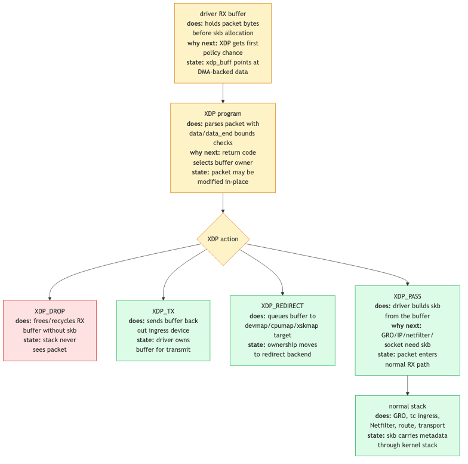

# Day 27 — XDP and the rest of the stack

> **Today's mission:** see exactly where the XDP hook sits in the receive path, why it can do things faster than tc-bpf, and how XDP cooperates with (rather than replacing) the regular Linux network stack. Total time: ~75 minutes.

> **Phase 5 starts here.** The last four days cover the modern hooks layered on top of everything you've learned, plus a capstone day where you trace one real packet end-to-end.

## What XDP is, kernel-side

XDP — eXpress Data Path — is a BPF-program hook *inside the NIC driver's RX path*, before any `sk_buff` is allocated. It runs on the raw frame received from the hardware, decides what to do with it, and either:

- Drops it (XDP_DROP) — packet freed, no kernel work done.
- Passes it (XDP_PASS) — kernel allocates skb and continues with normal RX (Day 2).
- Sends it back out the same NIC (XDP_TX) — reflects the packet without ever touching skb.
- Redirects it (XDP_REDIRECT) — sends to a different netdev, a CPU map (cpumap), or an AF_XDP socket.
- Aborts (XDP_ABORTED) — same effect as DROP plus a tracepoint fires (debugging signal).



This is the **earliest hook in the kernel for incoming packets**. There's nothing before XDP except the NIC and the driver code that just received the frame.

## Why this matters

A `sk_buff` allocation costs ~500 ns (metadata, refcount setup, cache-line dirtying). Routing, conntrack, netfilter — each adds more. For high-rate packet filtering or load balancing, you don't want to do any of that for packets you'll just drop or redirect.

XDP runs at ~10 ns of fixed overhead plus your program's logic. A drop in XDP is the cheapest packet operation Linux can do. Cilium's load balancer, Cloudflare's DDoS scrubbing, Facebook's Katran — all use XDP to decide "drop / pass / redirect / mangle" in the few hundred nanoseconds before the kernel commits to processing the packet.

## Three modes

XDP has three execution modes, picked at attach time:

### Native XDP (default, fastest)

The driver implements XDP support: it calls `bpf_prog_run_xdp` directly from its NAPI poll, before allocating skb. The packet is in the driver's RX buffer; XDP gets a pointer to it and the data length. ~10 ns overhead for an empty program.

Major drivers with native XDP: ixgbe, i40e, mlx5, mlx4, virtio_net, veth (yes, veth supports XDP — useful for testing).

### Generic XDP (`XDP_FLAGS_SKB_MODE`)

Works on any driver. The kernel implements XDP as a hook *after* the driver has done some skb-related setup. Slower than native (~half the speed) because it duplicates work.

Use generic when your NIC doesn't support native XDP. Or for development on virtio in older VM setups.

### Hardware-offloaded XDP (`XDP_FLAGS_HW_MODE`)

The BPF program is JITed to NIC firmware (Netronome NFP, some Mellanox SKUs). Runs *on the NIC*, not on the host CPU. Insanely fast for simple programs but very limited (no maps, no helpers — depends on what the NIC supports).

Practically rare; most production XDP runs in native mode.

## XDP and the rest of the stack

XDP doesn't *replace* the network stack — it sits in front of it. For traffic that returns `XDP_PASS`:

1. XDP returns PASS.
2. Driver allocates skb (`napi_alloc_skb`).
3. Normal RX path (Day 2): GRO, `__netif_receive_skb_core`, tc-bpf ingress, IP, conntrack, sockets.

XDP is "the fast path for the easy cases." Everything else still flows through the regular stack.

### Cooperating with tc-bpf

Many production setups use both. **XDP for high-rate fast-path drops/redirects**, **tc-bpf for everything skb-aware**. Cilium, for example:

- XDP for L3 service load balancing (a few hot services with millions of pps).
- tc-bpf for L4 connection tracking, NetworkPolicy enforcement, encryption negotiation.
- The two work in sequence: XDP runs first, returns PASS for traffic tc-bpf needs to see.

You can attach both to the same interface. They don't interfere — XDP runs at packet boundary; tc-bpf runs at skb boundary; the only shared resource is the kernel's BPF map ecosystem (where they can communicate via shared maps).

## XDP_REDIRECT — where it shines

`bpf_redirect_map()` is the highest-throughput mechanism XDP exposes. Three target map types:

### `BPF_MAP_TYPE_DEVMAP`

`{ netdev_index → netdev *, optional egress XDP program }`. `XDP_REDIRECT` to this map sends the packet to the named netdev. Used for L3 forwarding, container networking (redirect from physical NIC into a veth), gateway boxes.

### `BPF_MAP_TYPE_CPUMAP`

`{ cpu_id → cpu queue }`. Redirects the packet to a different CPU's per-CPU queue, which then runs the *kernel* RX path on that CPU. Useful for steering: "RSS landed this on CPU 0 but the destination socket is pinned to CPU 4 — redirect."

### `BPF_MAP_TYPE_XSKMAP`

`{ queue_id → AF_XDP socket }`. Sends the packet directly to userspace via AF_XDP — zero-copy if the NIC supports it. The basis of high-throughput userspace packet processing (DPDK-on-Linux-without-DPDK).

## Limitations

- **No fragmentation handling.** XDP sees the raw frame as the NIC delivered it; it can't reassemble IP fragments (would require buffering).
- **No GRO.** GRO happens after XDP. If you want coalesced superpackets, see them in tc-bpf, not XDP.
- **Limited mutation.** You can `bpf_xdp_adjust_head` to add/remove bytes at the front, `bpf_xdp_adjust_tail` for the back. But you can't reach inside arbitrarily without bounds checking.
- **No skb metadata.** No conntrack info, no netfilter mark, no socket lookup (until kernel 5.0 added `bpf_sk_lookup_tcp/udp` to the XDP hook).

## Today's experiment

```bash
# See if your driver supports native XDP. Find your NIC first — on most modern
# distros and cloud VMs the primary NIC is enp0s3/ens5/eno1, not eth0.
ip -br link                       # list interfaces, pick your NIC
ethtool -i <iface> | grep driver  # e.g. virtio_net, mlx5_core, ixgbe
# virtio_net and veth support native XDP; many cloud NICs only do generic mode.

# Quick test on veth (always supports XDP). Put the peer in its OWN netns so the
# frame is forced across the wire and is actually *received* on veth0's RX path.
# If both ends share the root namespace, the kernel short-circuits via the
# loopback fast-path, the frame never crosses the link, and the XDP program on
# veth0 never runs (the ping would simply succeed and teach you nothing).
sudo ip link add veth0 type veth peer name veth1
sudo ip netns add ns1
sudo ip link set veth1 netns ns1
sudo ip addr add 10.99.0.1/24 dev veth0
sudo ip link set veth0 up
sudo ip netns exec ns1 ip addr add 10.99.0.2/24 dev veth1
sudo ip netns exec ns1 ip link set veth1 up
sudo ip netns exec ns1 ip link set lo up

# Tiny XDP program: drop everything
cat << 'EOF' > /tmp/xdp_drop.bpf.c
#include <linux/bpf.h>
#include <bpf/bpf_helpers.h>
SEC("xdp")
int xdp_drop(struct xdp_md *ctx) { return XDP_DROP; }
char _license[] SEC("license") = "GPL";
EOF
clang -O2 -target bpf -c /tmp/xdp_drop.bpf.c -o /tmp/xdp_drop.o
# If clang errors with "'asm/types.h' file not found", add your arch include
# path, e.g.: clang -O2 -target bpf -I/usr/include/x86_64-linux-gnu -c ...

# Attach to veth0
sudo ip link set veth0 xdp obj /tmp/xdp_drop.o sec xdp

# Send traffic FROM ns1 so it is received on veth0's RX/XDP path. XDP_DROP kills
# every frame — even the ARP request — so the echo requests never reach the
# stack and get no replies. Expect 100% packet loss. Without -W 1, ping would
# hang ~10 s on each unanswered probe before reporting the loss.
sudo ip netns exec ns1 ping -c 3 -W 1 10.99.0.1
#   3 packets transmitted, 0 received, 100% packet loss

# Inspect while the program is STILL attached — before the detach/cleanup below.
# Once you detach and delete veth0 there is nothing left for bpftool to show.
sudo bpftool net show
sudo bpftool prog show

# Detach and ping again to confirm the contrast: now it succeeds.
sudo ip link set veth0 xdp off
sudo ip netns exec ns1 ping -c 3 -W 1 10.99.0.1
#   3 packets transmitted, 3 received, 0% packet loss

# Cleanup
sudo ip link del veth0
sudo ip netns del ns1
```

The two `bpftool` commands (run above, while the program is still attached) confirm the attachment. `bpftool net show` lists per-interface BPF attachments — look for an `xdp` entry under veth0, which confirms the program is bound at the **driver RX hook** (not tc/ingress):

```
xdp:
veth0(N) driver id M
```

`bpftool prog show` lists every loaded program; find the one of type `xdp` named `xdp_drop` whose `id` matches the `M` shown by `net show`:

```
M: xdp  name xdp_drop  tag <hex>  gpl
	loaded_at ...  uid 0
	xlated ...B  jited ...B  memlock 4096B
```

Your `N` and `M` will differ — the point is that the **same id appears in both outputs**, proving the loaded program is the one bound to veth0's RX path. Run these *before* the `xdp off` / `ip link del` step: once veth0 is gone, `net show` lists no XDP attachment for it.

## What to read in the kernel

- **`net/core/dev.c`** — search `bpf_prog_run_xdp` (the generic-XDP dispatch from driver to BPF). For the `XDP_REDIRECT` implementation (`xdp_do_redirect`), see **`net/core/filter.c`**.

- **`include/net/xdp.h`** — `struct xdp_md`, `struct xdp_buff`, the action constants. Quick read.

- **`kernel/bpf/devmap.c`** — `BPF_MAP_TYPE_DEVMAP` implementation. How a `bpf_redirect_map` to a devmap entry results in xmit to that netdev.

- **`kernel/bpf/cpumap.c`** — `BPF_MAP_TYPE_CPUMAP`. How packet → CPU queue → kernel RX on that CPU.

- **`net/core/filter.c`** — search `xdp_func_proto`. The helper allowance table for XDP programs (which BPF helpers XDP can call).

- **`drivers/net/ethernet/intel/ixgbe/ixgbe_main.c`** (or other drivers) — concrete native-XDP implementation. Look at `ixgbe_run_xdp` (line 2400) to see how a driver calls into BPF in its NAPI poll.

- **`drivers/net/veth.c`** — search `veth_xdp`. veth's XDP support; useful because it's simpler than NIC drivers.

- **`Documentation/networking/af_xdp.rst`** (and `xdp-rx-metadata.rst`) — official guide. Brief.

- **`tools/testing/selftests/bpf/progs/test_xdp_*.c`** — example programs.

## Bullet Points

- **XDP** runs in the NIC driver's NAPI poll, before skb allocation. Earliest hook in the kernel for RX.
- Five actions: **PASS, DROP, TX, REDIRECT, ABORTED**.
- Three modes: **native** (driver-supported, fastest), **generic** (any driver, slower), **HW-offloaded** (NIC firmware, rarest).
- **Cooperates** with the rest of the stack: PASS routes through normal RX. XDP doesn't replace anything.
- **`XDP_REDIRECT`** with `bpf_redirect_map()` to **DEVMAP / CPUMAP / XSKMAP** for forwarding, CPU steering, AF_XDP zero-copy.
- Cilium / Katran / Cloudflare use XDP for the hot path; tc-bpf for skb-aware logic.
- Limitations: no IP fragment reassembly, no GRO, limited mutation.

## Check question

You attach an XDP program that returns `XDP_DROP` for some packets and `XDP_PASS` for others. Does iptables/nftables ever see the dropped packets?

<details>
<summary>Click to reveal answer</summary>

**Answer:** **No.** XDP runs *before* skb allocation; the dropped packets never reach netfilter — they don't even reach `__netif_receive_skb_core`. iptables/nftables only see what XDP passed through. This is why XDP is preferred for high-rate DDoS mitigation: drops at this layer never pay the cost of skb alloc + netfilter rule walk + conntrack lookup. For 10M-pps DDoS traffic, that cost difference is the difference between staying online and falling over.

If you want both XDP filtering *and* netfilter visibility on dropped packets (e.g., for forensics), you need to log/sample at XDP and emit metadata to userspace via a perf or ringbuf map — netfilter cannot see what XDP dropped because the packet never existed as an skb.

</details>

---

## Tomorrow

Day 28: io_uring networking. The completion-based I/O model applied to sockets, with zero-copy send.
