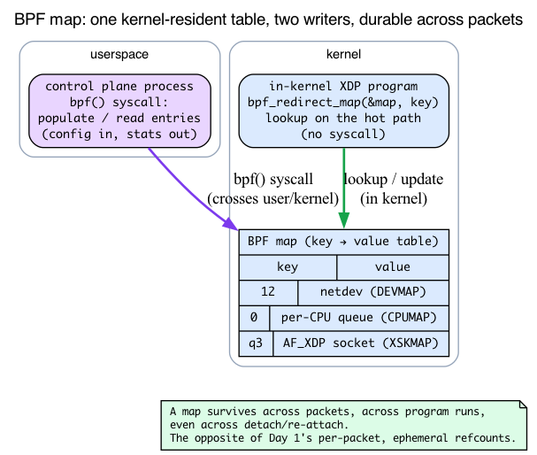
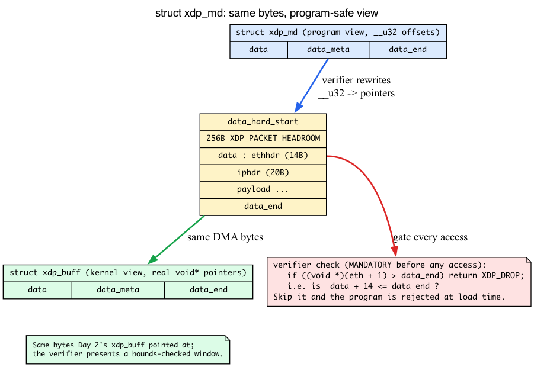
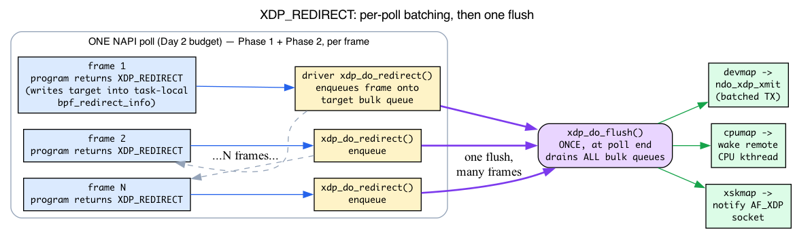
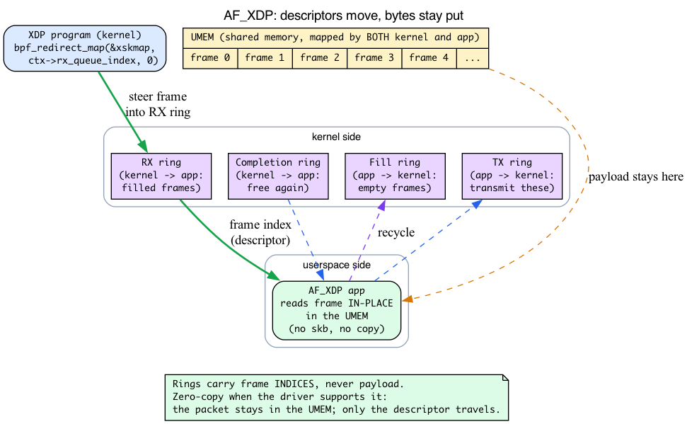

# Day 27 — XDP and the rest of the stack

> **Today's mission:** see exactly where the XDP hook sits in the receive path, why it can do things faster than tc-bpf, and how XDP cooperates with (rather than replacing) the regular Linux network stack. Along the way we'll fill in the four pieces of background the rest of the book never taught: what a *BPF map* actually is, what `struct xdp_md` looks like to your program, how `XDP_REDIRECT` *really* fires, and what an AF_XDP socket is. Total time: ~110 minutes.

> **Phase 5 starts here.** The last four days cover the modern hooks layered on top of everything you've learned, plus a capstone day where you trace one real packet end-to-end.

## What XDP is, kernel-side

You already met XDP on **Day 2**, so we won't re-derive it from scratch. The one-line refresher:

> **Recall from Day 2:** *native* XDP is an eBPF program the driver runs on the raw RX frame **before any `sk_buff` exists** — the earliest software hook in the kernel. It looks at an `xdp_buff` (four stack pointers over the DMA page, no slab allocation, no `users`/`dataref` refcounts) and returns one of five action codes. `XDP_PASS` is the *only* one that proceeds to build an skb; the other four consume the frame in the driver. *Generic* XDP (`do_xdp_generic` → `netif_receive_generic_xdp`, `net/core/dev.c:5656`/`:5576`) is the slower fallback that runs later, after an skb already exists.

So the five actions, in the order the kernel defines them (`enum xdp_action`, `include/uapi/linux/bpf.h:6548` — note `XDP_ABORTED` is **0**, not last):

- **`XDP_ABORTED` (0)** — same effect as DROP plus a tracepoint fires (debugging signal).
- **`XDP_DROP`** — packet freed in-driver, no kernel work done.
- **`XDP_PASS`** — kernel allocates skb and continues with normal RX (Day 2).
- **`XDP_TX`** — sends it back out the same NIC, reflecting the packet without ever touching skb.
- **`XDP_REDIRECT`** — sends it to a different netdev, a CPU map (cpumap), or an AF_XDP socket.


This is the **earliest hook in the kernel for incoming packets**. There's nothing before XDP except the NIC and the driver code that just received the frame.

## Why this matters

> **Recall from Day 1:** allocating an `sk_buff` is not free — it's a slab allocation of the descriptor plus a separate data-buffer allocation, refcount setup, and cache-line dirtying (~500 ns of fixed cost). Routing, conntrack (Days 20–22), and netfilter each add more on top.

For high-rate packet filtering or load balancing, you don't want to pay any of that for packets you'll just drop or redirect. XDP runs at ~10 ns of fixed overhead plus your program's logic. A drop in XDP is the cheapest packet operation Linux can do. Cilium's load balancer, Cloudflare's DDoS scrubbing, Facebook's Katran — all use XDP to decide "drop / pass / redirect / mangle" in the few hundred nanoseconds before the kernel commits to processing the packet.

## Three modes

XDP has three execution modes, picked at attach time:

### Native XDP (default, fastest)

The driver implements XDP support: it calls `bpf_prog_run_xdp` directly from its NAPI poll, before allocating skb. The packet is in the driver's RX buffer; XDP gets a pointer to it and the data length. ~10 ns overhead for an empty program.

Major drivers with native XDP: ixgbe, i40e, mlx5, mlx4, virtio_net, veth (yes, veth supports XDP — useful for testing).

### Generic XDP (`XDP_FLAGS_SKB_MODE`)

Works on any driver. The kernel implements XDP as a hook *after* the driver has done some skb-related setup. Slower than native (~half the speed) because it duplicates work.

Use generic when your NIC doesn't support native XDP. Or for development on virtio in older VM setups.

### Hardware-offloaded XDP (`XDP_FLAGS_HW_MODE`)

The BPF program is JITed to NIC firmware (Netronome NFP, some Mellanox SKUs). Runs *on the NIC*, not on the host CPU. Insanely fast for simple programs but very limited — the offload target supports only a *subset* of maps and helpers (the NFP, for example, offloads array/hash maps plus `map_lookup/update/delete_elem` and `xdp_adjust_head/tail`, but rejects anything outside that subset). Exactly what works depends on the NIC.

Practically rare; most production XDP runs in native mode.

---

## Background 1: what a BPF map actually is

Everything interesting XDP does — redirect to a device, steer to a CPU, hand off to a userspace socket, export a drop counter — leans on a thing this book has been quietly assuming: a **BPF map**. The whole "`XDP_REDIRECT` — where it shines" section below is built on three map types, and the tc-bpf cooperation note says XDP and tc "communicate via shared maps." Time to make a map real.

### The problem a map solves: a BPF program is stateless and forgets everything

An XDP program runs, returns an action code, and is *done* — there is no skb to stash state in (it runs before the skb exists), no socket to hang data off. Each invocation starts with a blank slate. So how does a load balancer remember its backend list across millions of packets? How does a DDoS filter export "I dropped 4 billion packets" to a dashboard? How does the program even know *which* device to redirect a frame to?

The answer is the **BPF map**: a typed key→value table that lives **in the kernel**, outside any single program invocation. It is the durable state that an otherwise stateless per-packet program reads and writes.

- A map is **created from userspace** via the `bpf()` syscall, which returns a file descriptor. The map persists as long as someone holds a reference to it (an fd, or a pin in the bpffs filesystem) — it survives across packets, across program invocations, even across the program being detached and re-attached.
- A BPF program references a map by fd/id and does lookups/updates inside the kernel with no syscall.
- **Both sides touch the same table.** A userspace "control plane" process populates and reads entries (config in, stats out); the in-kernel program reads them on the hot path. For XDP — which has no skb and no socket — this shared map is the *only* way to keep configuration and export statistics. It is also exactly how XDP and tc-bpf "communicate": they each hold an fd to the same map.

> **Contrast with what you already know.** Day 1's two `sk_buff` refcounts and Day 2's thrown-away `xdp_buff` are the *opposite* of a map: they are per-packet, ephemeral, gone the moment the packet leaves. A map is the durable counterpart — the state that *survives* between packets.



### Redirect maps: the value is a *forwarding target*, not plain data

Maps come in many types — the v7.1 enum `bpf_map_type` (`include/uapi/linux/bpf.h`) lists dozens. The three this chapter uses are **redirect maps**, where each value is not a number or a struct you read, but a *place to send the packet*:

| Map type (enum at `include/uapi/linux/bpf.h`) | Key | Value is… |
|---|---|---|
| `BPF_MAP_TYPE_DEVMAP` (line 1014) | array slot (0..max_entries-1) | a **netdev** (the real ifindex lives in the *value*, + optional egress XDP program) |
| `BPF_MAP_TYPE_CPUMAP` (line 1016) | CPU id | a **per-CPU queue** |
| `BPF_MAP_TYPE_XSKMAP` (line 1017) | queue id | an **AF_XDP socket** |

The DEVMAP value layout is worth seeing, because it proves a map value can be "a device plus an optional program" (`struct bpf_devmap_val`, `include/uapi/linux/bpf.h:6575`, just after `struct xdp_md`):

```c
struct bpf_devmap_val {
    __u32 ifindex;             /* device index */
    union {
        int   fd;             /* prog fd on map write */
        __u32 id;             /* prog id on map read  */
    } bpf_prog;               /* optional egress XDP program */
};
```

The *in-kernel* entry that this becomes is `struct bpf_dtab_netdev` (`kernel/bpf/devmap.c:67`); the CPUMAP equivalent is `struct bpf_cpu_map_entry` (`kernel/bpf/cpumap.c:60`). Userspace writes a `bpf_devmap_val` into the map; the kernel turns it into a `bpf_dtab_netdev` holding a real `net_device *`.

The program stages a redirect with a single helper:

```c
long bpf_redirect_map(struct bpf_map *map, __u64 key, __u64 flags);
```

It looks up `map[key]` and stages the redirect (we'll see exactly what "stages" means in Background 3). The helper is allowed for XDP programs via `BPF_FUNC_redirect_map` (`net/core/filter.c:8528`), backed by `bpf_xdp_redirect_map_proto` (`net/core/filter.c:4674`).

---

## Background 2: `struct xdp_md` and mandatory bounds checking

Today's experiment hands you `int xdp_drop(struct xdp_md *ctx)`. Day 2 taught the *kernel-side* `struct xdp_buff` (four pointers into the DMA page) — but **a BPF program never sees an `xdp_buff`.** It sees `struct xdp_md`, the verifier-exposed context. You cannot write any non-trivial XDP program — parse Ethernet, look at an IP header, the whole *point* of XDP filtering — without understanding it.

### What the program sees

`struct xdp_md` is the context the verifier presents to an XDP program (`include/uapi/linux/bpf.h:6559`):

```c
struct xdp_md {
    __u32 data;            /* start of packet bytes      */
    __u32 data_end;        /* one past the last byte      */
    __u32 data_meta;       /* custom metadata region      */
    /* Below access go through struct xdp_rxq_info */
    __u32 ingress_ifindex; /* rxq->dev->ifindex           */
    __u32 rx_queue_index;  /* rxq->queue_index            */
    __u32 egress_ifindex;  /* txq->dev->ifindex           */
};
```

The trick: `data` and `data_end` are declared `__u32`, but the verifier **rewrites them into real pointers at load time**. After the rewrite, the packet bytes live in `[data, data_end)`. Same DMA bytes Day 2's `xdp_buff` pointed at — the verifier just presents them as a bounds-checked, program-safe window.

> **Relate to Day 2:** the kernel builds an `xdp_buff` over the DMA page; for your program the verifier presents that same window as `xdp_md` with bounded `data`/`data_end`. Same bytes, program-safe view.

The other fields tell a redirect program *where the frame came from*: `ingress_ifindex` (= `rxq->dev->ifindex`) and `rx_queue_index` (= `rxq->queue_index`) are how a steering program decides what to do; `egress_ifindex` is set for devmap egress programs. `data_meta` is a scratch region for XDP→XDP or XDP→tc handoff.

### The cardinal rule: prove every access in-bounds, or the verifier rejects you

This is the #1 thing that trips up a first XDP program. Before you dereference *any* header at `data`, you must prove to the verifier that the bytes are actually there:

```c
SEC("xdp")
int xdp_parse(struct xdp_md *ctx)
{
    void *data     = (void *)(long)ctx->data;
    void *data_end = (void *)(long)ctx->data_end;
    struct ethhdr *eth = data;

    if ((void *)(eth + 1) > data_end)   /* MANDATORY: data + 14 <= data_end? */
        return XDP_DROP;                /* not enough bytes — bail */

    if (eth->h_proto == bpf_htons(ETH_P_IP))
        return XDP_PASS;
    return XDP_DROP;
}
```

Skip that `if` and the verifier rejects the program at load time — it cannot prove the access is safe, so it refuses to load it. This is the concrete meaning of the "limited mutation / can't reach inside arbitrarily" limitation noted below: *every* packet access is gated on a bounds check against `data_end`.

There's headroom in front of `data` to make pushes cheap: `XDP_PACKET_HEADROOM` is **256** bytes (`include/uapi/linux/bpf.h:6541`), reserved so `bpf_xdp_adjust_head` (prepend/strip bytes at the front) rarely has to do anything expensive.



---

## XDP and the rest of the stack

XDP doesn't *replace* the network stack — it sits in front of it. For traffic that returns `XDP_PASS`:

1. XDP returns PASS.
2. Driver allocates skb (`build_skb` / `napi_build_skb` — recall the zero-copy wrap from Day 1).
3. Normal RX path (Day 2): GRO, `__netif_receive_skb_core`, tc-bpf ingress, IP, conntrack, sockets.

XDP is "the fast path for the easy cases." Everything else still flows through the regular stack.

### Cooperating with tc-bpf

Many production setups use both. **XDP for high-rate fast-path drops/redirects**, **tc-bpf for everything skb-aware**. Cilium, for example:

- XDP for L3 service load balancing (a few hot services with millions of pps).
- tc-bpf for L4 connection tracking, NetworkPolicy enforcement, encryption negotiation.
- The two work in sequence: XDP runs first, returns PASS for traffic tc-bpf needs to see.

You can attach both to the same interface. They don't interfere — XDP runs at packet boundary; tc-bpf runs at skb boundary; the only shared resource is **the BPF map ecosystem from Background 1**, where they can communicate via shared maps (each side holds an fd to the same key→value table).

---

## XDP_REDIRECT — where it shines

`bpf_redirect_map()` is the highest-throughput mechanism XDP exposes. Three target map types (the redirect maps from Background 1):

### `BPF_MAP_TYPE_DEVMAP`

`{ array slot → netdev *, optional egress XDP program }` — the key is just the slot index you chose at map-update time; the target netdev's real ifindex is stored in the value (`bpf_devmap_val.ifindex`). `XDP_REDIRECT` to this map sends the packet to the named netdev. Used for L3 forwarding, container networking (redirect from physical NIC into a veth), gateway boxes.

### `BPF_MAP_TYPE_CPUMAP`

`{ cpu_id → cpu queue }`. Redirects the packet to a different CPU's per-CPU queue, which then runs the *kernel* RX path on that CPU. Useful for steering: "RSS landed this on CPU 0 but the destination socket is pinned to CPU 4 — redirect."

### `BPF_MAP_TYPE_XSKMAP`

`{ queue_id → AF_XDP socket }`. Sends the packet directly to userspace via AF_XDP — zero-copy if the NIC supports it. The basis of high-throughput userspace packet processing (DPDK-on-Linux-without-DPDK). Background 4 explains what's on the other end.

---

## Background 3: how `XDP_REDIRECT` actually fires

Here's the part that's usually just *asserted*: redirect is "the highest-throughput path." Why? The mechanism is a **two-phase, batched model** — and the batching is the whole reason it's fast. `bpf_redirect_map()` does **not** transmit the packet.

### Phase 1 — the helper records intent, the program just returns a code

When your program calls `bpf_redirect_map(&map, key, flags)`, the helper looks up the target and **stashes it into a `struct bpf_redirect_info`** (`include/linux/filter.h:774`). In v7.1 this lives inside a `struct bpf_net_context` hung off `current->bpf_net_context` — task-local scratch on the softirq stack, fetched via `bpf_net_ctx_get_ri()` (`include/linux/filter.h:815`). (It used to be a literal per-CPU variable; it's still effectively one-per-CPU because NAPI runs in BH-disabled softirq context that can't migrate, but the data structure itself is no longer a `DEFINE_PER_CPU`.) Then it returns `XDP_REDIRECT`. Your program does nothing else — it just returns that action code. No packet has moved.

### Phase 2 — the driver enqueues, then flushes once per poll

Seeing `XDP_REDIRECT`, the driver calls **`xdp_do_redirect()`** (`net/core/filter.c:4519`). That reads the `bpf_redirect_info` and **enqueues the frame onto the target's bulk queue** — dispatching to `__xdp_do_redirect_xsk` (`:4424`) for an AF_XDP socket, or `__xdp_do_redirect_frame` (`:4449`) for a devmap/cpumap target. Still no transmit: the frame is sitting on a bulk queue (devmap bulk queue / cpumap ptr_ring / xsk ring).

Then, **once per NAPI poll** — at the end of the driver's `->poll()` call, after that call has drained up to its per-poll `weight` (Day 2's inner budget, default 64; *not* the outer `netdev_budget` of 300, which is spread across all NAPI instances in the softirq) — the driver calls **`xdp_do_flush()`** (`net/core/filter.c:4358`), which flushes *all* the bulk queues at once:

- devmap → `ndo_xdp_xmit` (batched TX of many frames),
- cpumap → wake the remote CPU's kthread,
- xskmap → notify the AF_XDP socket.

**Batching across the whole poll is the throughput win.** N frames redirected during the poll cost *one* flush, not N transmits. This is exactly why `XDP_REDIRECT` beats `XDP_TX` for forwarding to *other* devices, and why it rides the same per-CPU, per-poll batching that makes NAPI efficient (Day 2). The kernel even guards against a driver forgetting to flush: `WARN_ONCE(missed, "Missing xdp_do_flush() invocation after NAPI by %ps\n", ...)` at `net/core/filter.c:4392`.

The driver call site that proves the whole pattern is the ixgbe one you'll read below: `ixgbe_run_xdp`'s `case XDP_REDIRECT:` calls `xdp_do_redirect(adapter->netdev, xdp, xdp_prog)` (`drivers/net/ethernet/intel/ixgbe/ixgbe_main.c:2435`, inside the function at line 2400).



---

## Background 4: AF_XDP sockets and the UMEM

The XSKMAP bullet promised "zero-copy … the basis of DPDK-on-Linux-without-DPDK." Nothing earlier in this book teaches AF_XDP (Day 25's "zero-copy" was kTLS sendfile; Day 28 is io_uring) — so here's the model behind what XSKMAP delivers to.

### A socket whose buffer is shared memory

**AF_XDP** is a socket family: `socket(AF_XDP, SOCK_RAW, 0)`. Its receive endpoint is not a kernel skb queue — it's a **UMEM**: a userspace-allocated array of equal-size frames that *both* the kernel and the app map into their address spaces. The packet bytes land directly in this shared region.

### Four rings move descriptors, not bytes

Around the UMEM sit four single-producer/single-consumer rings that carry **frame descriptors** (essentially UMEM frame indices), never payload:

| Direction | Rings |
|---|---|
| Receive | **Fill** (app → kernel: "here are empty frames to fill") and **RX** (kernel → app: "these frames now hold packets") |
| Send | **TX** (app → kernel: "transmit these frames") and **Completion** (kernel → app: "these are free again") |

Because what moves between kernel and app is a *frame index*, the bytes never get copied when the driver supports zero-copy. The packet stays put in the UMEM; only the descriptor travels.

### Where XSKMAP fits

An XSKMAP value is an AF_XDP socket **bound to a specific `(netdev, queue_id)`**. In XDP you write:

```c
return bpf_redirect_map(&xskmap, ctx->rx_queue_index, 0);
```

That steers the frame into that socket's RX ring (`__xdp_do_redirect_xsk`, the Background-3 dispatch). Userspace then reads the packet straight out of the UMEM in place. This is the DPDK-class userspace fast path — while staying entirely inside the kernel's normal driver model.

> **Contrast with Day 1's sk_buff path:** AF_XDP bypasses skb allocation *and* the socket-buffer copy entirely. It's the same "don't build an skb" motivation that justifies XDP itself, extended all the way out to a userspace application.

The official model lives in `Documentation/networking/af_xdp.rst` (UMEM + four rings); the ring implementation is in `net/xdp/` (`xsk.c`, `xsk_queue.h`).



---

## Limitations

- **No fragmentation handling.** XDP sees the raw frame as the NIC delivered it; it can't reassemble IP fragments (would require buffering).
- **No GRO.** GRO happens after XDP (Day 2). If you want coalesced superpackets, see them in tc-bpf, not XDP.
- **Limited mutation.** You can `bpf_xdp_adjust_head` to add/remove bytes at the front (that's what the 256-byte `XDP_PACKET_HEADROOM` is for), `bpf_xdp_adjust_tail` for the back. But you can't reach inside arbitrarily without the `data_end` bounds checking from Background 2.
- **No skb metadata.** No conntrack info, no netfilter mark, no socket lookup (until kernel 5.0 added `bpf_sk_lookup_tcp/udp` to the XDP hook).

---

## Today's experiment

```bash
# See if your driver supports native XDP. Find your NIC first — on most modern
# distros and cloud VMs the primary NIC is enp0s3/ens5/eno1, not eth0.
ip -br link                       # list interfaces, pick your NIC
ethtool -i <iface> | grep driver  # e.g. virtio_net, mlx5_core, ixgbe
# virtio_net and veth support native XDP; many cloud NICs only do generic mode.

# Quick test on veth (always supports XDP). Put the peer in its OWN netns so the
# frame is forced across the wire and is actually *received* on veth0's RX path.
# If both ends share the root namespace, the kernel short-circuits via the
# loopback fast-path, the frame never crosses the link, and the XDP program on
# veth0 never runs (the ping would simply succeed and teach you nothing).
sudo ip link add veth0 type veth peer name veth1
sudo ip netns add ns1
sudo ip link set veth1 netns ns1
sudo ip addr add 10.99.0.1/24 dev veth0
sudo ip link set veth0 up
sudo ip netns exec ns1 ip addr add 10.99.0.2/24 dev veth1
sudo ip netns exec ns1 ip link set veth1 up
sudo ip netns exec ns1 ip link set lo up

# Tiny XDP program: drop everything
cat << 'EOF' > /tmp/xdp_drop.bpf.c
#include <linux/bpf.h>
#include <bpf/bpf_helpers.h>
SEC("xdp")
int xdp_drop(struct xdp_md *ctx) { return XDP_DROP; }
char _license[] SEC("license") = "GPL";
EOF
clang -O2 -target bpf -c /tmp/xdp_drop.bpf.c -o /tmp/xdp_drop.o
# If clang errors with "'asm/types.h' file not found", add your arch include
# path, e.g.: clang -O2 -target bpf -I/usr/include/x86_64-linux-gnu -c ...

# Attach to veth0
sudo ip link set veth0 xdp obj /tmp/xdp_drop.o sec xdp

# Send traffic FROM ns1 so it is received on veth0's RX/XDP path. XDP_DROP kills
# every frame — even the ARP request — so the echo requests never reach the
# stack and get no replies. Expect 100% packet loss. Without -W 1, ping would
# hang ~10 s on each unanswered probe before reporting the loss.
sudo ip netns exec ns1 ping -c 3 -W 1 10.99.0.1
#   3 packets transmitted, 0 received, 100% packet loss

# Inspect while the program is STILL attached — before the detach/cleanup below.
# Once you detach and delete veth0 there is nothing left for bpftool to show.
sudo bpftool net show
sudo bpftool prog show

# Detach and ping again to confirm the contrast: now it succeeds.
sudo ip link set veth0 xdp off
sudo ip netns exec ns1 ping -c 3 -W 1 10.99.0.1
#   3 packets transmitted, 3 received, 0% packet loss

# Cleanup
sudo ip link del veth0
sudo ip netns del ns1
```

That `xdp_drop` program is the minimal `struct xdp_md` consumer from Background 2 — it never touches `ctx->data`, so it needs no bounds check; it unconditionally returns `XDP_DROP`. The moment you want it to *parse* anything, the Background-2 `data + sizeof(hdr) <= data_end` check becomes mandatory.

The two `bpftool` commands (run above, while the program is still attached) confirm the attachment. `bpftool net show` lists per-interface BPF attachments — look for an `xdp` entry under veth0, which confirms the program is bound at the **driver RX hook** (not tc/ingress):

```
xdp:
veth0(N) driver id M
```

`bpftool prog show` lists every loaded program; find the one of type `xdp` named `xdp_drop` whose `id` matches the `M` shown by `net show`:

```
M: xdp  name xdp_drop  tag <hex>  gpl
	loaded_at ...  uid 0
	xlated ...B  jited ...B  memlock 4096B
```

Your `N` and `M` will differ — the point is that the **same id appears in both outputs**, proving the loaded program is the one bound to veth0's RX path. Run these *before* the `xdp off` / `ip link del` step: once veth0 is gone, `net show` lists no XDP attachment for it.

---

## There are no Dumb Questions

> **Q: A BPF program forgets everything between packets — so where does a load balancer keep its backend list?**
>
> A: In a **BPF map** (Background 1). The map lives in the kernel, outside any single program run, and survives across packets and even across detach/re-attach. A userspace control plane populates it (backend IPs, weights); the XDP program looks entries up on the hot path. The map is also how the program exports stats *out* and how XDP and tc-bpf share state — both hold an fd to the same table.

> **Q: I see `struct xdp_md` in my program but Day 2 talked about `struct xdp_buff`. Which is it?**
>
> A: Both, at different altitudes. The kernel builds an `xdp_buff` (real pointers into the DMA page). The verifier exposes that same window to *your program* as `struct xdp_md`, whose `data`/`data_end` are declared `__u32` but rewritten into pointers at load time. Same bytes; `xdp_md` is the bounds-checked, program-safe view.

> **Q: Does `bpf_redirect_map()` send the packet?**
>
> A: No. It only records the target in a `bpf_redirect_info` (task-local scratch off `current->bpf_net_context` in v7.1) and returns `XDP_REDIRECT` (Background 3). The driver then calls `xdp_do_redirect()` to *enqueue* the frame on a bulk queue, and one `xdp_do_flush()` per NAPI poll actually fans everything out. The batching is why redirect is the highest-throughput path.

> **Q: What's actually on the other end of an XSKMAP redirect?**
>
> A: An **AF_XDP socket** bound to one `(netdev, queue_id)`, backed by a shared-memory **UMEM** and four descriptor rings (Background 4). The frame lands in the UMEM and userspace reads it in place — no skb, no copy. That's the "DPDK without DPDK" claim made concrete.

---

## What to read in the kernel

- **`net/core/dev.c`** — search `bpf_prog_run_xdp` (the generic-XDP dispatch from driver to BPF). For the `XDP_REDIRECT` implementation (`xdp_do_redirect`), see **`net/core/filter.c`**.

- **`include/net/xdp.h`** — `struct xdp_buff` (line 86), the kernel-side view. The program-side `struct xdp_md` and the action constants live in **`include/uapi/linux/bpf.h`** (`xdp_md` at line 6559, `enum xdp_action` at line 6548). Quick read.

- **`include/uapi/linux/bpf.h`** — `enum bpf_map_type` (DEVMAP at line 1014, CPUMAP 1016, XSKMAP 1017), `struct bpf_devmap_val` (line 6575). The map-value layout that proves a value can be "a device plus an egress program."

- **`net/core/filter.c`** — `xdp_do_redirect` (line 4519), `xdp_do_flush` (line 4358), the missed-flush `WARN_ONCE` (line 4392), `bpf_xdp_redirect_map_proto` (line 4674), the `BPF_FUNC_redirect_map` allowance (line 8528). Also search `xdp_func_proto` for the full helper-allowance table for XDP programs.

- **`include/linux/filter.h`** — `struct bpf_redirect_info` (line 774), held in `struct bpf_net_context` and fetched via `bpf_net_ctx_get_ri()` (line 815) off `current->bpf_net_context`. The task-local scratch that Phase 1 of redirect writes.

- **`kernel/bpf/devmap.c`** — `BPF_MAP_TYPE_DEVMAP` implementation; the in-kernel entry `struct bpf_dtab_netdev` (line 67). How a `bpf_redirect_map` to a devmap entry results in xmit to that netdev.

- **`kernel/bpf/cpumap.c`** — `BPF_MAP_TYPE_CPUMAP`; the entry `struct bpf_cpu_map_entry` (line 60). How packet → CPU queue → kernel RX on that CPU.

- **`drivers/net/ethernet/intel/ixgbe/ixgbe_main.c`** — concrete native-XDP implementation. Look at `ixgbe_run_xdp` (line 2400) to see how a driver calls into BPF in its NAPI poll, and its `XDP_REDIRECT` case calling `xdp_do_redirect` (line 2435).

- **`drivers/net/veth.c`** — search `veth_xdp`. veth's XDP support; useful because it's simpler than NIC drivers.

- **`Documentation/networking/af_xdp.rst`** — the official UMEM + four-ring description (Background 4). The ring structs live in `net/xdp/` (`xsk.c`, `xsk_queue.h`).

- **`tools/testing/selftests/bpf/progs/test_xdp_*.c`** — example programs.

---

## Bullet Points

- **XDP** runs in the NIC driver's NAPI poll, before skb allocation. Earliest hook in the kernel for RX. Five actions: **ABORTED (0), DROP, PASS, TX, REDIRECT** — only `XDP_PASS` builds an skb (recall Day 2).
- A **BPF map** is a kernel-resident key→value table, created from userspace via `bpf()`, that **outlives any single program run**. It's the durable state a stateless per-packet program reads, the way it exports stats, and how XDP and tc-bpf "communicate" (shared fd to one table).
- A program sees **`struct xdp_md`**, not `xdp_buff`: `data`/`data_end` are `__u32` rewritten into pointers by the verifier. **You must prove `data + sizeof(hdr) <= data_end` before every access** or the program won't load.
- Three modes: **native** (driver-supported, fastest), **generic** (any driver, slower), **HW-offloaded** (NIC firmware, rarest).
- **`XDP_REDIRECT` is a two-phase, batched model:** `bpf_redirect_map()` only records the target in a `bpf_redirect_info` (task-local scratch off `current->bpf_net_context`) and returns the code; the driver's `xdp_do_redirect()` enqueues onto a bulk queue; one **`xdp_do_flush()` per NAPI poll** fans out (devmap xmit / cpumap kthread wake / xsk notify). The per-poll batching is the throughput win.
- Three redirect maps: **DEVMAP** (→ netdev), **CPUMAP** (→ per-CPU queue), **XSKMAP** (→ AF_XDP socket).
- **AF_XDP** = a socket family whose buffer is a shared-memory **UMEM** with four SPSC rings (Fill/RX, TX/Completion). Descriptors (frame indices) move; bytes stay put. XSKMAP steers a frame into a socket's RX ring for zero-copy userspace processing.
- **Cooperates** with the rest of the stack: PASS routes through normal RX. XDP doesn't replace anything. Cilium / Katran / Cloudflare use XDP for the hot path; tc-bpf for skb-aware logic.
- Limitations: no IP fragment reassembly, no GRO, limited mutation (bounds-checked).

---

## Check question

You attach an XDP program that returns `XDP_DROP` for some packets and `XDP_PASS` for others. Does iptables/nftables ever see the dropped packets?

<details>
<summary>Click to reveal answer</summary>

**Answer:** **No.** XDP runs *before* skb allocation; the dropped packets never reach netfilter — they don't even reach `__netif_receive_skb_core`. iptables/nftables only see what XDP passed through. This is why XDP is preferred for high-rate DDoS mitigation: drops at this layer never pay the cost of skb alloc + netfilter rule walk + conntrack lookup. For 10M-pps DDoS traffic, that cost difference is the difference between staying online and falling over.

If you want both XDP filtering *and* netfilter visibility on dropped packets (e.g., for forensics), you need to log/sample at XDP and emit metadata to userspace via a perf or ringbuf map — and notice that this is exactly Background 1's point: the only way an skb-less XDP program can tell userspace *anything* is through a BPF map. Netfilter cannot see what XDP dropped because the packet never existed as an skb.

</details>

---

## Tomorrow

Day 28: io_uring networking. The completion-based I/O model applied to sockets, with zero-copy send.
