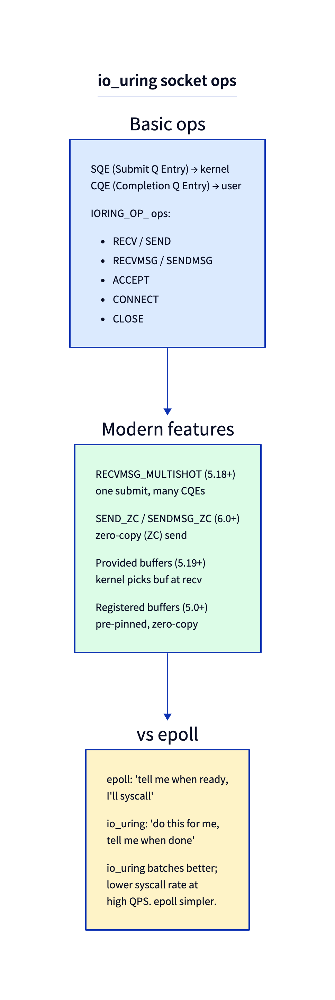

# Day 28 — io_uring networking: zero-copy send/recv

> **Today's mission:** see how io_uring's network ops differ from epoll, especially zero-copy. Total time: ~60 minutes.



## The async-IO mental model

epoll: "tell me when this FD is ready; I'll syscall."

io_uring: "do this network operation for me; tell me when done."

The kernel handles the operation in the background, including the syscall-equivalent work. Userspace gets a completion event when the work is finished.

## Operations

Basic:
- `IORING_OP_RECV / SEND`
- `IORING_OP_RECVMSG / SENDMSG`
- `IORING_OP_ACCEPT`
- `IORING_OP_CONNECT`

Modern:
- `IORING_OP_RECVMSG_MULTISHOT` — one submit, many completions (5.18+).
- `IORING_OP_SEND_ZC` / `SENDMSG_ZC` — zero-copy send (6.0+).
- Provided buffers — kernel picks a buffer at recv time, no per-recv allocation.
- Registered buffers — userspace pre-pins buffers for kernel's reuse.

## Zero-copy send

```c
struct io_uring_sqe *sqe = io_uring_get_sqe(&ring);
io_uring_prep_send_zc(sqe, sock_fd, buf, len, 0, 0);
io_uring_submit(&ring);

// Two completions per send_zc:
// 1. The send itself completed (kernel queued / TX'd)
// 2. The buffer is no longer in use (you can reuse buf)
```

The kernel pins the user pages (no copy), DMAs through the NIC, then notifies userspace twice. Higher throughput for big sends, but more complex than blocking `send`.

## What to read in the kernel

- **`io_uring/net.c`** — networking ops in io_uring.
- **`io_uring/io_uring.c`** — main entry.
- **`Documentation/networking/io_uring.rst`** — official.
- `liburing` userspace library and its examples.

## Bullet Points

- io_uring sockets: prep SQE, submit, poll for CQE.
- **Multishot recv** turns a single submission into a stream of completions.
- **Send-zc** pins user buffers; two completions per send.
- Higher throughput than epoll at the cost of more complex code.
- Modern web servers (envoy, some nginx variants) experimenting with io_uring.

## Check question

If you submit `IORING_OP_RECV` and immediately call `io_uring_wait_cqe`, what does that look like compared to `recv()`?

<details>
<summary>Click to reveal answer</summary>

**Answer:** Functionally similar — both block until data arrives. But io_uring's path through the kernel is different: instead of the recv() syscall handler waiting on the socket, the io_uring infrastructure registers a wait on the socket, you exit to userspace, when the wait fires the kernel posts a completion to your CQE ring, then the wait_cqe call returns it. For a single recv this is overkill; the win is when you have hundreds in flight at once — io_uring batches submission and completion at one syscall apiece.

</details>

## Tomorrow

Day 29: recent additions.
