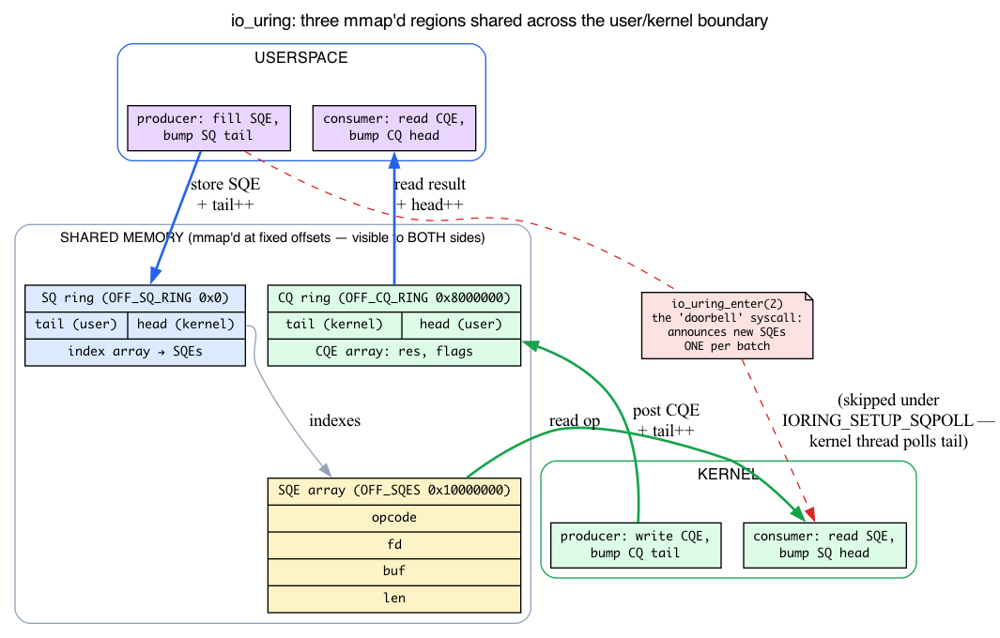
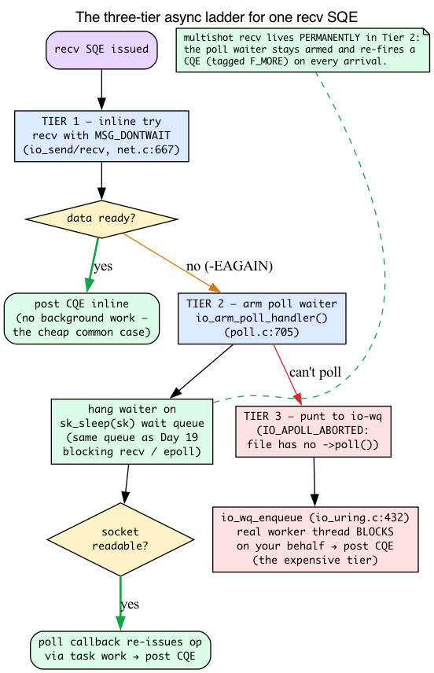
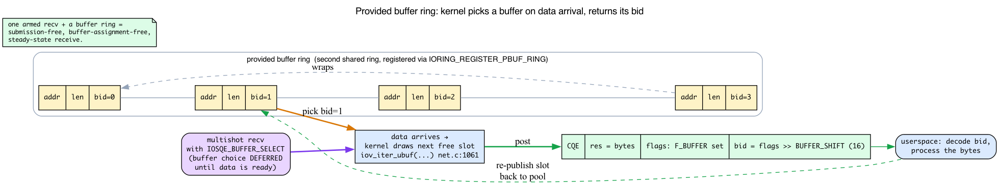
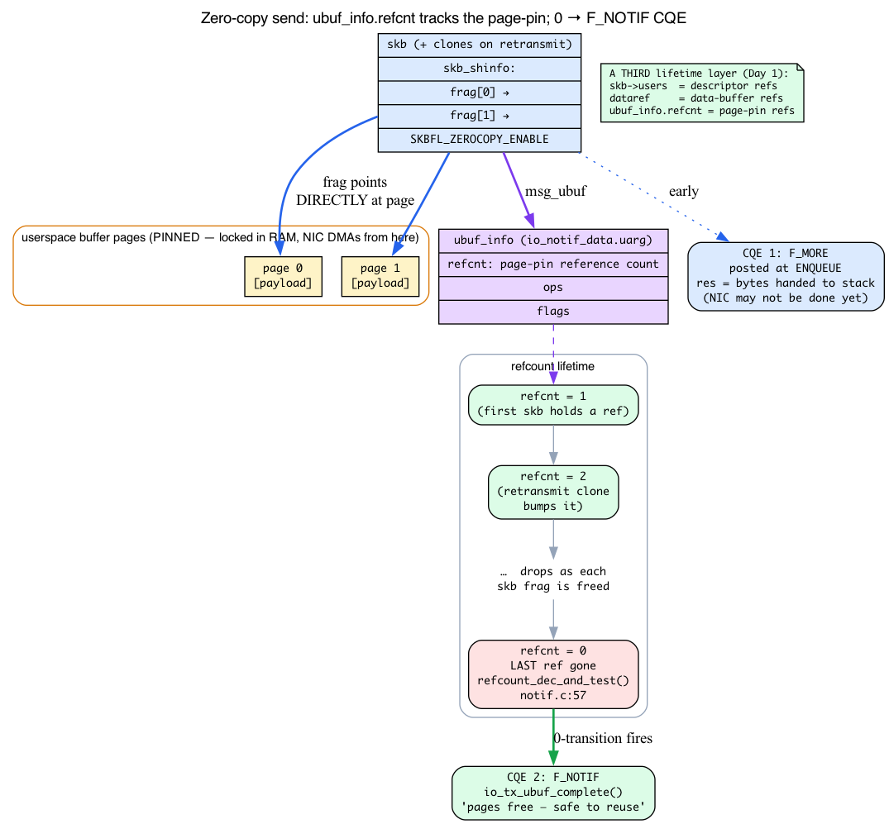

# Day 28 — io_uring networking: zero-copy send/recv

> **Today's mission:** see how io_uring fundamentally inverts the syscall model for sockets — and understand the *machinery* that makes that inversion work: a lock-free shared-memory ring, a three-tier async execution ladder, and a refcounted page-pin that tells you exactly when a zero-copy buffer is free again. Then see why zero-copy send is a big deal for high-throughput servers, and how multishot recv lets you submit once and receive many. Total time: ~120 minutes.

## The two I/O paradigms

Day 19 introduced epoll (readiness model) and io_uring (completion model). Today we go deep into io_uring's networking-specific abilities.


Recall:

- **epoll**: "tell me when this FD is ready; I'll syscall myself." Each I/O = `epoll_wait` (1 syscall) + `recv`/`send` (1 syscall). Two syscalls per I/O.
- **io_uring**: "do this for me; tell me when done." Each batch of I/Os = 1 syscall (`io_uring_enter`) covering many ops. Or zero in steady state with `IORING_SETUP_SQPOLL` (kernel-thread polling).

For workloads doing > 100k ops/sec per thread, the syscall savings alone are significant. For zero-copy send, the gains scale with payload size.

But that whole pitch — "one syscall per batch," "zero in steady state" — rests on a mechanism the marketing slides never show: *how do userspace and the kernel agree on a queue of work without a syscall per item?* That is the first thing we have to teach, because everything else today is built on it.

## How the ring actually works: a lock-free shared-memory queue

Here's the puzzle. A syscall is the normal way userspace asks the kernel to do something — and a syscall is exactly what we're trying to avoid. So how can userspace "submit" an operation without calling into the kernel at all? The answer is **shared memory**: userspace and the kernel literally read and write the *same physical pages*, so handing over a piece of work is just a memory store, not a mode switch.

### The setup: one fd, three mmap'd regions

`io_uring_setup(2)` is the one syscall that bootstraps everything. It returns a file descriptor, and then userspace `mmap`s that fd at a few **fixed magic offsets** to map the shared regions into its own address space (`include/uapi/linux/io_uring.h`):

```c
#define IORING_OFF_SQ_RING   0ULL          /* :551 — the SQ ring header + index array */
#define IORING_OFF_CQ_RING   0x8000000ULL  /* :552 — the CQ ring + CQE array          */
#define IORING_OFF_SQES      0x10000000ULL /* :553 — the SQE array itself              */
```

Three regions, one shared mapping each:

1. **The SQ ring** — a small header plus an array of indices into the SQE array.
2. **The CQE array** — where completions land (the CQ ring).
3. **The SQE array** — the actual Submission Queue Entries (the op descriptions: opcode, fd, buffer, length, …).

After the mmap, those pages are visible to *both* sides. When userspace fills in an SQE, the kernel sees the bytes with no copy. When the kernel writes a CQE, userspace sees it with no copy. liburing's `io_uring_queue_init` does the `io_uring_setup` + three `mmap`s for you, which is why the basic API below looks so innocent.

How does userspace know where the head/tail fields live inside those mapped pages? `io_uring_setup` fills in a `struct io_uring_params` (`:614`) and copies it back. Two sub-structs carry the byte offsets of every field within the rings:

```c
struct io_sqring_offsets {   /* :561 — head, tail, ring_mask, ring_entries, ... */ };
struct io_cqring_offsets {   /* :580 — head, tail, ring_mask, ring_entries, ... */ };
/* and inside io_uring_params: */
struct io_sqring_offsets sq_off;   /* :623 */
struct io_cqring_offsets cq_off;   /* :624 */
```

So userspace maps the regions, then uses `sq_off.head`, `sq_off.tail`, etc. to find the indices *inside* the shared pages. The kernel side of all this is `io_uring_setup` (`io_uring/io_uring.c:3111`) and its syscall entry `SYSCALL_DEFINE2(io_uring_setup)` (`:3150`), which allocate the rings and populate those offsets.

### The circular buffer: head, tail, and why no lock is needed

Each ring is a **single-producer / single-consumer (SPSC) circular buffer**, governed by two free-running 32-bit counters:

- a **tail**, advanced by the *producer* when it adds an entry, and
- a **head**, advanced by the *consumer* when it removes one.

Index into the array with `counter & ring_mask` (the mask is `ring_entries - 1`, so the size is always a power of two and the wrap is a cheap AND). The **gap between head and tail is the pending work**. Empty when `head == tail`; full when the gap equals the ring size.

The crucial property: **only one side ever writes each counter.** For the SQ, userspace owns the tail and the kernel owns the head. For the CQ, the kernel owns the tail and userspace owns the head. Because no counter has two writers, you never need a lock — only a memory barrier so the *other* side sees your index update after it sees the entry you wrote. That barrier is the only subtlety, and liburing hides it inside `io_uring_get_sqe` / `io_uring_cqe_seen`. The magic is the shared SPSC ring; the library is a thin, correct wrapper around it.

Put the two rings together and you get the full producer/consumer picture:

| Ring | Producer (writes entries, bumps **tail**) | Consumer (reads entries, bumps **head**) |
|------|-------------------------------------------|------------------------------------------|
| **SQ** (submissions) | **userspace** — fills SQE, bumps SQ tail | **kernel** — reads SQE, bumps SQ head |
| **CQ** (completions) | **kernel** — writes CQE, bumps CQ tail | **userspace** — reads CQE, bumps CQ head |

That last cell is what `io_uring_cqe_seen()` does: it bumps the CQ head to tell the kernel "I've consumed this completion; the slot is free again."



### Where the syscall went

Now the thesis makes mechanical sense. When you "submit," you have already written the SQE into shared memory and bumped the SQ tail — **no syscall happened.** The only thing the kernel still needs is a *notification* that new SQEs are present so it goes and drains them. That notification is the single `io_uring_enter` syscall (`SYSCALL_DEFINE6(io_uring_enter)`, `io_uring/io_uring.c:2600`), whose submission path calls `io_submit_sqes(ctx, to_submit)` (`:2651`, defined at `:2026`) to walk the SQ and run each op. One `io_uring_enter` can announce *hundreds* of SQEs at once — that's the "one syscall per batch."

And `IORING_SETUP_SQPOLL` (`include/uapi/linux/io_uring.h:175`) removes even that. With SQPOLL the kernel spawns a poll thread that watches the SQ tail itself; when it sees the tail move, it drains the queue without anyone calling `io_uring_enter`. *That* is the literal source of "zero syscalls in steady state" — the doorbell rings itself.

So when the rest of today says an op is "submitted," hold this picture: a store into a shared page and a tail bump. The expensive part — the mode switch — happens at most once per batch, and with SQPOLL not at all.

## The basic API

```c
#include <liburing.h>

struct io_uring ring;
io_uring_queue_init(256, &ring, 0);

/* Submit a recv */
struct io_uring_sqe *sqe = io_uring_get_sqe(&ring);
io_uring_prep_recv(sqe, sock_fd, buf, sizeof(buf), 0);
io_uring_sqe_set_data(sqe, /* user pointer */);
io_uring_submit(&ring);

/* Wait for completion */
struct io_uring_cqe *cqe;
io_uring_wait_cqe(&ring, &cqe);
/* cqe->res = number of bytes received (or -errno) */
io_uring_cqe_seen(&ring, cqe);
```

Read this with the ring picture in mind:

- **`io_uring_get_sqe`** hands you the next free slot in the shared SQE array (it bumps an internal "sqe tail" liburing tracks for you).
- **`io_uring_prep_recv`** fills that SQE: opcode `IORING_OP_RECV`, the fd, the buffer, the length.
- **`io_uring_submit()`** publishes the SQE (bumps the SQ tail) and rings the doorbell — one `io_uring_enter`, *not* one syscall per op. It is **not** copying the SQE into the kernel; the SQE was already in shared memory.
- **`io_uring_wait_cqe`** waits for the kernel to push a CQE onto the CQ ring.
- **`io_uring_cqe_seen`** bumps the CQ head so the kernel can reuse that completion slot.

Remember: `io_uring_submit()` publishes SQEs and rings the doorbell (one `io_uring_enter` for the whole batch, or none under SQPOLL) — it does **not** syscall per op.

## What "async" actually means: the three-tier execution ladder

Every op table row below says "Each is async: submit → kernel does the work in the background → CQE posted when done." That's true, but "in the background" hides a graceful three-step ladder that's worth understanding, because it explains *why io_uring is cheap when data is ready and only expensive when it isn't* — and it reuses machinery you already met on Day 19.

Think about what "do this recv for me" really involves. The data might already be sitting in the socket buffer, or it might not have arrived yet. A naive design would spin up a thread for every op and let it block — but threads are expensive, and most of the time the data is *right there*. So io_uring tries the cheapest thing first and only escalates when forced.

**Tier 1 — inline, non-blocking try.** When io_uring issues a network op, it ORs in `MSG_DONTWAIT` (the per-call "do not block" flag) if it's allowed to not block. You can see it in `io_send` (`io_uring/net.c:667`) and in the sendmsg path (`:568`):

```c
if (issue_flags & IO_URING_F_NONBLOCK)
    flags |= MSG_DONTWAIT;
```

If the data is already available, the op completes *immediately, inline*, and the CQE is posted right there — **no background work at all.** This is the common case for a busy server, and it costs essentially nothing.

**Tier 2 — arm a poll waiter.** If the non-blocking try returns `-EAGAIN` (socket not ready), io_uring does **not** immediately burn a thread. The send path bails with:

```c
if (ret == -EAGAIN && (issue_flags & IO_URING_F_NONBLOCK))
    return -EAGAIN;   /* io_uring/net.c:578 */
```

and the core then calls `io_arm_poll_handler(req, issue_flags)` (`io_uring/poll.c:705`). This registers an internal poll waiter on the socket — on the **exact same `sk_sleep(sk)` wait queue** that Day 19 showed blocking `recv()` and epoll hanging waiters on. When the socket becomes readable, the poll callback re-issues the op via task work and posts the CQE. The decision lives in the issue path:

```c
if (io_arm_poll_handler(req, issue_flags) == IO_APOLL_OK)   /* io_uring/io_uring.c:1563 */
```

This is why io_uring didn't have to invent a new wakeup path: it leans on the kernel's existing `->poll()` + wait-queue infrastructure. The recv that "would block" just becomes a waiter on the socket, costing one small registration instead of a thread.

**Tier 3 — punt to an io-wq worker.** Only if poll-arming is impossible (the file type doesn't support `->poll()`, reported as `IO_APOLL_ABORTED`) does io_uring fall back to the heavyweight path: hand the request to a kernel worker-thread pool that's *allowed* to block. The fallback is in `io_queue_async` (`io_uring/io_uring.c:1621`):

```c
switch (io_arm_poll_handler(req, 0)) {   /* :1634 */
...
case IO_APOLL_ABORTED:                    /* :1638 */
    ...                                   /* punt: */
}
io_wq_enqueue(tctx->io_wq, &req->work);   /* :432 */
```

`io_wq` (`io_uring/io-wq.c:116`) is the bounded/unbounded worker pool that runs ops in a context where blocking is fine. This is the expensive tier — a real thread blocks on your behalf — and it's why io_uring degrades *gracefully* rather than falling off a cliff: you only pay for a thread when the op genuinely can't be done any cheaper.



Keep this ladder in mind for two things below: **multishot recv** is just tier 2 made *permanent* (the poll waiter stays armed and re-fires), and the Check question at the end asks you to compare this path against a plain blocking `recv()`.

## Network-specific ops

In `io_uring/net.c`, where the actual `io_send`, `io_recv`, etc. functions live.

### Basic ops

| Op | Userspace prep | Equivalent syscall |
|----|----------------|---------------------|
| `IORING_OP_RECV` | `io_uring_prep_recv` | `recv()` |
| `IORING_OP_SEND` | `io_uring_prep_send` | `send()` |
| `IORING_OP_RECVMSG` | `io_uring_prep_recvmsg` | `recvmsg()` (msghdr — supports cmsg, scatter-gather) |
| `IORING_OP_SENDMSG` | `io_uring_prep_sendmsg` | `sendmsg()` |
| `IORING_OP_ACCEPT` | `io_uring_prep_accept` | `accept4()` |
| `IORING_OP_CONNECT` | `io_uring_prep_connect` | `connect()` |
| `IORING_OP_CLOSE` | `io_uring_prep_close` | `close()` |
| `IORING_OP_SHUTDOWN` | `io_uring_prep_shutdown` | `shutdown()` |

Each is async: submit → kernel does the work in the background (via the three-tier ladder above) → CQE posted when done.

### Multishot recv (6.0+)

`IORING_RECV_MULTISHOT` flag on `io_uring_prep_recv`: one submission, *many* CQEs. The kernel keeps the recv "armed" — every time data arrives, a CQE is posted. The recv stays in flight until the socket closes or you cancel it.

```c
io_uring_prep_recv(sqe, sock, buf, sizeof(buf), 0);
sqe->ioprio |= IORING_RECV_MULTISHOT;
io_uring_submit(&ring);

/* Now process CQEs as they come — no more submit per recv */
for (;;) {
    struct io_uring_cqe *cqe;
    io_uring_wait_cqe(&ring, &cqe);
    /* cqe->res = bytes received this time */
    io_uring_cqe_seen(&ring, cqe);
}
```

Mechanically, multishot is **tier 2 of the async ladder made permanent.** A normal recv disarms its poll waiter after one completion; a multishot recv leaves the request registered on the socket's `sk_sleep(sk)` wait queue and re-fires a CQE — tagged `IORING_CQE_F_MORE` — *every time* data arrives, until you cancel it or the socket closes. (`IORING_CQE_F_MORE` is the kernel saying "this SQE will produce more completions; don't retire it yet.")

For high-rate receivers, this eliminates the per-recv submission cost entirely: one armed recv, a stream of CQEs.

### Provided buffers (5.19+)

There's a subtle waste in multishot recv as described so far: each recv still needs a *buffer* to land data in. If you hand the kernel a fixed buffer per recv, you're back to per-recv bookkeeping. **Provided buffer rings** fix this by handing the kernel a whole *pool* of buffers up front and letting it pick one only when data actually arrives.

#### What gets registered

A provided buffer ring is a **second shared-memory ring**, entirely separate from the SQ/CQ. Userspace fills it with descriptors, each naming a buffer's address, length, and a **buffer id (`bid`)** (`include/uapi/linux/io_uring.h:857`):

```c
struct io_uring_buf {
    __u64 addr;   /* where the buffer is */
    __u32 len;    /* how big                 */
    __u16 bid;    /* :860 — the buffer id you'll get back */
    __u16 resv;
};

struct io_uring_buf_ring { /* :864 — the ring of the above */ };
```

You register this ring with the `IORING_REGISTER_PBUF_RING` opcode (`:685`, value 22) — that's what liburing's `io_uring_register_buf_ring` wraps:

```c
io_uring_register_buf_ring(&ring, &reg, 0);   /* IORING_REGISTER_PBUF_RING */
```

You've handed the kernel a *pool*, not a per-op pointer.

#### How the kernel tells you which buffer it used

When you submit a recv with the `IOSQE_BUFFER_SELECT` flag (`:167`, bit at `:149`), the kernel **defers the buffer choice until data is ready**, then consumes one descriptor from the pool ring. The recv path imports that selected buffer into the message iterator — `iov_iter_ubuf(&kmsg->msg.msg_iter, ITER_DEST, sel.addr, len)` (`io_uring/net.c:1061`), with the longer mapping path at `:1158`/`:1170`. The chosen `bid` is stashed in the request's `buf_index` slot (`include/linux/io_uring_types.h:726`, whose comment literally says "it points to the selected buffer ID").

But the part that makes the API *usable* is how you learn which buffer was used. The completion encodes the `bid` **in the upper bits of `cqe->flags`**, shifted by `IORING_CQE_BUFFER_SHIFT` (`:546`, value 16), and sets the `IORING_CQE_F_BUFFER` flag so you know it's there. Userspace decodes it:

```c
if (cqe->flags & IORING_CQE_F_BUFFER) {
    unsigned bid = cqe->flags >> IORING_CQE_BUFFER_SHIFT;
    /* the bytes landed in the buffer you registered with this bid */
    /* ...process them, then re-publish that descriptor to the ring */
}
```

Process the bytes, then re-publish that descriptor so the kernel can reuse it. Without decoding the `bid`, you'd have data but no idea *where* it landed — which is why this detail is the whole point of the section.



This pairs naturally with multishot recv: **one armed recv + a buffer ring** means every arriving datagram lands in the next free pool buffer and the CQE carries its `bid` — a fully submission-free, buffer-assignment-free, steady-state receive.

### Zero-copy send (6.0+)

`IORING_OP_SEND_ZC` / `IORING_OP_SENDMSG_ZC`. This is the day's headline op, so it deserves the full mechanism, not a hand-wave.

#### Why there's a buffer-lifetime problem at all

A normal `send()` **copies** your bytes out of userspace into kernel skb memory. That copy is the reason `send()` can return immediately and you can scribble over your buffer the next instant — the kernel already has its own copy. Zero-copy send **skips that copy**: the outgoing skb's page fragments point *directly at your userspace pages* (recall the linear-head + page-frags split from Day 1). The kernel pins those pages — locks them in memory so they can't be swapped or moved — and the NIC DMAs straight out of them.

That's faster, but it creates a new obligation: **your pages must stay valid and unchanged until the NIC has finished DMAing them.** If you reused the buffer too early, you'd transmit garbage. So zero-copy send needs a way to tell you "the hardware is done; your pages are free again" — and that is the *entire reason* for the deferred second CQE.

#### How the kernel knows the pages are free: `ubuf_info` and its refcount

The skb carries a shared-info flag, `SKBFL_ZEROCOPY_ENABLE` (`include/linux/skbuff.h:505`), and a pointer to a tiny refcounted kernel object, `struct ubuf_info` (`:546`):

```c
struct ubuf_info {
    const struct ubuf_info_ops *ops;
    refcount_t refcnt;   /* the page-pin reference count */
    u8 flags;
};
struct ubuf_info_msgzc { struct ubuf_info ubuf; ... };   /* :552 */
```

Every skb that references the pinned pages holds **one reference** on this `ubuf_info`. That matters because the TCP stack *clones* skbs constantly — a retransmit keeps a copy, segmentation splits one skb into many — and each clone that still points at your pages bumps the refcount. (Some of these paths use `SKBFL_MANAGED_FRAG_REFS`, `:524`, tested by `skb_zcopy_managed()` at `:1804`.)

io_uring wires this up by allocating a **notification request** whose embedded `ubuf_info` *is* the skb's `uarg`. The io_uring side is `struct io_notif_data { struct file *file; struct ubuf_info uarg; ... }` (`io_uring/notif.h:13`), reached via `io_notif_to_data` (`:30`). At prep time it allocates the notif — `notif = zc->notif = io_alloc_notif(ctx)` inside `io_send_zc_prep` (`io_uring/net.c:1353`, prep at `:1336`) — and the send path hands that `uarg` to the skb:

```c
kmsg->msg.msg_ubuf = &io_notif_to_data(sr->notif)->uarg;   /* io_uring/net.c:1518 */
```

Now follow the refcount. As the stack finishes with each skb fragment, it drops a reference on the `ubuf_info`. When the **last** reference goes away, the completion callback fires (`io_uring/notif.c:43`):

```c
void io_tx_ubuf_complete(struct sk_buff *skb, struct ubuf_info *uarg, ...)
{
    ...
    if (!refcount_dec_and_test(&uarg->refcnt))   /* :57 */
        return;
    /* refcount hit zero → post the F_NOTIF CQE */
}
```

So the `IORING_CQE_F_NOTIF` CQE is **not a timer and not a guess.** It is, precisely, "the last skb referencing your pages was freed." This is the *same* `ubuf_info` machinery the TCP stack already uses for plain `SO_ZEROCOPY` sockets (the `SO_ZEROCOPY`/`MSG_ZEROCOPY` path) — io_uring just routes the completion to a CQE instead of the socket error queue. And it's a *third* lifetime layer stacked on what Day 1 taught: `skb->users` counts descriptor references, `dataref` counts data-buffer references, and now `ubuf_info.refcnt` counts page-pin references.



#### The two CQEs

**Two CQEs per send:**

1. **Send result** (`IORING_CQE_F_MORE`): carries the actual send outcome — bytes sent (`cqe->res`). The data has been handed to the stack, but the NIC may not have DMAed it yet. This is the request's *own* final completion: `io_sendmsg_zc` ends with `io_req_set_res(req, ret, IORING_CQE_F_MORE); return IOU_COMPLETE;` (`io_uring/net.c:1556`), so the core posts it with `res` = bytes sent and the `F_MORE` flag set (defined at `include/uapi/linux/io_uring.h:539`). It is not an `io_req_post_cqe()` aux CQE.
2. **Notification of completion** (`IORING_CQE_F_NOTIF`, `:541`): user pages are no longer in use; the buffer is safe to free or reuse. This is the refcount-hit-zero moment above.

```c
sqe = io_uring_get_sqe(&ring);
io_uring_prep_send_zc(sqe, sock, buf, len, 0, 0);
io_uring_submit(&ring);

/* CQE 1: send started */
io_uring_wait_cqe(&ring, &cqe);

/* CQE 2: buffer no longer in use (e.g., NIC DMA done) */
io_uring_wait_cqe(&ring, &cqe);
```

Why split them? Because the two facts become true at very different times. The **byte count / errno** is known as soon as the data is queued to the stack — you want that promptly. But **reuse-safety** must wait for DMA completion, which can be much later. Decoupling the CQEs lets you learn the result immediately while still being told *precisely* when the pages are free. Reusing the buffer between CQE 1 and CQE 2 would corrupt the in-flight transmit.

> **There are no Dumb Questions**
>
> **Q: Why not just post one CQE after the DMA completes?**
>
> **A:** Because the two facts you care about become known at very different times. The byte count (or errno) is settled the instant the data is queued to the stack — you want to act on it right away. But the DMA-done moment, when your pages are finally free, can be much later. Folding them into one CQE would force you to wait for the slow fact before learning the fast one. Splitting lets you handle the result immediately while still being told *precisely* when the buffer is safe to reuse.

For large transfers (> ~4 KB), zero-copy send approaches the limits of what the NIC and PCIe bus allow. Userspace processes (databases, HTTP servers serving large files) see significant throughput improvement.

### Zero-copy receive (experimental 6.x)

Day 29 mentions **net_iov** and **page pool memory provider** — the infrastructure to extend zero-copy semantics to RX. Not as mature as ZC send; check kernel notes.

## When to choose which

For most servers, **epoll is enough**. Battle-tested, simple API, performs well into the millions of QPS for typical web workloads.

**io_uring shines** when:

1. Sustained > 100k ops/sec per thread *and* you can pay the development complexity.
2. You're already doing batched I/O across multiple kinds (file I/O alongside network).
3. You want zero-copy send for large transfers (CDN edges, large file serving).
4. You want to use `IORING_SETUP_SQPOLL` to skip the syscall path entirely (reduces context switches under heavy load).

**io_uring's complexity tax**:
- Bigger API surface (~50 ops, lots of flags).
- Subtle ordering rules (when the SQE order matters; when CQE delivery is guaranteed).
- More failure modes (incorrect ring sizing → drops; misuse of ZC buffers → crashes).

Adoption is real but slower than the engineering benefits suggest. Notable users: **ScyllaDB**, parts of **QEMU** for storage I/O, experimental **nginx** branches, some **Kubernetes** runtimes for high-volume pod ingest.

## Today's experiment

```bash
# Verify io_uring support (grep the file directly — /proc/kallsyms is a
# regular file, so `ls | grep` would only ever match the path string).
# The syscall wrappers show up as __x64_sys_io_uring_enter / __do_sys_io_uring_enter.
grep -q io_uring_enter /proc/kallsyms && echo "io_uring: supported" || cat /proc/version

# Install liburing if not present
sudo apt install liburing-dev liburing2

# Look at the examples (the -dev package installs them under liburing-dev/)
ls /usr/share/doc/liburing-dev/examples/

# A trivial async-accept loop
cat << 'EOF' > /tmp/iour_accept.c
#include <stdio.h>
#include <string.h>
#include <unistd.h>
#include <netinet/in.h>
#include <sys/socket.h>
#include <liburing.h>

int main() {
    int s = socket(AF_INET, SOCK_STREAM, 0);
    int one = 1;
    setsockopt(s, SOL_SOCKET, SO_REUSEADDR, &one, sizeof one);
    struct sockaddr_in a = { AF_INET, htons(7777) };
    bind(s, (struct sockaddr*)&a, sizeof a);
    listen(s, 64);

    struct io_uring ring;
    io_uring_queue_init(8, &ring, 0);

    struct io_uring_sqe *sqe = io_uring_get_sqe(&ring);
    io_uring_prep_accept(sqe, s, NULL, NULL, 0);
    io_uring_submit(&ring);

    struct io_uring_cqe *cqe;
    io_uring_wait_cqe(&ring, &cqe);   /* CQE for the accept */
    int conn = cqe->res;
    io_uring_cqe_seen(&ring, cqe);

    if (conn >= 0) {
        /* Reply through io_uring with a ZERO-COPY send so this experiment
         * actually exercises the day's headline op (IORING_OP_SEND_ZC).
         * io_uring_prep_send_zc(sqe, sockfd, buf, len, msg_flags, zc_flags). */
        const char msg[] = "hi via io_uring\n";
        sqe = io_uring_get_sqe(&ring);
        io_uring_prep_send_zc(sqe, conn, msg, sizeof msg - 1, 0, 0);
        io_uring_submit(&ring);

        /* CQE 1: send result, carries IORING_CQE_F_MORE (more to come) */
        io_uring_wait_cqe(&ring, &cqe);
        printf("send  res=%d more=%d\n", cqe->res,
               !!(cqe->flags & IORING_CQE_F_MORE));
        io_uring_cqe_seen(&ring, cqe);

        /* CQE 2: notification, carries IORING_CQE_F_NOTIF — buffer is now
         * free to reuse (the NIC is done with the pinned pages). */
        io_uring_wait_cqe(&ring, &cqe);
        printf("notif flag=%d\n", !!(cqe->flags & IORING_CQE_F_NOTIF));
        io_uring_cqe_seen(&ring, cqe);

        close(conn);
    }

    io_uring_queue_exit(&ring);
    close(s);
    return 0;
}
EOF
cc /tmp/iour_accept.c -o /tmp/iour_accept -luring && /tmp/iour_accept &

# Connect:
nc localhost 7777
```

The server handles exactly one accept (one `io_uring_prep_accept` + one CQE) and then exits. You should see the single greeting line, after which `nc` exits because the server closes the connection:

```
hi via io_uring
```

If nothing prints, the accept op never completed. The server's own stdout shows the two-CQE zero-copy pattern from the prose — the send result (with `F_MORE`) followed by the buffer-free notification (with `F_NOTIF`, i.e. the moment `ubuf_info.refcnt` hit zero):

```
send  res=16 more=1
notif flag=1
```

**Cleanup:** the server self-exits after one connection. If you start the bpftrace watch first and skip (or fail) the `nc` step, the backgrounded server stays blocked in `io_uring_wait_cqe` holding port 7777 — stop it with `pkill -f iour_accept`.

Watch the kernel side. Trace the ops this program actually submits — the async accept and the zero-copy send — and bound it with an `exit()` so it does not run forever (the original probes traced `io_send`/`io_recvmsg`, ops this workload never issues, so they would stay permanently blank):

```bash
sudo bpftrace -e 'fentry:io_accept  { @accept = count(); }
fentry:io_sendmsg_zc { @zc = count(); }
interval:s:5 { print(@accept); print(@zc); exit(); }'
```

After running `/tmp/iour_accept` and connecting once with `nc localhost 7777`, expect one of each (connect again for higher counts):

```
@accept: 1
@zc: 1
```

Probe names must match the submitted op: a plain `recv` goes through `io_recv`, `recvmsg` through `io_recvmsg`, `send` through `io_send`, and ZC send through `io_sendmsg_zc` (both `IORING_OP_SEND_ZC` and `SENDMSG_ZC` issue through the same function).

## What to read in the kernel

- **`io_uring/net.c`** — networking ops. ~1900 lines. Key entries:
  - `io_send_setup` (line 350), `io_send` and friends — the send paths.
  - `io_sendmsg_setup` (line 396), `io_recvmsg`.
  - `io_send_zc_prep` / `io_sendmsg_zc` — zero-copy paths (both `IORING_OP_SEND_ZC` and `SENDMSG_ZC` issue through `io_sendmsg_zc`).
  - The `io_kiocb` struct holds per-op state — including the `buf_index` slot that carries the selected provided-buffer `bid`.

- **`io_uring/io_uring.c`** — main entry points: `io_uring_setup` (line 3111), `io_uring_register`, `io_uring_enter` (line 2600). Read `io_submit_sqes` (line 2026) for the submission walk and `io_iopoll_check` for the polled-IO completion path (the general completion wait is `io_cqring_wait`, now in `io_uring/wait.c`). The async ladder lives here too: `io_arm_poll_handler` decision (line 1563), `io_queue_async` (line 1621), and the io-wq punt `io_wq_enqueue` (line 432).

- **`io_uring/poll.c`** — multishot infrastructure. `io_arm_poll_handler` (line 705) registers the internal poll waiter on the socket's wait queue; multishot recv keeps requests in a "ready" state and re-fires CQEs.

- **`io_uring/notif.c`** / **`io_uring/notif.h`** — the zero-copy notification object. `struct io_notif_data` (notif.h line 13) embeds the `ubuf_info uarg`; `io_tx_ubuf_complete` (notif.c line 43) is where the page-pin refcount hits zero and the `F_NOTIF` CQE is born.

- **`include/uapi/linux/io_uring.h`** — UAPI. Operation IDs (`IORING_OP_*`), flags (`IOSQE_*`), the mmap offsets (line 551), `io_uring_params` + ring offsets (line 614), provided-buffer structs (`io_uring_buf` line 857), and the CQE flags (`F_MORE` line 539, `F_NOTIF` line 541, `IORING_CQE_BUFFER_SHIFT` line 546).

- **`include/linux/skbuff.h`** — `struct ubuf_info` (line 546) and the `SKBFL_*` zero-copy flags (line 505) that connect the io_uring notif to the skb page-pin lifetime.

- **liburing repo** (https://github.com/axboe/liburing) — userspace API. The `examples/` directory has annotated code for every common pattern.

- **io_uring man pages** (`io_uring_setup(2)`, `io_uring_enter(2)`, and the liburing `man/` pages) — the primary reference docs; the kernel tree has no networking io_uring.rst.

- **External**: Jens Axboe's "io_uring: efficient io" papers/talks; the libuv issue tracker for nuanced behavior comparisons.

## Bullet Points

- **The ring is shared memory, not a syscall queue.** `io_uring_setup` returns an fd; userspace `mmap`s three regions (SQ ring, SQE array, CQ ring) at fixed offsets. Submitting = writing an SQE into shared pages + bumping a tail index. No copy, no per-op syscall.
- **Each ring is a lock-free SPSC circular buffer.** Producer bumps the tail, consumer bumps the head; only one writer per index ⇒ no lock. SQ: userspace produces, kernel consumes. CQ: kernel produces, userspace consumes (`io_uring_cqe_seen` bumps the CQ head).
- **One syscall per batch** (`io_uring_enter`) is just a *doorbell* announcing new SQEs. **Zero syscalls in steady state** with `IORING_SETUP_SQPOLL` (a kernel thread watches the SQ tail itself).
- **Async = a three-tier ladder:** (1) inline `MSG_DONTWAIT` try — data ready ⇒ instant CQE; (2) `-EAGAIN` ⇒ `io_arm_poll_handler` hangs a waiter on the same `sk_sleep(sk)` queue Day 19 uses; (3) can't poll ⇒ punt to an io-wq worker that's allowed to block.
- **Multishot recv** (6.0+): tier 2 made permanent — one submission, many CQEs (each tagged `F_MORE`) as data arrives.
- **Provided buffers** (5.19+): register a pool ring of `{addr,len,bid}`; with `IOSQE_BUFFER_SELECT` the kernel picks a buffer on data arrival and returns the `bid` packed into `cqe->flags >> IORING_CQE_BUFFER_SHIFT`. Pairs with multishot for fully submission-free receive.
- **Zero-copy send** (6.0+): `IORING_OP_SEND_ZC`. Pins your pages so the NIC DMAs them directly. Two CQEs: `F_MORE` (send result, posted at enqueue) and `F_NOTIF` (pages free — fired exactly when the skb's `ubuf_info.refcnt` hits zero in `io_tx_ubuf_complete`).
- For most servers, **epoll is fine**. io_uring is for sustained > 100k ops/sec or batched workloads.
- The complexity tax is real; adoption is slow but growing.

## Check question

If you submit `IORING_OP_RECV` and immediately `io_uring_wait_cqe`, what's the difference compared to a blocking `recv()`?

<details>
<summary>Click to reveal answer</summary>

**Answer:** Functionally similar — both block until data arrives. The mechanism is different.

For blocking `recv()`: the syscall enters the kernel and blocks on the socket's `sk_sleep(sk)` wait queue; when data arrives, `sk->sk_data_ready()` (`sock_def_readable`) is invoked and wakes that queue, and `recv` returns with the data copied to user.

For `IORING_OP_RECV` + immediate wait: the op runs the three-tier ladder. The kernel first tries the recv inline with `MSG_DONTWAIT`; if data is already there, the CQE is posted immediately. If not (`-EAGAIN`), `io_arm_poll_handler` registers a poll waiter on the *same* socket wait queue blocking `recv()` would have used, and you wait at `io_uring_wait_cqe`. When data arrives, the poll callback re-issues the recv and posts a CQE, waking you.

For a single recv this is *more overhead* than blocking recv — you pay the io_uring framework cost (the ring, the poll-arm) without getting the batching benefit. The win is when you have **hundreds of operations in flight**: one `io_uring_enter` syscall to submit them all, one to wait for any to complete. epoll would need one syscall per `recv()` plus one per `epoll_wait()`. At scale, io_uring's amortized syscall cost is much lower.

For a server doing 1 op/sec, blocking recv beats io_uring. For one doing 100k ops/sec, io_uring wins. The crossover depends on workload.

</details>

---

## Tomorrow

Day 29: recent additions — PSP encryption, drop_monitor improvements, devlink, NETLINK YAML.
