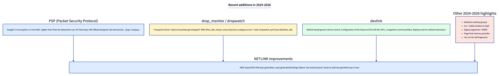

# Day 29 — Recent additions: PSP, drop_monitor, devlink, NETLINK

> **Today's mission:** know what's new in the network stack as of kernel 7.x. Total time: ~60 minutes.



## PSP — Packet Security Protocol

Google's lightweight L4 encryption (different from IPsec). In-tree as of 2025. Per-flow keys, designed for hardware offload, intended for datacenter scale. Code in `net/psp/` (and NIC driver implementations).

```bash
ls net/psp/   # if your kernel has it
ip psp ...    # CLI (requires iproute2 with PSP support)
```

## drop_monitor / dropwatch

Watch every kernel-side packet drop with category attribution. The `kfree_skb_reason` mechanism (covered Day 1) feeds this.

```bash
# install dropwatch
sudo dropwatch -l kas
# inside: 'start'

# or via perf:
sudo perf trace --no-syscalls -e skb:kfree_skb 2>&1 | head
```

Each drop now has a `reason` enum (~150 categories in 7.x). New code should always use `kfree_skb_reason()` instead of `kfree_skb()`.

## devlink

Generic netlink-based device control. Replaces ad-hoc ethtool extensions. Examples:
- SR-IOV configuration.
- DPLL (digital PLL for time synchronization, important for 5G).
- Per-port congestion control profile selection.

```bash
devlink dev show
devlink dev info pci/0000:01:00.0
```

## NETLINK improvements (libynl)

The kernel community now writes NETLINK protocols in YAML (`Documentation/netlink/specs/`). Bindings auto-generate from the specs:

```bash
ls tools/net/ynl/
# generated C/Python bindings for many netlink protocols
```

This dramatically lowers the cost of adding new netlink ops — each new feature comes with bindings out of the box.

## Other 2024–2026 highlights

- **Resilient nexthop groups** (Day 9): localizes impact when a nexthop fails.
- **tcx and netkit**: modern tc-bpf attach (replaces classic tc-bpf).
- **bigtcp**: TCP segments larger than 64KB on the local stack (4MB), great for fast NICs.
- **Page Pool memory provider**: io_uring zero-copy recv (still maturing).
- **net_iov**: skb fragments backed by io_iov for unified handling with io_uring.

## What to read in the kernel

- **`net/psp/`** — PSP.
- **`include/net/dropreason-core.h`** — drop reasons.
- **`net/core/devlink/`** — devlink core.
- **`Documentation/netlink/specs/`** — YAML netlink specs.
- **`tools/net/ynl/`** — code generators.

## Bullet Points

- **PSP** — Google's lightweight datacenter encryption.
- **drop_monitor + kfree_skb_reason** — modern drop attribution.
- **devlink** — generic netlink device control.
- **YAML NETLINK + libynl** — easier protocol additions.
- **bigtcp** — large local segments for very fast NICs.

## Check question

Why is `kfree_skb_reason` strictly better than `kfree_skb` in new code?

.  
.  
.

**Answer:** It feeds the drop monitor with a *category* enum, making "where do my drops come from?" answerable. Plain `kfree_skb` just disposes of the skb; `kfree_skb_reason(skb, SKB_DROP_REASON_X)` does the same plus emits a tracepoint `skb:kfree_skb` that includes the reason. Tools like dropwatch/perf can then aggregate by reason, helping diagnose why things are getting dropped (PROTO_MEM full, SOCKET_FILTER, IP_INHDR_INVALID, etc.).

## Tomorrow

Day 30: capstone.
