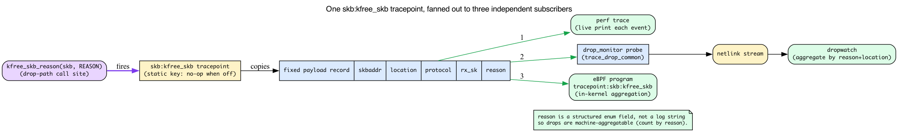
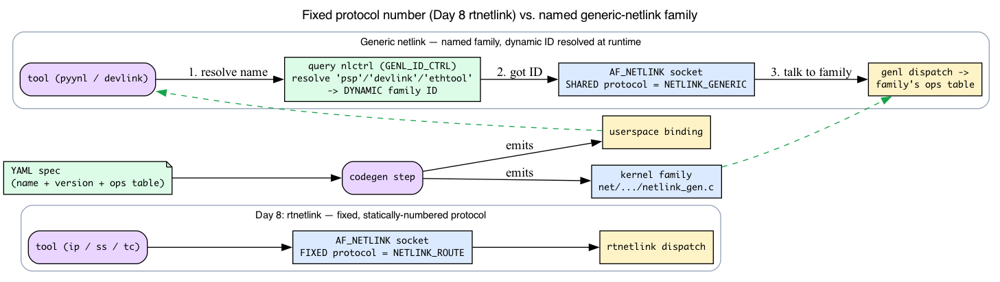
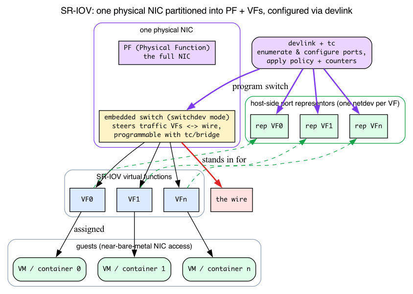

# Day 29 — Recent additions: PSP, drop_monitor, devlink, NETLINK YAML

> **Today's mission:** know what's new in the network stack as of kernel 7.1 — PSP encryption, categorized drop attribution, generic device control, and the YAML-driven netlink toolchain — what each subsystem is *for*, and where it fits alongside everything you've already learned. Along the way we'll teach the two pieces of plumbing the whole chapter rests on but no earlier day covered: **tracepoints** (the static instrumentation hooks that make `kfree_skb` observable) and **generic netlink** (the family layer PSP, devlink, and ethtool all sit on). Total time: ~110 minutes.

This is a survey day. It is less "here is one struct, dissected to the field" and more "here are four recent subsystems, and here is exactly enough of the machinery underneath each that none of them is a black box." Two of those machines — tracepoints and generic netlink — are load-bearing for the whole chapter, so we teach them properly, intuition first, before the subsystem that leans on them.

---

## Background 1: what a tracepoint actually is

The entire observability story today — `perf trace`, `dropwatch`, eBPF watching drops — rests on one mechanism the book has used but never explained: the **tracepoint**. Before we can say "drop_monitor listens on the `skb:kfree_skb` tracepoint," you need to know what that hook *is*.

### The problem: instrument the kernel without paying for it when nobody's watching

You want to be able to ask "every time the kernel frees a packet, tell me where and why." The naive way — a `printk` at the free site — is a disaster: it fires on every single freed skb whether or not anyone is listening, drowning the box. What you want is a hook that is **completely free when no one is attached** and only does work when a consumer turns it on.

That is a **tracepoint**: a named, statically-placed hook compiled into the kernel at a fixed source location, costing essentially nothing when off (the call site is patched out to a no-op via a *static key* — a runtime-patched branch), and dispatching to every registered listener when on.

### `TRACE_EVENT`: declaring the hook and its payload

A tracepoint is declared with the **`TRACE_EVENT`** macro, which defines two things: the hook's **argument list** (`TP_PROTO`) and the **fixed payload record** copied to every listener (`TP_STRUCT__entry`). Here is the real declaration for the one this chapter cares about (`include/trace/events/skb.h:24`):

```c
TRACE_EVENT(kfree_skb,

    TP_PROTO(struct sk_buff *skb, void *location,
             enum skb_drop_reason reason, struct sock *rx_sk),   /* skb.h:26 */

    TP_STRUCT__entry(
        __field(void *,            skbaddr)     /* skb.h:32 */
        __field(void *,            location)
        __field(void *,            rx_sk)
        __field(unsigned short,    protocol)
        __field(enum skb_drop_reason, reason)
    ),

    TP_printk("skbaddr=%p rx_sk=%p protocol=%u location=%pS reason: %s",
              __entry->skbaddr, __entry->rx_sk, __entry->protocol,
              __entry->location,
              __print_symbolic(__entry->reason,
                               DEFINE_DROP_REASON(FN, FNe)))     /* skb.h:47 */
);
```

Read that payload carefully, because it is the whole reason this chapter exists:

- **`skbaddr`** — which skb died.
- **`location`** — the kernel call site that freed it, printed as a symbol (`%pS` turns the raw address into `tcp_v4_rcv+0x2a`).
- **`protocol`** — the EtherType (recall `skb->protocol` from the Day 2 demux).
- **`rx_sk`** — the receiving socket, if any.
- **`reason`** — the drop-reason enum, rendered to a human string by `__print_symbolic` over `DEFINE_DROP_REASON`.

That **`reason` is a structured field in the payload, not a free-text log string.** That single fact is the chapter's whole thesis: because the reason is an enum that travels in the record, "why was this packet dropped?" becomes *machine-aggregatable* — you can count drops by reason, the way you'll do in today's experiment.

### Who fires it: `kfree_skb_reason`

You met this on Day 1. Every time the kernel frees a packet on the drop path it calls **`kfree_skb_reason(skb, reason)`** (`include/linux/skbuff.h:1322`), which is what trips the `kfree_skb` tracepoint. And the plain old `kfree_skb(skb)` you've seen for years is now *literally* just the reason'd version with the reason left blank (`skbuff.h:1333`):

```c
static inline void kfree_skb(struct sk_buff *skb)
{
    kfree_skb_reason(skb, SKB_DROP_REASON_NOT_SPECIFIED);   /* skbuff.h:1333 */
}
```

So a call site that still uses bare `kfree_skb` *does* fire the tracepoint — but its `reason` field is the useless `NOT_SPECIFIED`. Converting it to `kfree_skb_reason(skb, SKB_DROP_REASON_X)` costs one argument and turns a "something died here" event into a categorized one (the structured-enum property from Background 1). (Hold that thought — it is exactly today's Check question.)

### Many consumers, one hook

The payoff the chapter keeps asserting — "perf, dropwatch, and BPF all see the same drops" — falls straight out of how tracepoints dispatch. **Multiple consumers attach to the same hook independently**, and the kernel fans the payload out to all of them:

- **`perf trace`** subscribes and prints each event live.
- **The in-kernel `drop_monitor`** registers a probe with `register_trace_kfree_skb(ops->kfree_skb_probe, NULL)` (`net/core/drop_monitor.c:1164`); the registered probe is `trace_kfree_skb_hit` (`drop_monitor.c:485`), which dispatches to the shared aggregator `trace_drop_common` (`drop_monitor.c:216`) and forwards events to userspace **over netlink** — which is what the `dropwatch` tool reads.
- **eBPF programs** can attach to `tracepoint:skb:kfree_skb` and run arbitrary aggregation in-kernel.

One `kfree_skb_reason` call site, three independent subscribers, zero cost when none are attached. *That* is why this chapter's observability all comes back to a single hook.



---

## Background 2: generic netlink — the family layer PSP, devlink, and ethtool share

Three of today's subsystems (PSP config, devlink, and the ethtool the YAML toolchain talks to) speak **generic netlink**. Day 8 already taught you the netlink substrate; here we teach only the one new layer on top.

> **Recall from Day 8 (Background 4, the rtnetlink path):** netlink is a socket-based control-plane protocol — userspace opens an `AF_NETLINK` socket and exchanges structured messages built from TLV (type-length-value) attributes, with a *dump* form (list everything) and a *do* form (one operation). Day 8's `ip`/`ss`/`tc` traffic all rode `NETLINK_ROUTE`, a **fixed, statically-numbered protocol**. We do **not** re-teach any of that.

Here is the new problem. A netlink socket is opened against one of a small, fixed set of **`NETLINK_*` protocol numbers** — `NETLINK_ROUTE`, `NETLINK_NETFILTER`, and so on. There are only 32 such slots, and they are a scarce, static resource. If every new subsystem — PSP, devlink, ethtool, DPLL, conntrack-over-netlink — claimed its own `NETLINK_*` number, the space would have been exhausted years ago.

So modern subsystems do **not** each grab a protocol number. Instead they register a **generic netlink family**: a named multiplexed channel living under the single shared protocol `NETLINK_GENERIC`. The family is identified by a **string name** — `"psp"`, `"devlink"`, `"ethtool"` — not a compiled-in number:

```c
/* net/psp/psp-nl-gen.c:129 */
struct genl_family psp_nl_family __ro_after_init = {
    .name = PSP_FAMILY_NAME,          /* "psp"  — include/uapi/linux/psp.h:10 */
    /* .version, .ops table, ... */
};

/* net/devlink/netlink.c:398 */
struct genl_family devlink_nl_family __ro_after_init = {
    .name = DEVLINK_GENL_NAME,        /* "devlink" — include/uapi/linux/devlink.h:18 */
    /* ... */
};
```

(ethtool's family name is `ETHTOOL_GENL_NAME` `"ethtool"`, `include/uapi/linux/ethtool_netlink_generated.h:10` — that's the family the working `pyynl rings-get` dump at the end of this chapter talks to.)

### Name → ID resolved at runtime

The family's **numeric ID is allocated dynamically at registration**. `genl_register_family(struct genl_family *family)` (`net/netlink/genetlink.c:775`, `EXPORT_SYMBOL` at `:840`) hands out an ID at boot/module-load time — PSP comes online via exactly this call (`net/psp/psp_main.c:377`: `return genl_register_family(&psp_nl_family);`).

So how does a userspace tool find that runtime ID? It asks the one family with a *fixed* ID — the **controller family `nlctrl`** (`.id = GENL_ID_CTRL, .name = "nlctrl"`, `genetlink.c:1805-1806`). The tool sends `nlctrl` a "resolve this name" request, gets back the dynamic family ID, and then talks to the subsystem. This runtime name resolution is precisely why `pyynl/cli.py` takes a `--spec` and a family name and "just works" with no hand-assigned protocol number.

### Why this makes the YAML codegen possible

Look at the struct again: a genl family is *just* a name, a version, and an **ops table**. That regularity is what lets the YAML story (next-to-last section) work — a YAML spec describes exactly those fields, so a generator can emit **both** the kernel-side family (`net/.../netlink_gen.c`) **and** the userspace binding from one file. A statically-numbered protocol with hand-rolled message parsing (Day 8's rtnetlink) couldn't be generated that mechanically; a genl family can.



---

## PSP — Packet Security Protocol

A datacenter-scale L4 encryption protocol developed by Google, contributed to Linux in 2025 (in-tree by 7.x).

- **What:** symmetric authenticated encryption applied to L4 payloads inside a UDP encapsulation (`PSP_DEFAULT_UDP_PORT` 1000); the in-tree Linux socket integration upgrades TCP connections. Per-flow keys, designed for hardware offload (NICs with PSP-aware crypto).
- **Why:** datacenter operators want confidentiality and integrity on internal traffic without IPsec's complexity (IKE, SA database, kernel SADB) or TLS's per-connection handshake. PSP is lightweight: per-flow shared secret negotiated out of band, then plain symmetric crypto on every packet.
- **When:** datacenter East-West traffic between trusted hosts running compatible PSP stacks. Not for internet-facing.
- **Where:** **`net/psp/`** — `psp_main.c` (registration), `psp_sock.c` (socket integration), `psp_nl.c` (netlink config interface), `psp.h` (UAPI).
- **Status:** in-tree but new; tooling (`ip psp ...` via iproute2) is being established. Practical use is mostly inside Google for now; broader adoption pending.

You already have every prerequisite for PSP from earlier days — PSP is mostly a *recombination* of things you've built:

> **The UDP encapsulation (recall Day 12).** PSP rides UDP destination port 1000 — the same encapsulate-then-demux-by-port pattern you built for VXLAN in Day 12. On TX, `psp_dev_encapsulate` (`net/psp/psp_main.c:224`) calls `psp_write_headers`, which sets `uh->dest = htons(PSP_DEFAULT_UDP_PORT)` (`psp_main.c:171`); on RX, `psp_dev_rcv` demuxes on `uh->dest == htons(PSP_DEFAULT_UDP_PORT)` (`psp_main.c:313`). No new tunnel mechanism — reuse Day 12's mental model.

> **The crypto (recall Day 25).** "Symmetric authenticated encryption" and "per-flow shared secret negotiated out of band, then plain symmetric crypto on every packet" is the same **AEAD-after-out-of-band-handshake** split you saw in kTLS on Day 25 — bulk symmetric crypto in the steady state, key negotiation done elsewhere. The contrast worth one sentence: kTLS keys are per-TCP-connection (a ULP) and aimed at the software/offload boundary, whereas **PSP keys are per-flow and designed specifically for hardware crypto offload in the NIC.** The per-flow key material lives in a *PSP association* created by `psp_assoc_create` (`net/psp/psp_sock.c:47`); installing it for offload is `psp_dev_tx_key_add` → `psd->ops->tx_key_add` (`psp_sock.c:80`), which hands the key down to the NIC. `psp_key_size(version)` (`psp_main.c:149`) returns how much key material a given PSP version needs.

So PSP is genuinely new *as a protocol*, but for a reader who did Day 12 and Day 25 there is no new background to learn — only a new place those two ideas combine, registered as a generic-netlink family (`psp`, Background 2) and brought online by `genl_register_family(&psp_nl_family)` at `psp_main.c:377`.

## drop_monitor + `kfree_skb_reason`

Observability infrastructure for "where do packets get dropped?" — and now (Background 1) you know exactly what it's built on.

`net/core/drop_monitor.c`. It registers a probe on the `skb:kfree_skb` tracepoint (`register_trace_kfree_skb`, `drop_monitor.c:1164`) and, in its default summary mode, aggregates the events by **call-site location** inside the kernel (`trace_drop_common`, `drop_monitor.c:216` — the summary record `struct net_dm_drop_point` carries only `pc` + `count`, no reason field, so `trace_kfree_skb_hit` passes the `reason` argument straight through to `trace_drop_common` without keying on it), forwarding the aggregate to userspace over netlink. The drop *reason* is carried per-event only in drop_monitor's optional **packet mode** (`net_dm_packet_trace_kfree_skb_hit` stashes `cb->reason` and emits `NET_DM_ATTR_REASON`); the live histogram you build later aggregates by reason in *userspace* (`perf trace | awk | sort | uniq`), not in the drop_monitor summary path. Combined with `kfree_skb_reason` (Day 1), that gives you a categorized dropwatch.

**The `kfree_skb_reason` API:**

```c
kfree_skb_reason(skb, SKB_DROP_REASON_TCP_INVALID_SEQUENCE);
```

Replaces the older `kfree_skb(skb)` (which, recall from Background 1, is now just this with `NOT_SPECIFIED`). The reason is one of ~125 categories — the **core** enum in `include/net/dropreason-core.h` runs up to `SKB_DROP_REASON_MAX` (`dropreason-core.h:613`), and subsystems add their own on top:

```c
enum skb_drop_reason {     /* include/net/dropreason-core.h:138; values/order abridged */
    SKB_DROP_REASON_NOT_SPECIFIED,        // :146  legacy callers (what plain kfree_skb emits)
    SKB_DROP_REASON_NO_SOCKET,            // :154  no listener
    SKB_DROP_REASON_PKT_TOO_SMALL,        // :173  truncated
    SKB_DROP_REASON_TCP_CSUM,             //       bad TCP checksum
    SKB_DROP_REASON_SOCKET_FILTER,        //       BPF socket filter dropped
    SKB_DROP_REASON_UDP_CSUM,
    SKB_DROP_REASON_NETFILTER_DROP,       //       iptables/nftables rule
    SKB_DROP_REASON_TC_INGRESS,
    /* ... up to SKB_DROP_REASON_MAX at :613, plus per-subsystem reasons ... */
};
```

The names are real; the order/values are abridged for illustration. The list is generated from the `DEFINE_DROP_REASON` table — the same table `TP_printk` uses (Background 1) to render `reason` into a string.

**Why the change:** old `kfree_skb` gave no signal beyond "a packet died here." With reasons, dropwatch tells you `SOCKET_FILTER` (a BPF filter dropped) vs `NETFILTER_DROP` (a firewall rule did) vs `IP_INHDR` (the packet was malformed). Differentiating those is the difference between "fix my firewall rules" and "fix my broken sender" — and the structured-enum property from Background 1 is what makes those categories countable in the histogram you're about to build.

**Inspect drops:**

An idle box drops almost nothing, so provoke some `NO_SOCKET` drops first. In another terminal, hit a closed port a few times — each attempt is dropped with no listener:

```bash
for i in $(seq 1 50); do curl -s --max-time 1 http://localhost:1 >/dev/null; done
```

While that runs, watch the live event stream. `perf trace` is one of the tracepoint subscribers from Background 1 — it attaches to `skb:kfree_skb` and prints each payload record as it fires:

```bash
# Live event stream with reasons (timeout so it terminates cleanly)
sudo timeout 10 perf trace --no-syscalls -e skb:kfree_skb 2>&1 | head -50
```

Each line names the call site that freed the skb plus the reason category — these are the `location` and `reason` fields of the payload record we read in Background 1:

```
0.104 curl/506057 skb:kfree_skb(skbaddr: 0xffff..., location: 0xffff..., rx_sk: 0xffff..., protocol: 2048, reason: SKB_DROP_REASON_NO_SOCKET)
```

`dropwatch` is the second subscriber from Background 1 — it reads the drop_monitor netlink stream and aggregates the same tracepoint by call-site location (and, in packet mode, surfaces the per-event reason). It ships in its own `dropwatch` package (`apt install dropwatch` / `dnf install dropwatch`) — skip this block if it isn't installed:

```bash
sudo dropwatch -l kw       # 'kw' = kallsyms based
```

That drops you at dropwatch's interactive prompt (`dropwatch>`); type `start`, generate drops, then `stop`. The parenthesized reason below appears only when dropwatch is run in **packet mode** — the `-l kw` summary mode shown here emits call-site location + count only (Background 1's `net_dm_drop_point`), so a real summary line carries no reason string:

```
dropwatch> start
1 drops at tcp_v4_rcv+0x2a (SKB_DROP_REASON_NO_SOCKET)   # reason shown only in packet mode
dropwatch> stop
```

To aggregate reasons over a window, bound `perf trace` with `timeout` *before* the pipe — `perf trace` streams forever, and `sort`/`uniq` only print after the input stream ends, so they need a clean EOF:

```bash
# Aggregate by reason
sudo timeout 10 perf trace --no-syscalls -e skb:kfree_skb 2>&1 | awk '{print $NF}' | sort | uniq -c | sort -rn | head
```

With the closed-port loop running, one category dominates the histogram. *Which* one is path- and environment-dependent: the loopback RST path may yield `SKB_DROP_REASON_NO_SOCKET`, but you'll also commonly see `SKB_DROP_REASON_QUEUE_PURGE` or `SKB_DROP_REASON_NOT_SPECIFIED` depending on how the closed-port reset is handled:

```
    160 SKB_DROP_REASON_NO_SOCKET)
```

That histogram is only possible because `reason` is a structured enum field, not a log message — the mechanism Background 1 spelled out.

**Adopting `kfree_skb_reason`** is an ongoing kernel project. Many call sites still use plain `kfree_skb`; new code is expected to use `_reason`.

## devlink — generic device control

`net/devlink/`. A netlink-based generic interface for device-level configuration that doesn't fit ethtool. Concretely (Background 2) it's the generic-netlink family named `"devlink"` (`net/devlink/netlink.c:398`) — which is why a brand-new device knob doesn't need its own `NETLINK_*` number.

What ethtool does: per-NIC counters, ring sizes, offload flags. It's been growing for years and getting sloppy at the edges.

What devlink does: more abstract device knobs.
- **SR-IOV management**: configure virtual functions, switchdev mode, port representors.
- **Health reporting**: hardware/firmware telemetry, recovery actions.
- **Resource control**: device-internal table sizes (bridge FDB, IPv4 routes, ACLs).
- **DPLL** (Digital PLL): time-synchronization for 5G and HFT applications.
- **Per-port congestion-control profiles**: configure NIC-level CC behavior.

That first bullet packs four terms no earlier day taught. Here's the one-paragraph demystifier so the bullet stops being four black boxes:

> ### Refresher: SR-IOV, PF/VF, switchdev, port representors
>
> **SR-IOV** (Single-Root I/O Virtualization) lets one physical NIC present itself as many lightweight PCIe devices: one **Physical Function (PF)** — the full NIC — plus N **Virtual Functions (VFs)**, each assignable to a VM or container so it gets near-bare-metal NIC access *without* the host's software switch sitting on its data path. **switchdev mode** means the NIC's built-in hardware switch — the thing that steers traffic between those VFs and the wire — is exposed to Linux so you can program it with ordinary `tc`/`bridge` tooling instead of vendor-proprietary knobs. A **port representor** is a host-side netdev that *stands in* for one VF (or one physical port), so the host can attach counters, `tc` rules, and policy to a VF's traffic it otherwise couldn't see. **devlink is the channel that enumerates and configures all of this** — which is why SR-IOV lives under devlink, not ethtool. (Kernel side: `net/devlink/port.c` holds the port objects behind `devlink port show`, including port-flavour/representor handling; the per-port rate and shared-buffer knobs behind the "per-port congestion-control" and "resource control" bullets live in `net/devlink/rate.c` and `net/devlink/sb.c`.)



Tools: `devlink dev show`, `devlink port show`, `devlink dev info`, `devlink resource show`. The `iproute2` package ships the `devlink` binary.

Run `devlink dev show` first and copy one of the listed handles into the next two commands — `pci/0000:01:00.0` below is a placeholder that almost certainly won't match your NIC:

```bash
devlink dev show
# Substitute a handle from the line above, e.g.:
devlink dev info pci/0000:01:00.0
devlink resource show pci/0000:01:00.0
```

On virtio-net / `hv_netvsc` / most cloud-VM NICs `devlink dev show` prints **nothing** — those drivers don't register a devlink instance, so there is no handle to inspect. You need an mlx5 / ice / nfp device (some cloud VMs expose an mlx5 SR-IOV VF) to see real output. Even then `resource show` often returns `Operation not supported` — it's driver-specific (see below).

devlink is **driver-specific** — each driver opts in by registering its capabilities. mlx5, ice (Intel), nfp (Netronome) have rich devlink support; many older drivers don't.

## NETLINK YAML and libynl

Netlink is the kernel's preferred control-plane protocol — `ip`, `ss`, `nft`, `tc`, all of devlink, and most modern subsystems use it (and, as Background 2 showed, the newer ones via generic-netlink families). Adding new netlink ops historically required:

1. Define the protocol's UAPI structs/enums.
2. Implement the kernel-side handler.
3. Write the userspace parsing/formatting code (often in libnl, iproute2, or a custom binding).

The third step was the bottleneck — every binding had to be written by hand for every new netlink subsystem. So the kernel community now writes netlink protocols as **YAML specifications**, and tooling auto-generates bindings. This is exactly the regularity Background 2 pointed at: a genl family is just a name + version + ops table, so a YAML file can describe it completely and a generator can emit both ends.

The YAML specs live at `Documentation/netlink/specs/`:

```
Documentation/netlink/specs/
├── conntrack.yaml
├── devlink.yaml
├── dpll.yaml
├── ethtool.yaml
├── handshake.yaml
├── nlctrl.yaml       # the controller family from Background 2
├── psp.yaml          # PSP's spec
└── ...
```

Each spec describes the protocol's messages, attributes, types. From these, tools generate:

- C bindings for the kernel side (in `net/.../netlink_gen.c` — e.g. devlink's `net/devlink/netlink_gen.c`).
- Python bindings (`tools/net/ynl/pyynl/`).
- C library code (`tools/net/ynl/lib/`).
- Test scaffolding.

The generator is `tools/net/ynl/`. Adding a new netlink protocol is now: write the YAML, run the generator, implement only the actual logic.

**Practical impact:** new features land with bindings on day one. Less drift between kernel UAPI and userspace tooling.

## Other 2024–2026 highlights

A grab bag of features that aren't dedicated days but matter:

### Resilient nexthop groups (Day 9)

ECMP that survives nexthop changes without re-hashing every flow.

### tcx and netkit (Day 17 of eBPF book / Day 23 of network book)

Modern tc-bpf attach with `bpf_link` lifecycle and link-based multi-program ordering. Replaces classic `tc filter add bpf` for new code.

### bigtcp

TCP segments larger than 64 KB on the local stack (up to ~512 KB, `GSO_MAX_SIZE`). Useful for very fast NICs (200/400 Gbps) where the per-segment overhead becomes the bottleneck. Configurable via `ip link set <dev> gso_max_size <bytes>` and matching `gro_max_size`.

### Page Pool memory provider

Improved zero-copy receive (in progress). Lets receivers get packet payloads without copying from kernel page-cache pages. Integrated with io_uring's zero-copy recv work.

### net_iov and skb fragments

Unifies the "skb frags hold pages" model with io_uring's iovec model. Gives a single representation that both kernel networking and io_uring's I/O batching can use. Reduces translation overhead. (You met `net_iov` already on Day 1 — it's the non-page memory a frag's `netmem_ref` can encode.)

### Smart NIC offload progress

Per-flow TLS offload (Day 25) is well-established. Inline IPsec offload landed in 2024. Per-flow QoS offload (some NICs support arbitrary classification rules) keeps maturing.

## There are no Dumb Questions

> **Q: If a tracepoint is "zero cost when off," how does turning it on not require recompiling the kernel?**
>
> A: The call site is patched at runtime. A tracepoint compiles to a *static key* — a branch that the kernel rewrites in place (a no-op when no consumer is attached, a real call when one is). Registering a probe (`register_trace_kfree_skb`, `perf`, or a BPF attach) flips the key on; the last consumer detaching flips it back off. So "off" is genuinely a no-op in the instruction stream, and "on" needs no rebuild — only a live code patch.

> **Q: Why does PSP get a generic-netlink family instead of its own `NETLINK_*` number like rtnetlink?**
>
> A: Because the 32 `NETLINK_*` protocol slots are a scarce static resource (Background 2). Every modern subsystem — PSP, devlink, ethtool, DPLL — registers a *named* generic-netlink family under the single shared `NETLINK_GENERIC` protocol instead, getting a dynamically-allocated ID that userspace resolves at runtime by name via `nlctrl`. That's also what makes the YAML codegen possible: a family is a uniform name+version+ops record a generator can describe.

> **Q: `perf trace`, `dropwatch`, and a BPF program are all watching drops at once. Do they interfere?**
>
> A: No — they're independent subscribers to the same `skb:kfree_skb` tracepoint (Background 1). The kernel fans each fired payload record out to every registered listener. `perf` prints, `dropwatch` (via the drop_monitor probe and netlink) aggregates, BPF runs its own program — none of them consumes the event so the others miss it.

## Today's experiment

The drop_monitor section already walked you through the full `perf trace` histogram (provoke `NO_SOCKET` drops with the closed-port curl loop, then aggregate by reason) — **re-run that histogram now** if you skipped it, then move on to the two probes the body only described but never ran hands-on: devlink enumeration and a YAML-generated python tool.

```bash
# Probe devlink
which devlink && devlink dev show
```

Prints one device handle per registered device — or nothing on virtio/cloud NICs that register no devlink instance.

```bash
# Look at the YAML netlink specs
cd ~/code/linux                    # your kernel source tree
ls Documentation/netlink/specs/
```

Lists the per-protocol `.yaml` spec files, including `devlink.yaml`, `ethtool.yaml`, and `psp.yaml`.

```bash
# Try a YAML-generated python tool. Install the ynl deps first:
pip install -r tools/net/ynl/requirements.txt   # or: pip install jsonschema pyyaml
cd tools/net/ynl
# ethtool's spec decodes cleanly against a stock NIC — dump the ring sizes:
python3 ./pyynl/cli.py --spec ../../../Documentation/netlink/specs/ethtool.yaml \
    --dump rings-get 2>&1 | head     # may need root
```

This prints a JSON object per interface — the kernel's ethtool ring config, fetched over netlink with zero hand-written C (the `nlctrl` name-resolution from Background 2 does the wiring):

```
[{'header': {'dev-index': 2, 'dev-name': 'eth0'}, 'rx': 9362, 'rx-max': 18139, ...}]
```

The genuinely new lesson here is **two gotchas the body's YAML section didn't cover.** **Op naming:** ops are `get`/`rings-get`, not `dev-get` — `--do dev-get` raises `KeyError: 'dev-get'`. Use `--dump <op>` (lists every instance, like `devlink dev show`) since the `--do` form needs a specific id. **Spec-vs-kernel skew:** the YAML specs track mainline, so dumping a spec whose attributes are newer/older than your running driver can raise `YnlException: Space '...' has no attribute with value 'N'` — e.g. `devlink.yaml --dump get` against an mlx5 device on this kernel. That's a spec/kernel version mismatch, not a bug in your invocation; the stabler specs like `ethtool.yaml` decode cleanly. Without the deps you'll instead see `ModuleNotFoundError: No module named 'jsonschema'`.

## What to read in the kernel

- **`include/trace/events/skb.h`** — the `TRACE_EVENT(kfree_skb)` declaration (line 24). Read `TP_PROTO` (line 26), `TP_STRUCT__entry` (line 31), and the `TP_printk` (line 47) to see the exact payload every subscriber receives.

- **`net/psp/`** — PSP. Read `psp_main.c` first (~380 lines — confirmed 380) for the registration model (`genl_register_family(&psp_nl_family)` at line 377), then `psp_sock.c` for the socket-side integration (`psp_assoc_create` at line 47, `psp_dev_tx_key_add` at line 80).

- **`include/net/dropreason-core.h`** — the `enum skb_drop_reason` list (line 138, up to `SKB_DROP_REASON_MAX` at line 613). Skim. Tells you what categories of drops dropwatch can report.

- **`net/core/drop_monitor.c`** — the drop-monitor implementation. Read `trace_drop_common` (line 216) to see how the tracepoint is dispatched to userspace via netlink, and `register_trace_kfree_skb` (line 1164) to see the probe attach.

- **`net/netlink/genetlink.c`** — generic netlink core. `genl_register_family` (line 775) for dynamic ID allocation, and the controller family `nlctrl` (`.id = GENL_ID_CTRL`, lines 1805-1806) that userspace queries to resolve a family name.

- **`net/devlink/`** — devlink core. ~15000 lines across multiple files. Read `core.c` for the registration model, `dev.c` for device lifecycle, `health.c` for the health-reporter framework, and `port.c`/`rate.c`/`sb.c` for the SR-IOV port and per-port-resource knobs.

- **`Documentation/netlink/specs/`** — the YAML protocol specs. Open `devlink.yaml` or `ethtool.yaml`; the structure is self-descriptive.

- **`tools/net/ynl/`** — the YAML processing toolchain. `pyynl/cli.py` is a runnable example.

- **`Documentation/networking/devlink/`** — devlink user-facing docs. Subsystem-specific writeups.

- **External:** the netdev mailing list (`netdev@vger.kernel.org`) is where these things land. Subscribe if you want to track future features in real time.

## Bullet Points

- A **tracepoint** is a named, static, zero-cost-when-off hook declared with `TRACE_EVENT`; `kfree_skb_reason` fires `skb:kfree_skb`, whose payload carries `skbaddr/location/protocol/rx_sk/reason`. The `reason` being a structured enum (not a log string) is what makes drops machine-aggregatable.
- **Generic netlink** lets PSP/devlink/ethtool register *named* families under the single `NETLINK_GENERIC` protocol (vs. Day 8's fixed `NETLINK_ROUTE`); IDs are allocated at `genl_register_family` and resolved by name at runtime via `nlctrl`. This regularity is what makes the YAML codegen possible.
- **PSP** — Google's lightweight datacenter L4 encryption. UDP-encapsulated (port 1000, recall Day 12) with per-flow AEAD keys for NIC offload (recall Day 25). In-tree 7.x; `net/psp/`.
- **`kfree_skb_reason` + drop_monitor** — categorized drop attribution over the `skb:kfree_skb` tracepoint. Replace `kfree_skb` in new code.
- **devlink** — netlink-based generic device control. Replaces ad-hoc ethtool extensions for SR-IOV (PF/VF/switchdev/representors), DPLL, health reporting, resource control.
- **NETLINK YAML** + **libynl** (`tools/net/ynl/`) — YAML-driven binding generation. New protocols ship with bindings.
- **bigtcp** — segments > 64 KB locally for very fast NICs.
- **Resilient nexthop groups** — ECMP without re-hash on nexthop change (Day 9).
- **tcx + netkit** — modern tc-bpf with link-based lifecycle.

## Check question

Why is `kfree_skb_reason` strictly better than `kfree_skb` in new code, and what infrastructure depends on it?

<details>
<summary>Click to reveal answer</summary>

**Answer:** It feeds the drop monitor with a *category* enum, making "where do my drops come from?" answerable. Plain `kfree_skb` just disposes of the skb; `kfree_skb_reason(skb, SKB_DROP_REASON_X)` does the same plus emits a tracepoint `skb:kfree_skb` whose payload includes the reason (Background 1). Tools that depend on this:

- **`dropwatch`** aggregates drops by category and source location, reporting top contributors over time (via the drop_monitor probe → netlink).
- **`perf trace --no-syscalls -e skb:kfree_skb`** prints each drop with the category in real time.
- **eBPF programs** can attach to the tracepoint (e.g., `tracepoint:skb:kfree_skb`) and apply custom aggregation.

All three are independent subscribers to the *same* hook — that's the tracepoint fan-out from Background 1.

Without `_reason`, you can still see *that* a drop happened (the tracepoint fires for plain `kfree_skb` too, since `kfree_skb` is literally `kfree_skb_reason(skb, NOT_SPECIFIED)`) but you can't tell *why* — and the most common reason of all becomes `SKB_DROP_REASON_NOT_SPECIFIED`, which is useless for diagnosis.

In a kernel with full `_reason` adoption, you can do meaningful "why are my packets being dropped?" analysis without strace, ftrace, or guesswork. The conversion of every legacy `kfree_skb` call site is an ongoing project; new code is required to use the reason'd variant.

</details>

---

## Tomorrow

Day 30: capstone — pick a real packet and trace it end to end through every kernel layer you've learned.
