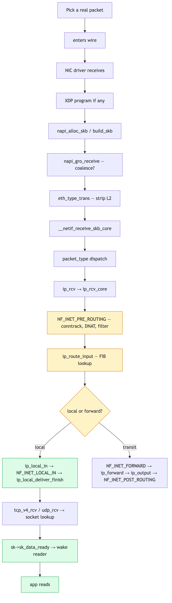
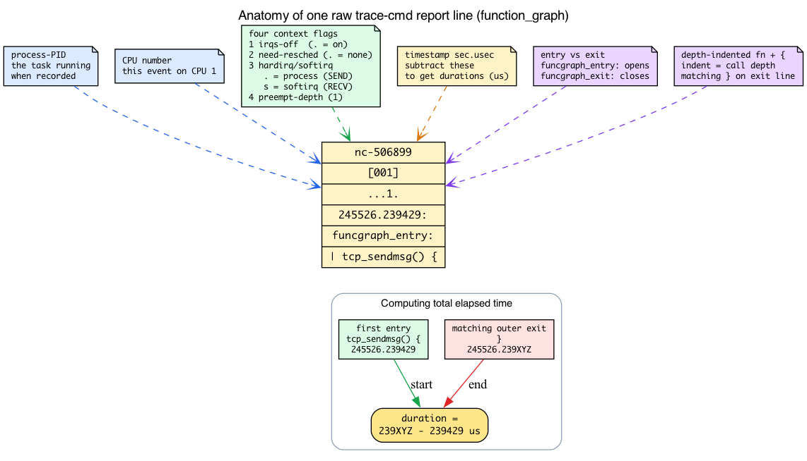
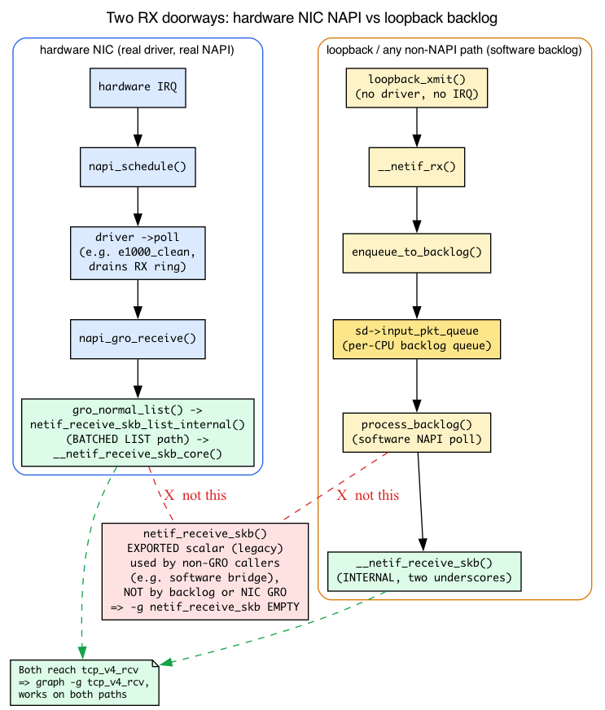

# Day 30 — Capstone: trace one packet end to end

> **Mission:** pick one real packet from your system. Trace it through every kernel layer you've learned over the last 29 days. Write up what you saw, with kernel function names and rough timings. Along the way you'll learn the two last pieces of background the capstone leans on — how to read raw `trace-cmd` output, and the per-CPU "backlog" device that loopback's receive side runs on. ~4–5 hours.

## Why this exercise

Twenty-nine days have given you a vocabulary: sk_buff, NAPI, qdisc, fib_lookup, conntrack, netfilter hook, sk_prot, congestion control, retransmit timer, MPTCP, kTLS. Each in isolation. The capstone is to see them *cooperate* on one real, observable packet.

When you can describe a single ping or HTTP request as a sequence of kernel operations with names, you've internalized the model. That's the goal.

There are two small bits of machinery you've leaned on implicitly but never had to *read* directly, and the capstone is the first place you stare at them up close:

1. **Raw `trace-cmd report` output.** Days 2 and 3 showed you the *symbolic* call chain (`netif_receive_skb → __netif_receive_skb_one_core → ip_rcv`). Today you'll paste literal multi-column trace lines and pull a call tree and a duration out of them. We decode that format once, below.
2. **The per-CPU backlog (software NAPI) device.** Day 2 taught the *hardware* NAPI path — a driver's `->poll` draining an RX ring. Loopback has no ring and no driver; its receive side runs on a second, *software* NAPI instance per CPU called the backlog. That's why the experiment graphs `-g tcp_v4_rcv` instead of `-g netif_receive_skb`, and we teach exactly why below.

Both are short. Then you trace your packet.

## The exercise

Pick a packet — your choice of:

- **A TCP request/response over a real network**: `curl https://example.com`, watching the SYN go out and the response come back.
- **A simple ICMP exchange**: `ping -c 1 8.8.8.8`.
- **A UDP service interaction**: `dig @8.8.8.8 example.com`.
- **A bridged packet**: traffic between two namespaces over a Linux bridge.
- **A NAT'd packet**: outgoing traffic via a masquerade rule, tracking conntrack state.

Trace it through, identify each kernel layer it traverses, and write up the journey.



## Tools you'll use

- **`trace-cmd record -p function_graph`**: full function-call tree.
- **`perf trace`**: event-level visibility across syscalls and tracepoints.
- **`bpftrace` one-liners**: targeted measurements for specific functions.
- **`tcpdump`**: wire-level view (what actually went out vs what kernel state thinks). `tshark` works too if installed (`apt install tshark`), but `tcpdump` alone is sufficient here.
- **`ss -tipsm`**: socket-level state at any moment.
- **`/proc/net/*`** and `/proc/sys/net/*`: kernel state and tunables.
- **`bpftool`**: BPF program inspection if you've got any attached.

## Reading raw `function_graph` output

For 29 days you've read the *symbolic* chain — `netif_receive_skb → __netif_receive_skb_one_core → ip_rcv` — drawn for you with arrows. The capstone's deliverable asks you to produce that chain yourself from a literal `trace-cmd report`, plus a total elapsed time. So before anything else, decode one real line.

### Why `function_graph` can draw a tree at all

There are two relevant ftrace tracers. The plain **`function`** tracer probes each function only on *entry* — it can tell you a function ran, but not when it returned or how long it took. **`function_graph`** "traces on both entry and exit of the functions" and "then provides the ability to draw a graph of function calls similar to C code source" (`Documentation/trace/ftrace.rst` ~line 828). Because it sees both ends, it "calculates the timings of when the function starts and returns internally."

That is the whole reason Day 2's experiment (and today's) uses `-p function_graph`: entry **and** exit means the tracer can open a `{` brace when a function is called and close the matching `}` when it returns, and the **indentation depth equals the call-stack depth.** A nested `{ ... }` literally *is* "this function called that one." That nesting is what you'll transcribe into your `tcp_sendmsg → tcp_sendmsg_locked → ...` arrow chain.

### Decoding one line, column by column

Here is one real line from the send side (we'll meet the whole block again below):

```
nc-506899 [001] ...1. 245526.239429: funcgraph_entry: |  tcp_sendmsg() {
```

Reading left to right — and the column legend is right there in the kernel docs (`Documentation/trace/ftrace.rst:961-964`):

- **`nc-506899`** — the process name and PID that was running when this line was recorded. Here, our `nc` generator, PID 506899.
- **`[001]`** — the **CPU number**, in brackets. This event happened on CPU 1.
- **`...1.`** — the **four context-flag positions** (`ftrace.rst:1063-1083`). Decode them one at a time:
  - **position 1 — irqs-off:** `d` if interrupts are disabled, `.` otherwise.
  - **position 2 — need-resched:** `N`/`n`/`.` etc. — whether the scheduler wants to switch tasks.
  - **position 3 — hardirq/softirq:** `h` = a hard IRQ is running, `s` = a soft IRQ is running, `.` = normal (process) context.
  - **position 4 — preempt-depth:** the digit is the level of `preempt_disable` nesting (here `1`).
  - The trailing `.` is the delay marker column.
- **`245526.239429`** — the **timestamp in seconds.microseconds** since boot (six fractional digits, as `trace-cmd report` renders it; ftrace's underlying clock is nanosecond-resolution but the report rounds it to microseconds). This is what you subtract to get durations.
- **`funcgraph_entry:`** — this line is a function *entry* (the other kind is `funcgraph_exit:`).
- **`|  tcp_sendmsg() {`** — the depth-indented function, with a **`{`** opening a frame. The matching **`}`** appears later on a `funcgraph_exit:` line at the same indentation.

The position-3 flag is the one to care about for packet tracing. **`.` (normal context) means the function ran in process context** — the *send* side, running off a syscall like `send()`. **`s` (soft irq running) means softirq context** — the *receive* side, running off NAPI / `net_rx_action`. So just by glancing at the third flag column you can tell whether you're looking at the transmit half or the receive half of your flow. That's the send-vs-receive distinction this whole chapter draws, visible in one character.



### Computing the "total time elapsed" the deliverable asks for

The walk-through deliverable demands "total time elapsed (the displayed timestamps are seconds.microseconds; you can compute this)." Here's the arithmetic, on the pasted example. Each frame's duration is **the timestamp of its closing `funcgraph_exit:` minus the timestamp of its opening `funcgraph_entry:`.** For the whole `tcp_sendmsg()` subtree, find the first `tcp_sendmsg() {` entry timestamp and the matching outer `}` exit timestamp:

```
funcgraph_entry:  245526.239429   tcp_sendmsg() {     <- first entry
...
funcgraph_exit:   245526.239XYZ   }                   <- matching outer exit
```

Subtract: `239XYZ − 239429` **microseconds** is your total (the displayed timestamps are sec.usec, so the difference is in microseconds — don't mislabel it ns). You don't even have to do it by hand — when `funcgraph-tail`/`duration` is enabled (Day 2 and Day 3 both record with `-O funcgraph-tail`), `trace-cmd report` prints a **duration column** on each `funcgraph_exit` line (also in `us` units), so you can read the elapsed time straight off the outer `}`.

### One trap to expect (don't think your trace is broken)

Some frames you "expect" won't appear, for two reasons you already met in Day 2:

- **Inlined wrappers vanish.** `ip_rcv_finish` is inlined, so the trace shows `ip_rcv_finish_core` instead; `deliver_skb` is inlined into `__netif_receive_skb_core` and never appears as its own node.
- **Compiler suffixes rename symbols.** You'll see `__netif_receive_skb_core.constprop.0` or names with `.isra.N` — same function, decorated by the compiler.

This is the same caveat Day 2 spelled out — we don't re-explain it, just *remember it* so a missing or renamed frame doesn't make you think your `trace.dat` is wrong.

## The backlog device: how loopback's receive side works

Day 2 taught the **hardware** RX path in full: a NIC raises an IRQ, the driver's top half calls `napi_schedule`, `net_rx_action` walks the per-CPU `poll_list`, and each NIC queue's `->poll` (e.g. `e1000_clean`, weight 64) drains the RX ring, building skbs and feeding them to GRO. Modern GRO then flushes them through the **batched list path**: `gro_normal_list()` (`include/net/gro.h:519`) → **`netif_receive_skb_list_internal()`** (`net/core/dev.c:6406`) → `__netif_receive_skb_list()` → `__netif_receive_skb_list_core()`, which calls the per-skb core. (Recall the RX descriptor ring + DMA from Day 1.)

Loopback has none of that. There is no NIC, no IRQ, no DMA ring, no driver poll routine. So how does a packet you `nc localhost` ever "arrive"? Through a **second, software NAPI instance that exists per CPU — the backlog.**

### One backlog NAPI per CPU, hanging off softnet_data

Every CPU's `struct softnet_data` carries its own embedded backlog NAPI plus the two queues that feed it (`include/linux/netdevice.h:3551`):

```c
struct softnet_data {
    struct sk_buff_head  process_queue;   /* :3553  drained by the poll */
    /* ... */
    struct sk_buff_head  input_pkt_queue; /* :3597  where new skbs land */
    struct napi_struct   backlog;         /* :3599  the software NAPI    */
};
```

At boot, each CPU's backlog is wired to a poll routine called **`process_backlog`** (`net/core/dev.c:13256`):

```c
sd->backlog.poll = process_backlog;
```

So the backlog *is* a NAPI device — it sits on the same per-CPU `poll_list`, gets polled by the same `net_rx_action`, under the same budgets — but it is a **degenerate** one: there's no hardware ring to drain, just a software queue of skbs that something `netif_rx`'d.

### Following the loopback TX→RX hop concretely

When you send to `localhost`, the loopback device's transmit routine runs and immediately hands the skb to the *receive* side of the **same** CPU. Trace it:

1. **`loopback_xmit()`** (`drivers/net/loopback.c:70`) does `skb->protocol = eth_type_trans(skb, dev)` and then, at line ~89, `if (likely(__netif_rx(skb) == NET_RX_SUCCESS))`. There's the hop: TX calls straight into the RX entry point.
2. **`__netif_rx()`** (`net/core/dev.c:5732`) → `netif_rx_internal()` (`:5692`) → **`enqueue_to_backlog()`** (`:5373`).
3. `enqueue_to_backlog` does **`__skb_queue_tail(&sd->input_pkt_queue, skb)`** (`net/core/dev.c:5405`) — parking the skb on this CPU's backlog input queue — and, if the queue was empty, sets `NAPI_STATE_SCHED` on `sd->backlog` and calls `napi_schedule_rps(sd)` to put the backlog on the poll list and raise `NET_RX_SOFTIRQ`.
4. Later, `net_rx_action` polls the backlog: **`process_backlog()`** (`net/core/dev.c:6644`) splices `input_pkt_queue` into `process_queue` and, for each skb, calls **`__netif_receive_skb(skb)`**.

That is the entire loopback receive path: `loopback_xmit → __netif_rx → enqueue_to_backlog → sd->input_pkt_queue → process_backlog → __netif_receive_skb`. Any non-NAPI or software path — loopback, the veth/tun slow paths, legacy non-NAPI drivers — feeds this same backlog.



### Why `-g netif_receive_skb` comes up *empty* on loopback

Look closely at step 4. `process_backlog` calls the **internal** `__netif_receive_skb` (two underscores), **not** the **exported** `netif_receive_skb` (one underscore). And here's the subtler point worth getting right: a real NIC doesn't reach the exported scalar `netif_receive_skb` either. Modern NAPI GRO flushes through the **batched list path** (`netif_receive_skb_list_internal` → `__netif_receive_skb_list` → `__netif_receive_skb_core`), and the exported single-skb `netif_receive_skb()` (`net/core/dev.c:6454`) is a *legacy* entry point used by a few non-GRO callers — notably the software bridge via `br_handle_frame_finish` — not by NIC GRO.

So `-g netif_receive_skb` is an unreliable doorway on **both** paths: loopback enters via `__netif_receive_skb`, and a real NIC enters via the list path. That is exactly why the experiment graphs **`-g tcp_v4_rcv`** instead: it sits *below* the list-receive, scalar-receive, and backlog paths alike, so it is reliably reached by loopback `nc`, real `curl`, and `ping` traffic. Same packet, dependable doorway.

### Tying it back to "what loopback skips"

Because loopback's RX is the backlog, it has no driver, no hardware IRQ, no real NAPI ring drain, and no GRO coalescing — `process_backlog` just dequeues and delivers. That is why the worked example's NIC layers are simply absent on `lo`.

## A worked example: `curl http://example.com`

Let's pre-walk what your trace might look like.

### Step 1: DNS lookup (UDP)

`curl` calls `getaddrinfo("example.com")` → glibc → DNS query.

- Userspace: `socket(AF_INET, SOCK_DGRAM, 0)` → `sendto(...)` to your DNS server's port 53.
- Kernel: **`udp_sendmsg`** (`net/ipv4/udp.c:1233`) builds an skb, hands to IP.
- Outbound: `ip_send_skb` → routing → `dev_queue_xmit` → qdisc (`fq_codel`) → driver → wire.
- Wait for response.
- Inbound: NIC RX → NAPI poll → driver allocates skb → GRO → `__netif_receive_skb_core` → `ip_rcv` → routing → `udp_rcv` (`net/ipv4/udp.c:2588`) → 4-tuple lookup → enqueue on `sk_receive_queue` → wake `recvfrom`.
- Userspace: `recvfrom` returns the DNS response.

### Step 2: TCP connect (SYN)

`curl` calls `socket(AF_INET, SOCK_STREAM)` → `connect(example.com:80)`.

- Userspace: connect syscall.
- Kernel: `tcp_v4_connect` (`net/ipv4/tcp_ipv4.c:221`).
  - Route lookup → fib_lookup → `fib_table_lookup` (`net/ipv4/fib_trie.c`).
  - Pick source port → `inet_csk_get_port` → ehash insert.
  - Build SYN segment → `tcp_transmit_skb` (`net/ipv4/tcp_output.c`).
- IP layer: `ip_queue_xmit` → `ip_local_out` → `NF_INET_LOCAL_OUT` netfilter hook → conntrack creates NEW entry → `dst_output` → `ip_output` → `NF_INET_POST_ROUTING` hook → conntrack possibly NATs → `ip_finish_output2` → neighbor resolution (ARP if not cached) → `dev_queue_xmit` → qdisc → driver.
- Sock state: `TCP_SYN_SENT`.

### Step 3: TCP handshake completion (SYN-ACK + ACK)

Inbound SYN-ACK:
- NIC → NAPI → driver → skb → GRO (probably no coalesce for 1 packet) → `ip_rcv` → `NF_INET_PRE_ROUTING` → conntrack matches → `ip_rcv_finish` → routing → `ip_local_deliver` → `NF_INET_LOCAL_IN` hook → `tcp_v4_rcv` (`net/ipv4/tcp_ipv4.c:2068`) → ehash lookup finds our sock in SYN_SENT → `tcp_rcv_state_process` (`net/ipv4/tcp_input.c:7119`) sees SYN+ACK → calls `tcp_set_state(sk, TCP_ESTABLISHED)` and queues outgoing ACK.

Outbound ACK: same path as the SYN, just smaller and through a now-EST sock.

### Step 4: HTTP request (TCP send)

`curl` calls `send(fd, "GET / HTTP/1.1\r\n...", n, 0)`.

- `tcp_sendmsg` (`net/ipv4/tcp.c:1447`) → `tcp_sendmsg_locked` → copy to skb → append to `sk_write_queue` → `tcp_push` → `tcp_write_xmit` decides to send (cwnd open, snd_wnd open, Nagle satisfied) → `tcp_transmit_skb` → IP → ... → wire.

### Step 5: HTTP response (TCP recv)

Inbound packets arrive: NIC → NAPI → driver → skb → GRO (coalesce up to 64 KB!) → `ip_rcv` → `tcp_v4_rcv` → tcp state machine:
- ACKs advance `snd_una`, free skbs from `sk_write_queue`, possibly grow cwnd via the CC algorithm's `cong_avoid`.
- DATA segments append to `sk_receive_queue`, wake `recvmsg`.

`curl` calls `recv(fd, buf, n, 0)` → `tcp_recvmsg` → copies from `sk_receive_queue` to user buffer.

### Step 6: TCP close

`curl` finishes, calls `close(fd)`. `tcp_close` (`net/ipv4/tcp.c:3310`) builds FIN, sends it, transitions to `TCP_FIN_WAIT_1`, waits for peer's ACK, transitions to `TCP_FIN_WAIT_2`, waits for peer's FIN, transitions to `TCP_TIME_WAIT`. ~60s later: state CLOSED, sock freed.

### What you saw

A single web fetch involves: 2 DNS packets (UDP), 7 TCP packets minimum (SYN, SYN-ACK, ACK, request, response, FIN, FIN-ACK), routing lookups, neighbor resolution, GRO coalescing, congestion control, the netfilter PREROUTING/LOCAL_IN/LOCAL_OUT/POSTROUTING hooks ×N, conntrack state, qdisc scheduling. That's the kernel networking stack in action.

## Suggested concrete experiment

```bash
# 0. Remove any stale trace.dat. trace-cmd writes it as root, and a leftover
#    file from a prior run makes `report` silently read OLD data instead of
#    erroring.
sudo rm -f trace.dat

# 1. Set up tracing — records for 8s as a background job in THIS shell
sudo trace-cmd record -p function_graph \
    -g tcp_sendmsg \
    -g tcp_v4_rcv \
    -e net:* \
    -e tcp:* \
    -e skb:kfree_skb \
    sleep 8 &

# 2. Generate one packet exchange in this same shell
nc -l 9999 >/dev/null &
sleep 0.5
echo "test" | nc -q 1 localhost 9999

# 3. Wait for the background trace-cmd recorder (sleep 8) to exit, so
#    trace.dat is fully finalized before we read it. `wait` (no args) blocks
#    on the recorder; it also reaps the nc listener, which has already exited
#    once the client closed the connection.
wait

# 4. Generate the report
sudo trace-cmd report > /tmp/packet_trace.txt

# 5. Walk through the report
less /tmp/packet_trace.txt

# 6. Clean up — trace-cmd dropped a (potentially large) trace.dat here
rm -f trace.dat
pkill -f 'nc -l 9999' 2>/dev/null  # usually already gone after the single connection
```

> **Why loopback, and what it skips.** This experiment uses `nc localhost` for reproducibility — no external network needed. Be aware that loopback is a degenerate path: it uses the `noqueue` qdisc (no `fq_codel`), has no driver/NAPI, no GRO coalescing, no ARP/neighbor resolution, and no routing to a gateway — i.e. most of the layers the worked example above emphasizes. Loopback's RX is the backlog (see the backlog section above), so `-g netif_receive_skb` is empty here; we graph `-g tcp_v4_rcv` instead. To see the full stack — qdisc, GRO, neighbor, routing, driver — re-run while driving real off-box traffic, e.g. `curl -s http://example.com >/dev/null` or `ping -c1 8.8.8.8`, on a real interface.

The send side comes out looking like this (function_graph nesting; CPU/timestamp columns trimmed for width):

```
  nc-506899 [001] ...1. 245526.239429: funcgraph_entry: |  tcp_sendmsg() {
  nc-506899 [001] ...1. 245526.239432: funcgraph_entry: |    tcp_sendmsg_locked() {
  nc-506899 [001] ...1. 245526.239452: funcgraph_entry: |      tcp_push() {
  nc-506899 [001] ...1. 245526.239453: funcgraph_entry: |        tcp_write_xmit() {
  nc-506899 [001] ...1. 245526.239456: funcgraph_entry: |          __tcp_transmit_skb() {
  nc-506899 [001] ...1. 245526.239498: funcgraph_entry: |            ip_queue_xmit() {
  nc-506899 [001] ...2. 245526.239500: funcgraph_entry: |              ip_local_out() {
  nc-506899 [001] ...2. 245526.239512: funcgraph_entry: |                ip_output() {
  nc-506899 [001] ...3. 245526.239515: funcgraph_entry: |                  ip_finish_output2() {
```

Now you can read every column of that block. The **`...1.`** flags say: irqs on, no resched pending, **normal/process context** (position 3 is `.`), preempt-depth 1 — confirming this is the *send* side running off the `send()` syscall, exactly as the context-flags section predicted. (Notice the preempt-depth digit climbing `1`→`2`→`3` as locks nest deeper toward `ip_finish_output2`.) The **indentation/brace nesting** is the call tree: `tcp_sendmsg` *calls* `tcp_sendmsg_locked` *calls* `tcp_push` ... — which is precisely the arrow chain you'll write in the deliverable. And the **timestamps** (`239429` → `239515` µs so far) are what you subtract for durations.

The receive side opens with `tcp_v4_rcv() { → tcp_inbound_hash()`. On the receive lines, expect position-3 of the flags to read **`s`** (soft irq running), since `tcp_v4_rcv` runs out of the backlog poll inside `net_rx_action`, in softirq context — the visible counterpart to the send side's `.`. The *indented nesting* above is the raw `trace-cmd report` format — it maps onto the arrow chain you'll write below. Confirm your `trace.dat` actually contains this `tcp_sendmsg`/`tcp_v4_rcv` subtree before you invest 1–2 hours on the write-up.

The report will be long — hundreds to thousands of lines. Pick **one TCP segment** (the SYN you sent, or the response you received) and follow it through the kernel:

- Find the entry point (e.g., `tcp_sendmsg` for an outgoing segment, `tcp_v4_rcv` for incoming).
- Note every function called in sequence (read the brace nesting as call depth).
- For each, look up which file/line it's at (click any `path:N` reference to open that file/line on GitHub at the pinned kernel tag).
- Write the sequence as: "tcp_sendmsg → tcp_sendmsg_locked → ip_queue_xmit → ip_local_out → ...".

## Annotated walk-through deliverable

Your final write-up should be ~1–2 pages covering:

- The packet you traced and its purpose.
- Each kernel function it touched, in order.
- For each function: the file/line, what it did, what data structure it touched.
- Total time elapsed (the displayed timestamps are sec.usec, so the difference is in microseconds; you can compute this — subtract the first `funcgraph_entry` timestamp from the matching outer `funcgraph_exit`, or read the duration column when `-O funcgraph-tail` is on).
- One surprise you found ("I didn't realize netfilter ran *twice* for forwarded traffic").

That document is the artifact that proves you understood the system. Save it; use it as a reference.

## There are no Dumb Questions

> **Q: My `trace.dat` is 50,000 lines. How do I isolate just my flow?**
>
> A: A few quick filters. `trace-cmd report -F 'sched:*'` won't help here, but `trace-cmd report | grep -A40 'tcp_sendmsg() {'` jumps straight to your send subtree. To cut by task, record with `-P <pid>` or filter the report by the `nc-<pid>` column. To cut by CPU, grep the `[001]` bracket. Easiest of all: graph a narrow `-g tcp_sendmsg -g tcp_v4_rcv` (as the experiment does) so the capture only contains those two subtrees in the first place.

> **Q: `perf trace` vs `trace-cmd` — when do I reach for each?**
>
> A: `trace-cmd record -p function_graph` gives you the in-kernel *call tree* with timings — the right tool for "what functions did this packet traverse, in order, and how long did each take." `perf trace` is closer to an `strace` across syscalls and tracepoints — the right tool for "what syscalls and net events fired, with arguments, across the whole system." Use `trace-cmd` for the capstone's function-by-function deliverable; reach for `perf trace` when you want the syscall-and-tracepoint event stream instead.

> **Q: Why does `tcp_v4_rcv` show up under `net_rx_action` and not under my `nc` PID?**
>
> A: Receive runs in softirq context, decoupled from the process. The skb is delivered by `net_rx_action` (the `NET_RX_SOFTIRQ` handler) draining the backlog/NAPI poll — that's whatever task happened to be running on the CPU when the softirq fired, not your `nc`. That is also why the receive lines carry `s` in the flags' third position. Your `nc` only re-enters the picture later, when `recvmsg` copies the queued data out in process context.

> **Q: Some functions from the worked example don't appear in my trace. Is it incomplete?**
>
> A: Probably not. `ip_rcv_finish` is inlined (you'll see `ip_rcv_finish_core`), `deliver_skb` is inlined into `__netif_receive_skb_core`, and the compiler renames others with `.constprop.N`/`.isra.N` suffixes. Same caveat as Day 2 — a missing or renamed frame is a compiler artifact, not a lost packet.

## What to read in the kernel

- **`Documentation/trace/ftrace.rst`** — the `function_graph` tracer description (~line 828: traces entry **and** exit, draws the call graph, computes timings internally), the column legend (`:961-964`), and the per-flag meanings (`:1063-1083`: irqs-off, need-resched, hardirq/softirq `h`/`s`/`.`, preempt-depth).
- **`drivers/net/loopback.c`** — `loopback_xmit` (line 70); note `eth_type_trans` then `__netif_rx(skb)` at line ~89 — the TX→RX hop with no driver in between.
- **`net/core/dev.c`** — the backlog machinery: `__netif_rx` (line 5732) → `netif_rx_internal` (line 5692) → `enqueue_to_backlog` (line 5373), which does `__skb_queue_tail(&sd->input_pkt_queue, skb)` (line 5405); `process_backlog` (line 6644), the backlog poll that calls the internal `__netif_receive_skb`; and `sd->backlog.poll = process_backlog` (line 13256).
- **`include/linux/netdevice.h`** — `struct softnet_data` (line 3551): `process_queue` (3553), `input_pkt_queue` (3597), and the embedded `struct napi_struct backlog` (3599) — the per-CPU software-NAPI state.
- The seven protocol entry points the worked example cites: `udp_sendmsg` (`net/ipv4/udp.c:1233`), `udp_rcv` (`net/ipv4/udp.c:2588`), `tcp_v4_connect` (`net/ipv4/tcp_ipv4.c:221`), `tcp_v4_rcv` (`net/ipv4/tcp_ipv4.c:2068`), `tcp_rcv_state_process` (`net/ipv4/tcp_input.c:7119`), `tcp_sendmsg` (`net/ipv4/tcp.c:1447`), `tcp_close` (`net/ipv4/tcp.c:3310`).

## What's not covered

In 30 days you skipped:

- **rxrpc** (AFS-style transport — `net/rxrpc/`).
- **SCTP** — interesting alternate transport (`net/sctp/`).
- **DCCP** — mostly historical; the in-tree implementation was removed in 6.16, so there's no longer a `net/dccp/`.
- **RDS, TIPC, Sun RPC** — niche transports.
- **Bluetooth** (`net/bluetooth/`) — entirely different stack with its own protocols.
- **CAN bus** (`net/can/`) — automotive networking.
- **NFC** (`net/nfc/`).
- **L2TP, PPP, X.25** — legacy/specialized protocols.
- **Phonet, QRTR**, etc. — single-application stacks.

If your work touches one of these, apply the same methodology — read source, trace with tools, observe — to learn it. The patterns repeat.

## Bullet Points

- **`function_graph` traces both entry and exit**, so it can draw a call tree (`{`/`}` braces, indentation = call depth) and compute per-function timings internally. Plain `function` only probes entry.
- A raw `trace-cmd report` line is: **process-PID**, **CPU `[NNN]`**, the **four context-flag positions** (irqs-off / need-resched / hardirq-softirq / preempt-depth), the **sec.usec timestamp**, `funcgraph_entry:`/`funcgraph_exit:`, then the depth-indented function.
- The **third flag** is the send/receive tell: `.` = process context (send, off a syscall), `s` = softirq (receive, off NAPI/backlog), `h` = hardirq.
- **Total elapsed time** = outer `funcgraph_exit` timestamp − first `funcgraph_entry` timestamp (displayed as sec.usec, so the result is microseconds); or read the duration column printed when `-O funcgraph-tail` is on.
- Inlined wrappers (`ip_rcv_finish`, `deliver_skb`) and compiler suffixes (`.constprop.N`/`.isra.N`) make some frames vanish or rename — not a broken trace.
- The **backlog** is a per-CPU **software NAPI** (`sd->backlog`, poll = `process_backlog`) used by loopback and any non-NAPI path. Loopback RX: `loopback_xmit → __netif_rx → enqueue_to_backlog → sd->input_pkt_queue → process_backlog → __netif_receive_skb`.
- `process_backlog` calls the **internal** `__netif_receive_skb`, **not** the exported `netif_receive_skb` — so `-g netif_receive_skb` is **empty** on loopback. Graph **`-g tcp_v4_rcv`** instead (works on both paths).
- Loopback is degenerate (`noqueue` qdisc, no driver/IRQ/NAPI ring, no GRO, no ARP, no routing) precisely because its RX is the backlog. Drive real off-box traffic to exercise the full stack.
- The capstone deliverable — packet + purpose, each function in order with file/line and data structure, total ns time, one surprise — is the artifact that proves you understood the system.

## After Day 30

Real fluency comes from working on the stack, not just reading it. Pick one of:

- **Submit a fix.** Look at the netdev mailing list, find a `Reported-by` you can verify, propose a fix.
- **Write a tool.** Build a tracer for something you want to know — a kernel-side per-flow latency histogram, a custom drop-categorizer, a cgroup-aware bandwidth tracker.
- **Optimize a workload.** Take a real performance problem you face — high latency, drops, packet reordering — and use what you learned to diagnose and fix.
- **Read the eBPF book** (the companion to this one). It builds on the kernel-networking foundation laid here, showing you how to *write* the BPF programs that hook into all these places.

You now know the Linux kernel network stack from first principles. That's a durable skill. Welcome to the community.
